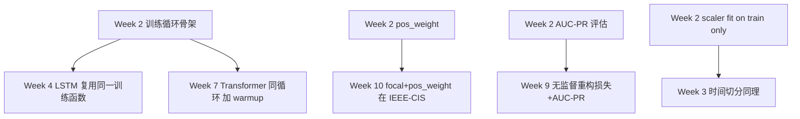

# Week 2 — 知识伴读：MLP、训练循环解剖与不平衡损失

> 配套 notebook：`week02/02_mlp_baseline.ipynb`（MVP v0.1）
> 前置阅读：`transformer-12week-plan.md` §5 Week 2、§4 v0.1
> 本周目标：能用一段 40 行左右的 PyTorch 训练循环在 Kaggle 信用卡数据上跑到 val AUC-PR > 0.70，并能逐行讲清每个 API 为什么这么写。

---

## 1. 本周要回答的核心问题

1. **训练循环的 5 个组件（`zero_grad / forward / loss / backward / step`）为什么缺一不可？**一个不漏怎么记？
2. **`BCEWithLogitsLoss` 比 `Sigmoid + BCELoss` 好在哪？**log-sum-exp 的数值稳定性怎么推？
3. **`pos_weight` 在损失里到底做了什么？**数学上它和 SMOTE / 下采样 / focal loss 的边界在哪？
4. **Focal Loss 公式里的 $\alpha$ 和 $\gamma$ 各自调节什么？**和 `pos_weight` 的本质区别（类别权重 vs 难样本聚焦）是什么？
5. **`StandardScaler` 为什么只能 `fit` 在 train？**Early stopping + best-model checkpoint 的实现陷阱在哪？

---

## 2. 理论骨架

### 2.1 MLP = 函数组合 + 梯度链式法则

本周的模型：

$$\hat{z}(x) = W_3 \cdot \text{Dropout}(\text{ReLU}(W_2 \cdot \text{Dropout}(\text{ReLU}(W_1 x + b_1)) + b_2)) + b_3$$

输入 $x \in \mathbb{R}^{30}$，$W_1 \in \mathbb{R}^{64 \times 30}$, $W_2 \in \mathbb{R}^{64 \times 64}$, $W_3 \in \mathbb{R}^{1 \times 64}$。总参数 $\approx 30 \cdot 64 + 64 \cdot 64 + 64 \cdot 1 + \text{biases} = 6209$。

**为什么够用**：Week 1 §2.5 讲过，V1–V28 已经是 PCA 主成分，特征近正态、去相关，浅层网络就能抓到信号。**为什么不够深**：数据只有 28w 条、492 正样本，更深的网络很快过拟合。这是"数据告诉你模型容量"的典型例子。

输出 $\hat{z}(x)$ 是 **logit**（不经 sigmoid），原因见 §2.3。

### 2.2 训练循环 5 组件的理论解释

一个 step 做的事：

$$\theta_{t+1} = \theta_t - \eta \nabla_\theta \mathcal{L}(f_\theta(x), y)$$

- **`optimizer.zero_grad()`** — PyTorch 的 `.grad` 是**累加**的（历史设计选择，为支持 RNN 的多步反向）。不清零上次 step 的梯度会叠加进这次，等效于用了奇怪的动量。
- **`logits = model(x)`** — forward 构建计算图。每个 tensor 记录 `grad_fn` 链，反向时沿链回传。
- **`loss = loss_fn(logits, y)`** — 计算标量 loss。必须是标量，因为 `.backward()` 隐式 seed 的是 $\frac{d\mathcal{L}}{d\mathcal{L}}=1$；非标量要显式传 grad_outputs。
- **`loss.backward()`** — 反向传播，沿 grad_fn 链填充每个叶子 tensor 的 `.grad`。这一步之后 `.grad` 有值、但参数还没变。
- **`optimizer.step()`** — 读 `.grad`，按优化器规则（Adam 会再叠加动量、二阶矩估计）更新参数 `.data`。

**记忆口诀**：**"清零 → 前向 → 算 loss → 反向 → 更新"**。少任何一步会出现：

| 漏掉 | 症状 |
|------|------|
| `zero_grad` | loss 缓慢发散或震荡；梯度量级随 epoch 线性增长 |
| `forward` | 不可能——loss_fn 的输入得从这来 |
| `loss` | `.backward()` 报错"element 0 of tensors does not require grad" |
| `backward` | `.grad` 为 None，step 报错 |
| `step` | 参数永远是初始化值；loss 在 epoch 内不变 |

**加分项**（本项目的 cell 16 里都做了）：

- `torch.nn.utils.clip_grad_norm_(..., 1.0)` — 反向之后、step 之前裁剪梯度范数，防止极端 batch 引发爆炸。Transformer 后续会重度依赖。
- `model.train() / model.eval()` — 切换 Dropout、BatchNorm 的训练/评估模式。Dropout 在 eval 下不丢，BN 用累积统计量。
- `@torch.no_grad()` — 评估时不建图省显存/快 2x。

### 2.3 `BCEWithLogitsLoss` 与数值稳定性

定义：给定 logit $z = f_\theta(x)$，目标 $y \in \{0,1\}$，

$$\mathcal{L}_{\text{BCE}}(z, y) = -y \log \sigma(z) - (1-y) \log(1 - \sigma(z))$$

"朴素实现"（`Sigmoid + BCELoss`）先算 $p = \sigma(z) = 1/(1+e^{-z})$ 再算 $\log p$。当 $z$ 很大（比如 $z = 50$）时 $\sigma(z) = 1 - 10^{-22}$，在 FP32 下直接等于 1.0，再 $\log 1 = 0$——梯度消失。反过来 $z = -50$ 时 $\sigma(z)$ 下溢为 0，$\log 0 = -\infty$。

**log-sum-exp 技巧**：把两项合并后展开

$$\mathcal{L}_{\text{BCE}}(z, y) = \max(z, 0) - z \cdot y + \log(1 + e^{-|z|})$$

- $\max(z,0) - z \cdot y$ 避免了对 $\sigma(z)$ 直接求对数。
- $\log(1 + e^{-|z|})$ 中 $|z|$ 保证指数参数 $\leq 0$，不会上溢；结果最差也就是 $\log 1 = 0$（当 $|z|$ 很大时）和 $\log 2 \approx 0.69$（当 $z = 0$）之间。

**推导**（设 $y=1$ 的情况）：
$$-\log \sigma(z) = -\log \frac{1}{1+e^{-z}} = \log(1+e^{-z})$$
当 $z < 0$ 时 $e^{-z}$ 可能巨大，rewrite 为 $\log(1+e^{-z}) = -z + \log(1+e^z)$；合并成对称形式即得上面公式。

**结论**：`BCEWithLogitsLoss` 在 $|z| \to \infty$ 时 loss 保持有限且梯度不消失。这不是"更精确"，是**"能不能算"**的问题——Transformer 训练早期 logit 尺度容易暴走，这个函数是默认选择。

### 2.4 `pos_weight` 的数学推导

对一个 mini-batch 里的单个样本，带 `pos_weight = w` 的二元交叉熵：

$$\mathcal{L}_w(z, y) = -\big[w \cdot y \log \sigma(z) + (1 - y) \log(1 - \sigma(z))\big]$$

这等价于把**正样本的梯度放大 $w$ 倍**：

$$\frac{\partial \mathcal{L}_w}{\partial z} = \begin{cases} w \cdot (\sigma(z) - 1) & y=1 \\ \sigma(z) & y=0 \end{cases}$$

（普通 BCE 对应 $w=1$；正样本梯度从 $\sigma(z)-1$ 变成 $w(\sigma(z)-1)$。）

**选 $w = N_{neg}/N_{pos}$ 的理由**：让正负样本对 loss 的**总贡献**均衡。本项目 cell 12 算得 $w \approx 577$。

**直觉对比**：

- **加权 BCE**（此方案）：改变 loss landscape，不改数据。实现最简单。
- **下采样负样本**：改变数据，保留少量负样本。训练快但信息损失大。
- **上采样 / SMOTE**：改变数据，复制/合成正样本。会过拟合合成点附近的区域。
- **两阶段训练**：先平衡采样预训练，再真实比例微调。复杂但实战最好。

**Week 2 的优先级**：`pos_weight` > focal loss > SMOTE。原因：干净、不引入新超参、不改数据。 `pos_weight` 打不动的时候再上 focal；两者都不够再考虑数据层操作。

### 2.5 Focal Loss 的推导与几何直觉

定义 $p_t = p$ 当 $y=1$，否则 $p_t = 1 - p$。直观上 $p_t$ 是"正确类别的预测概率"，$p_t \to 1$ 表示已经分对，$p_t \to 0$ 表示错得离谱。

**标准 CE**：$\mathcal{L}_{CE} = -\log p_t$。

**Focal Loss**（Lin et al., 2017）：

$$\mathcal{L}_{FL}(p_t) = -\alpha_t (1 - p_t)^\gamma \log p_t$$

- $(1-p_t)^\gamma$：**调制因子**。对容易分对的样本 $p_t \approx 1$，$(1-p_t)^\gamma \approx 0$——梯度几乎被抑制。对难样本 $p_t \approx 0.5$，调制因子 $\approx 0.5^\gamma$，$\gamma = 2$ 时衰减 $0.25$。
- $\alpha_t$：**类别权重**。和 `pos_weight` 作用一样，对少数类乘更大权重。原论文 $\alpha = 0.25$（作用在正样本）。

**梯度推导**（以 $y=1$ 为例）：

$$\frac{\partial \mathcal{L}_{FL}}{\partial z} = -\alpha (1-p)^\gamma \left[\gamma p \log p + (p - 1)\right]$$

（其中 $p = \sigma(z)$。）注意这里 $\gamma$ 对梯度的形状改变：$\gamma = 0$ 就是加权 BCE；$\gamma$ 变大，正确预测样本的梯度迅速归零，"难样本梯度占主导"。

**与 `pos_weight` 的本质区别**：

| 维度 | `pos_weight` | Focal Loss |
|------|-------------|------------|
| 调节对象 | 类别（正 vs 负） | 样本（易 vs 难） |
| 超参数 | 1 个（$w$） | 2 个（$\alpha, \gamma$） |
| 适用 | 类别不平衡 | 类别不平衡 + 类内难度分布 |
| 失效场景 | 难样本占比很小时仍被噪声样本淹没 | $\gamma$ 过大时容易过拟合噪声 |

**经验**：Kaggle 信用卡数据里 V1–V28 已经很"干净"，难样本不多，Focal Loss 相对加权 BCE 提升可能 < 0.01 AUC-PR。在 IEEE-CIS（W10）或图像检测等难易分布更广的任务上，Focal 优势明显。

### 2.6 `StandardScaler` 只能 `fit` 在 train 的数据泄露推理

**泄露链条**：
1. 若 `scaler.fit(X_all)`，$\mu$ 和 $\sigma$ 使用了 val/test 数据。
2. train 数据被归一化成 $(x - \mu_{all})/\sigma_{all}$。
3. 模型训练时看到的分布已经"知道未来"。
4. val/test 评估时偏高，上线后分布未知 → 实际表现掉。

**正确做法**（cell 6）：

```python
scaler = StandardScaler().fit(X_train)
X_train = scaler.transform(X_train).astype('float32')
X_val   = scaler.transform(X_val).astype('float32')
X_test  = scaler.transform(X_test).astype('float32')
```

**等价版本也要遵循**：任何"用数据统计量的预处理"都只 fit 在 train。包括：PCA、IQR 去异常、log 参数估计、embedding pretraining。只有"独立于数据的变换"（固定公式的 log1p、独热编码）才能在合并阶段做。

### 2.7 Early stopping + Best-model checkpoint

两件事不完全一样：

- **Early stopping**：当监控指标在 $p$ 个 epoch 内未改善则提前退出，防止过拟合。
- **Best-model checkpoint**：在整个训练过程中保留验证指标最好的那个权重，训练结束后回滚。

cell 16 把它们绑在一起：

```python
if val['ap'] > best_ap:
    best_ap = val['ap']
    best_state = copy.deepcopy(model.state_dict())
    bad = 0
else:
    bad += 1
    if bad >= patience:
        ...
model.load_state_dict(best_state)
```

**三个注意点**：

1. **`copy.deepcopy(state_dict())`**：`state_dict()` 返回的是**浅拷贝**的 OrderedDict，里面的 tensor 是原模型参数的引用。不 deepcopy 直接赋值，下一个 epoch 参数一更新，`best_state` 里的 tensor 也跟着变——等于没保存。
2. **监控哪个指标**：本项目选 `val AP`（AUC-PR），和最终评估指标对齐。用 `val_loss` 是错的，因为 `pos_weight` 改变了 loss scale，loss 下降 ≠ AUC-PR 上升。
3. **patience 怎么选**：过小（1–2）噪声里误触发；过大（20+）浪费时间。经验：从 $\text{patience} = 5$ 起步，观察训练曲线震荡幅度再调。

---

## 3. 代码对照

### 3.1 分层切分（cell 6）

```python
X_trainval, X_test, y_trainval, y_test = train_test_split(
    X, y, test_size=0.15, stratify=y, random_state=SEED)
X_train, X_val, y_train, y_val = train_test_split(
    X_trainval, y_trainval, test_size=0.1765,  # 0.15 / 0.85
    stratify=y_trainval, random_state=SEED)
```

**两次切分而不是一次三分**：sklearn 的 `train_test_split` 只能二分。`test_size=0.1765 = 0.15/0.85` 的魔数是为了让最终 train : val : test = 0.70 : 0.15 : 0.15。

**为什么要 stratify**：Week 1 §4.1 讲过——欺诈占比 0.17%，不 stratify 每 split 正样本数波动大。这里 test 预期约 74 个正样本，val 74 个，train 344 个，能用 stratify 把每个 split 压到 ±3 以内。

**和 Week 3 的对比**：Week 3 切序列时不能随机 stratify，要按时间切。Week 2 这里单笔独立，没有时间依赖，所以 stratify 安全。

### 3.2 `FraudDataset` 的"过度设计"（cell 8）

```python
class FraudDataset(Dataset):
    def __init__(self, X, y):
        self.X = torch.from_numpy(X)
        self.y = torch.from_numpy(y)
    ...
```

Week 2 用 `TensorDataset(X, y)` 就够了，为什么写一遍 `Dataset` 子类？**为了 Week 3 扩展**。Week 3 的 `SeqDataset` 返回 `(seq_x, label)`；Week 4 可能返回 `(seq_x, label, length)` 以支持 `pack_padded_sequence`；Week 7 的 Transformer 可能返回 `(seq_x, label, attention_mask)`。提前用 Dataset 子类，加字段时改一处即可。

### 3.3 `nn.Sequential` + `.squeeze(-1)` 的一个坑（cell 10）

```python
def forward(self, x):
    return self.net(x).squeeze(-1)  # (B,)
```

输入 `(B, 30)`，中间 `(B, 64)`, 最后 `Linear(64,1)` 输出 `(B, 1)`。`.squeeze(-1)` 变成 `(B,)`。**为什么要 squeeze**：`BCEWithLogitsLoss` 默认把 input 和 target 按元素对齐比较——`input.shape == target.shape` 是硬要求。不 squeeze 的话 input `(B,1)` 、 target `(B,)` 会触发 broadcasting（实际计算仍对但 PyTorch 会 warning），或者完全错位（特定旧版本）。

**陷阱**：如果 B=1（batch size 为 1 的极端情况），`.squeeze(-1)` 把 `(1,1)` 变 `(1,)`，但如果不加参数 `.squeeze()` 会把 `(1,1)` 变成 `()` 标量，loss 计算直接挂。一定用带参数的 `.squeeze(-1)`。

### 3.4 `pos_weight` 的计算与类型（cell 12）

```python
neg = (y_train == 0).sum()
pos = (y_train == 1).sum()
pos_weight = torch.tensor([neg / pos], dtype=torch.float32, device=device)
```

**注意事项**：

- `pos_weight` 必须是 tensor，不能是 Python float（`BCEWithLogitsLoss` 内部要做广播乘法）。
- device 要和 logits 一致——不一致会在 forward 里报 RuntimeError（现代 PyTorch 给好错提示）。
- 外面再包 `[...]` 成 shape `(1,)` 而非标量——这是文档要求的"match output shape"。

### 3.5 `predict_scores` 的评估范式（cell 14）

```python
@torch.no_grad()
def predict_scores(model, loader):
    model.eval()
    scores, labels = [], []
    for x, y in loader:
        x = x.to(device)
        logits = model(x)
        scores.append(torch.sigmoid(logits).cpu().numpy())
        labels.append(y.numpy())
    return np.concatenate(scores), np.concatenate(labels)
```

**三个细节**：

- `torch.sigmoid(logits)` 只在"要拿概率画 PR 曲线"时做；如果只是算 AUC，sklearn 的 `roc_auc_score` 接受任何单调变换的 score。为了 `precision_recall_curve` 的阈值解释性（0–1 区间），这里做 sigmoid。
- `.cpu().numpy()` 必须放在 `append` 里，不能最后一次性 cat——大 batch 累计在 GPU 会爆显存。
- `@torch.no_grad()` 和 `model.eval()` 都要——前者禁建图（省显存），后者切 dropout（正确性）。缺一个都有问题。

### 3.6 `Recall@FPR=0.001` 的实现陷阱（cell 14）

```python
fpr, tpr, thr = roc_curve(y, s)
idx = np.searchsorted(fpr, 0.001)
rec_at_fpr = tpr[min(idx, len(tpr) - 1)]
```

`roc_curve` 返回的 `fpr` 已按升序排列。`searchsorted(fpr, 0.001)` 返回第一个 $\geq 0.001$ 的位置。

**陷阱**：

- `fpr` 数组长度不一定等于样本数——sklearn 会合并相同阈值的点。所以 `idx` 可能超界，需要 `min(idx, len(tpr)-1)`。
- 如果 `fpr` 数组里根本没到 0.001（极端情况：模型太差所有阈值都有 FPR >> 0.001），返回的 TPR 可能是外推值。严谨起见应该检查 `fpr[idx]` 是否接近 0.001。
- `searchsorted` 默认 `side='left'`：找第一个 $\geq$ 目标的位置；若要严格 $<$ 则用 `side='right' - 1`。当前代码语义是"在 FPR 不超过 0.001 的最紧约束下的 recall"——正确。

### 3.7 训练循环主体（cell 16）

```python
for epoch in range(1, max_epochs + 1):
    model.train()
    t0, total = time.time(), 0.0
    for x, y in train_loader:
        x, y = x.to(device), y.to(device)
        optimizer.zero_grad()
        logits = model(x)
        loss = loss_fn(logits, y)
        loss.backward()
        torch.nn.utils.clip_grad_norm_(model.parameters(), 1.0)
        optimizer.step()
        total += loss.item() * x.size(0)
    train_loss = total / len(train_loader.dataset)

    val = evaluate(model, val_loader)
    ...
```

**四个值得强调的实现点**：

- `model.train()` 放在 epoch 最外层——每次 evaluate 后 `model.eval()` 被设上，下个 epoch 要切回来。忘了这个会让下轮训练时 dropout 失效、BN 不更新统计。
- `loss.item() * x.size(0)`：累加原始 loss 总和，最后 `/ len(dataset)` 得 per-sample 均值。这避免了最后一个 batch 小于 BATCH 时平均值被拉偏（尽管本项目 BATCH=512 下 drop_last=False 偏差很小）。
- `clip_grad_norm_(..., 1.0)` 放在 `backward()` 后、`step()` 前——改变的是 `.grad` 的内容，`step()` 读 `.grad` 更新。顺序反了 clip 无效。
- Adam 的 `weight_decay=1e-5`：这是 **L2 正则**等价（注意：严格 AdamW 才是"解耦 weight decay"，这里 Adam 的 weight_decay 实际是 L2 加进梯度——两者在大 lr 下差异明显，本项目 lr=1e-3 影响小）。

### 3.8 Focal Loss 的两种写法（cell 23）

```python
class FocalLoss(nn.Module):
    def __init__(self, alpha=0.25, gamma=2.0):
        super().__init__()
        self.alpha, self.gamma = alpha, gamma
    def forward(self, logits, targets):
        p = torch.sigmoid(logits)
        ce = nn.functional.binary_cross_entropy_with_logits(logits, targets, reduction='none')
        p_t = p * targets + (1 - p) * (1 - targets)
        alpha_t = self.alpha * targets + (1 - self.alpha) * (1 - targets)
        return (alpha_t * (1 - p_t) ** self.gamma * ce).mean()
```

**为什么用 `binary_cross_entropy_with_logits` 而不是手写 $-\log p_t$**：同样的数值稳定性理由（§2.3）。我们复用 PyTorch 稳定实现计算 `ce`，再乘上调制因子即可。这是一种典型的"组合稳定算子"的工程写法。

**$\alpha_t$ 和 $p_t$ 的对称写法**：`alpha_t = α·y + (1-α)·(1-y)` 自动给正样本 $\alpha$、负样本 $1-\alpha$，无 if-else。向量化效率高。

**$\alpha = 0.25$ 的直觉**：原论文对象检测里正样本（有物体的 anchor）少，给 $\alpha = 0.25$ 压低正样本权重、$\gamma = 2$ 压低易分样本。**信用卡这里正好是反直觉**：正样本（欺诈）才是少数，$\alpha$ 应该给 `0.75` 左右才对等。直接抄原论文的 0.25 会让正样本损失被进一步压低——**这是个陷阱**，复盘时要比较 `alpha=0.75, gamma=2` 的效果。

### 3.9 阈值选择：最大 F1（cell 21）

```python
prec, rec, thr = precision_recall_curve(y_true, s)
f1 = 2 * prec * rec / (prec + rec + 1e-9)
best_idx = np.nanargmax(f1[:-1])
```

**为什么 `f1[:-1]`**：`precision_recall_curve` 返回的数组比 `thr` 多一个元素（最后一点对应 threshold = inf），此时 precision=1, recall=0。取 `[:-1]` 排除这个"无意义端点"，避免 F1 的分母异常。

**`nanargmax` 而不是 `argmax`**：边界情况 prec 和 rec 同时为 0 时 F1 = NaN，`argmax` 会返回第一个 NaN 位置。用 `nanargmax` 忽略 NaN。

**"最大 F1 的阈值"只是其中一种选法**。业务上更常见的是：固定 Recall @ 0.8 找最高 Precision，或固定 FPR @ 0.001 找最大 TPR。这里默认 F1 是学习阶段的"综合感受"指标。

---

## 4. 常见坑位与调试思维

### 4.1 为什么 loss 很快降到 0 但 AUC-PR 还很低

典型症状：epoch 2 train_loss 从 0.6 降到 0.05，但 val AUC-PR 卡在 0.5。

**诊断**：忘了加 `pos_weight` 或 `pos_weight` 太小，模型把所有样本都预测成 0——对 99.83% 的负样本它都"对"了，loss 很低；但正样本全漏，PR 曲线贴地。

**修复**：检查 cell 12 的 `pos_weight` 打印是不是 ~577。如果是 1.0 说明 `pos_weight` 没传进去。

### 4.2 AUC-ROC 很高（0.97）但 AUC-PR 很低（0.2）

**诊断**：典型的"极不平衡下 ROC 过度乐观"（Week 1 §2.3）。模型其实把大部分欺诈排在前几百名之外，但因为负样本太多，ROC 看起来很好。

**修复**：不是模型坏，是数据难 + MLP 容量不够。Week 4+ 上序列/LSTM/Transformer 后 AUC-PR 才可能到 0.80+。先把 AUC-PR 0.70 接受下来进入下周。

### 4.3 Dropout 忘关（model.eval 漏）

**症状**：同一 val 集，`evaluate` 跑两次结果不同。

**诊断**：`model.eval()` 漏了，Dropout 还在丢神经元，输出带随机。

**修复**：永远在 `predict_*` 函数开头写 `model.eval()`，并在装饰器加 `@torch.no_grad()`（双保险：even 如果 dropout 通过 train 模式下也不会构建计算图）。

### 4.4 `copy.deepcopy` 漏

**症状**：训练显示 val_ap 在 epoch 5 达到 0.75 后开始下降，early stop 退出。加载 best_state 后 evaluate 拿到的是 epoch 10 的权重而非 epoch 5。

**诊断**：`best_state = model.state_dict()` 没 deepcopy，引用随模型更新。

**修复**：`copy.deepcopy(model.state_dict())`（cell 16 做对了）。或者保存到文件：`torch.save(model.state_dict(), tmp)`+ 后面 load。

### 4.5 batch 里没有正样本

**症状**：某些 iteration 的 loss 突然降到 0 或者异常小。

**诊断**：batch=512、正样本占 0.17%，期望一个 batch 里约 0.87 个正样本。有些 batch 一个正样本都没有，loss 就只剩负样本项。数学上没错，但让训练动态不稳定。

**缓解**：用 `WeightedRandomSampler` 按类别概率采样，让每个 batch 至少几个正样本。Week 2 还不用（`pos_weight` 已足够），但值得知道存在这个工具，Week 4+ LSTM 训练可能用到。

### 4.6 AdamW vs Adam weight decay 混淆

**症状**：训练后期 loss 平稳但 weight norm 持续变大/变小。

**诊断**：`Adam(weight_decay=λ)` 把 $\lambda \theta$ 加到梯度里，随后过 Adam 的 adaptive scaling——等价于"被方差归一化过的 L2"。而 `AdamW(weight_decay=λ)` 直接 $\theta \leftarrow \theta - \eta \lambda \theta$ 独立应用——才是严格意义的 weight decay。

**影响**：本项目 lr=1e-3, wd=1e-5 差异可忽略；但 Transformer 训练常 lr=1e-4, wd=0.01——务必用 `AdamW`。Week 7+ 我们会显式切过去。

### 4.7 Early stop patience 踩不到

**症状**：`max_epochs=30`，训练跑完全部 30 epoch，从没 early stop。

**诊断**：要么 `patience=5` 太宽松；要么 val AUC-PR 持续缓慢上升（值得多跑）；要么 val 指标本身噪声大（训练/val 分布不同）。

**修复**：先看 history，如果 val_ap 最后 5 epoch 在 0.745 ± 0.005 波动，`patience=3` 就能触发，避免浪费。

---

## 5. 与未来几周的连接



- **训练循环会几乎原样复用**：Week 4 换 LSTM、Week 7 换 Transformer，`train_one_epoch` 只改 `model = ...`。理解 5 组件的理由在于——**后面所有训练调参（warmup/lr_schedule/mixed precision）都是往这 5 步里插逻辑**。
- **`pos_weight` 在 Week 4/7/10 持续出现**：序列模型上通常改写为 per-token 的 `pos_weight`，但数学形式一致。
- **`BCEWithLogitsLoss` 会扩展**：Week 9 双头模型中分类头继续用它，重构头用 MSE；Week 10 的 IEEE-CIS 上可能改成 `nn.CrossEntropyLoss`（多分类多风险等级）。
- **Scaler 的规则 → Week 3 时间切分**：同样的"只从 train 采统计量"原则，Week 3 会进一步严格到"train.max(ts) ≤ val.min(ts)"，防时间泄露。
- **Early stopping + checkpoint 模板**：Week 4+ 都会沿用 `best_state = copy.deepcopy(state_dict())` 这个模式。

---

## 6. 自测题

**Q1**. 如果去掉 `optimizer.zero_grad()`，训练曲线会怎么样？

<details><summary>答案</summary>
前几步 loss 像正常下降（梯度累积还没大太多），随后 loss 开始震荡/发散。因为每步有效梯度变成 $g_1 + g_2 + \cdots + g_t$，相当于学习率线性增长。LSTM 的 BPTT 场景下这个"累积"是有意设计的（多步反向），但在 batch 训练里必须清零。
</details>

**Q2**. 为什么 `BCEWithLogitsLoss` 内部做 log-sum-exp 而不是 PyTorch 在 `nn.Sigmoid` 里做？

<details><summary>答案</summary>
因为 log-sum-exp 需要同时看到 $z$ 和 $y$——它是把 $\log \sigma(z)$ 和 $\log(1-\sigma(z))$ 用不同分支算的，取决于 $y$。单独在 `Sigmoid` 里算不了。这也是为什么"Sigmoid → BCELoss"这种两步组合总会有极端值风险：Sigmoid 不知道下游要干啥。
</details>

**Q3**. 如果把 `pos_weight = 577` 改成 `pos_weight = 10`，val AUC-PR 会上还是下？

<details><summary>答案</summary>
通常**下降**。577 是正负样本比，"还原"了类别权重；10 则让正样本梯度放大不够，模型仍然偏向预测负。但也不是越大越好——把 pos_weight 加到 5000 模型会"过度修正"，对负样本几乎不更新梯度，precision 崩。调 pos_weight 最好用 val 指标做搜索，$\{0.5w, w, 2w\}$ 三点探最好。
</details>

**Q4**. Focal Loss 的 $\gamma$ 设成 0 等价于什么？$\gamma \to \infty$ 会怎样？

<details><summary>答案</summary>
$\gamma = 0$ 时 $(1-p_t)^0 = 1$，Focal 退化为加权 CE（$\alpha$ 还在）。$\gamma \to \infty$ 时只有 $p_t$ 极低（极难样本）才贡献梯度，其他样本梯度趋零——训练只学难样本，会放大标签噪声的伤害。实践 $\gamma \in [1, 5]$，$\gamma = 2$ 是原论文推荐值。
</details>

**Q5**. 如果有人说"我用 SMOTE 过采样 + BCE 替代 pos_weight"，你会怎么回应？

<details><summary>答案</summary>
两个顾虑：1) SMOTE 在 PCA 特征空间里做合成，但 V 列经过 PCA 变换后合成样本的"反变换"并不回到合理的原始交易空间——可能学到合成流形上的伪信号。2) SMOTE 的 KNN 依赖度量，样本少时合成点聚集在原始正样本附近，等于复制粘贴。pos_weight 不引入新数据，更干净。实际工程上，SMOTE 常和 Tomek-link 配合先清 overlap，单用很少赢。
</details>

**Q6**. `StandardScaler.fit(X_train)` 之后，未来上线时新数据怎么处理？

<details><summary>答案</summary>
把 `scaler.mean_` 和 `scaler.scale_` 保存到 checkpoint（cell 19 就这么做了），上线时加载同样的 $\mu, \sigma$ 对新数据 `transform`。如果用户 base 变了（比如金额分布漂移 20%+），需要周期性重训 + 重 fit scaler——这是 Week 12 "特征漂移怎么办"的前置。
</details>

**Q7**. 为什么 `train_loss` 在整体下降过程中会出现几次 "跳升"？

<details><summary>答案</summary>
最常见原因：某个 batch 里一个超大梯度（比如异常金额样本 × pos_weight=577 → loss 值尖刺）。`clip_grad_norm_(1.0)` 本身能缓解参数更新幅度，但当前 batch 的 loss 数字仍会尖——那是"loss 观测"的噪声，不是"训练"的噪声。长期看 epoch-level 的 train_loss 应该单调下降。
</details>

**Q8**. 看 cell 17 的训练日志，如何判断模型是"欠拟合"还是"过拟合"？

<details><summary>答案</summary>
欠拟合：train_loss 高、val_ap 也低，且还在下降——加大模型容量或 epoch。过拟合：train_loss 持续下降但 val_ap 拐头向下——减小模型、加 dropout、加 weight_decay、或减 epoch（early stop）。欺诈数据两种都可能出现：MLP 浅学不够是欠，lr 过大或 pos_weight 过激是过。
</details>

---

## 7. 延伸阅读

1. **Lin et al., "Focal Loss for Dense Object Detection" (ICCV 2017)** — 摘要和 §3 精读。为什么现在读：本周 cell 23 实现了它，但直接照抄 $\alpha = 0.25$ 是坑（§3.8），通过原文理解设计意图才能调出正确 $\alpha$ 给欺诈场景。
2. **d2l 第 4 章 "多层感知机" + 第 5.1–5.3 节 "深度学习计算"** — 为什么现在读：反向传播链式法则、参数初始化、Xavier/He 初始化。Week 5+ 手写 attention 时这些是前置。
3. **PyTorch 文档 `BCEWithLogitsLoss`** — 重点看 "Notes" 部分对 log-sum-exp 的实现说明。为什么现在读：§2.3 的理论推导在官方文档里有工程版本确认。
4. **Kingma & Ba, "Adam: A Method for Stochastic Optimization" (ICLR 2015) Algorithm 1** — 只需看算法伪代码。为什么现在读：本周用 Adam 但没讲为什么。一图看懂 $m_t, v_t, \hat{m}_t, \hat{v}_t$，后续 Transformer 的 AdamW / Noam schedule 才能对接上。
5. **Loshchilov & Hutter, "Decoupled Weight Decay Regularization" (AdamW, ICLR 2019) §2** — 为什么现在读：§4.6 讲到 Adam vs AdamW 的区别，Week 7 Transformer 会切到 AdamW，这是过渡的理论依据。
