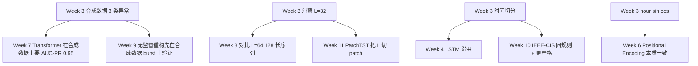

# Week 3 — 知识伴读：序列建模入门、合成数据设计与防泄露切分

> 配套 notebook：`week03/03_synth_data.ipynb`、`week03/03b_sequence_builder.ipynb`
> 前置阅读：`transformer-12week-plan.md` §5 Week 3、§4 v0.2、Week 2 知识伴读 §2.6（scaler 泄露）
> 本周目标：能把"单笔交易"的思维转换为"用户 × 时间的序列"思维；能写合成数据发生器；能按时间切分并自检无泄露。

---

## 1. 本周要回答的核心问题

1. **为什么"行为序列"比"单笔"更能识别欺诈？**举一个金额本身正常但序列异常的例子。
2. **滑动窗口 vs 整段序列 vs 按会话分桶，三种组装方式的 tradeoff 是什么？**
3. **数据泄露有哪几种形态（时间 / 用户 / 标签 / 特征）？**在本项目里各踩过哪些、怎么规避？
4. **合成数据的价值和陷阱各是什么？**为什么必须和真实数据配对使用，不能独立验证？
5. **异常注入的三种经典模式（point / contextual / collective）各对应什么异常类型？**

---

## 2. 理论骨架

### 2.1 单笔 vs 序列：信息论视角

把交易看成随机变量 $X_t \in \mathcal{X}$（含金额、时间、商户、地理等），标签 $Y_t \in \{0,1\}$。单笔建模估计的是：

$$p(Y_t = 1 \mid X_t)$$

序列建模估计的是：

$$p(Y_t = 1 \mid X_{t-L+1}, \ldots, X_t) = p(Y_t = 1 \mid X_t, \underbrace{H_{t-1}}_{\text{历史上下文}})$$

如果 $Y_t$ 与历史有互信息 $I(Y_t; H_{t-1} \mid X_t) > 0$（即给定当前 $X_t$ 历史仍携带增量信号），序列模型**理论上界更高**。

**具体例子**：

- 同一笔 $500 的交易，在一个月消费均值 $3000 的用户身上——正常；在一个月均值 $50 的小白身上——可能被盗。$X_t = 500$ 相同，$Y_t$ 预测不同，差别完全在 $H_{t-1}$。
- 小额交易 $10 单笔看无异，但 **3 分钟内 15 笔** 同金额——卡测试攻击（burst），单笔概率视角完全无感，序列视角一眼。
- 正常地理波动 ±5km，但**上一笔纽约、本笔伦敦、时间差 30 分钟**——geo_jump 异常。单笔特征里 `(lat, lng)` 本身可能是正常的伦敦坐标，必须联合 $X_{t-1}$ 才能识别。

三个例子对应下文 §2.5 的 **contextual / collective / collective** 三类异常。

### 2.2 序列的三种组装方式：滑动窗口 / 整段 / 会话分桶

| 方式 | 样本定义 | 优 | 劣 |
|------|---------|----|----|
| 滑动窗口 $L$ 固定 | 每 $L$ 连续笔 → 一条样本，步长 1（或 $s$） | 样本多、batch 均匀；适合 Transformer / LSTM 批训练 | 同一笔可能出现在多条样本里（重叠）；离散化损失事件边界 |
| 整段序列 | 每用户全部历史 → 一条样本（变长） | 不丢信息 | 长度极度不均衡（1–10000+），需 pack / mask；batch size 小 |
| 会话分桶 | 按时间 gap 分 session（比如 30 min 无交易切段） | 符合业务直觉；每 session 语义完整 | 需业务定义 session；session 长度仍变长 |

**Week 3 选滑动窗口 L=32** 的工程原因：

- 样本量倍增（每用户 $n$ 笔 → $n - L + 1$ 条样本），对 200 用户的合成数据和 500 伪用户的 Kaggle 都够用。
- batch 规整，Transformer 训练 batch matmul 效率高。
- $L = 32$ 经验值：长到能覆盖"早中晚"节律，短到能在 T4 GPU 上 batch=256 + attention $O(L^2)$ 不爆显存。Week 8 会把 L 拉到 64/128 对比。

**滑动窗口的标签语义**：cell 10 的选择是"窗口最后一笔的 `is_anomaly`"——业务含义"给过去 32 笔，判断最后这笔是否异常"。其他可能：

- 窗口内任一异常 → `label = max(y_{t-L+1:t})`：更宽松，适合召回优先。
- 窗口累计异常率 → 连续回归目标：研究级，业务不常用。

三种标签选择对应三种业务姿态：**事中实时拦截**（最后一笔）、**事后风险评分**（任一异常）、**宏观风险监控**（累计率）。

### 2.3 数据泄露的 4 种形态

| 类型 | 定义 | 本项目怎么规避 |
|------|------|----------------|
| **时间泄露** | 用未来时刻的样本/统计量进入训练 | 按 ts 分位切分（cell 8）；scaler 只 fit train（cell 12）|
| **用户泄露** | 同一用户样本在 train/val/test 都出现 | 本周**选择允许用户跨 split**（见下面说明）|
| **标签泄露** | 特征里包含"只有知道 y 才能产生的量"（如"是否被风控拦截"） | 本项目无，Kaggle V1–V28 已脱敏、合成数据 by construction 无 |
| **特征泄露** | 预处理用全量统计量（Week 2 §2.6） | scaler 只 fit train |

**用户泄露的一个细节**：经典教科书说"用户必须不交叉"。但时间切分下，同一用户的早期交易在 train、晚期交易在 test，物理上已经隔离；再强行 user-disjoint 会让 train/val/test 分别是**不同用户群体**——模型没法泛化到"已知用户的新行为"。Week 3 的选择是**以时间切分为主**、允许用户跨 split（但不许样本跨 split）。工业界的 A/B 评估如果是"同一用户 T+N 的新交易"，时间切分更贴合。如果业务是"冷启动新用户"，才需要 user-disjoint。Week 10 IEEE-CIS 会重新讨论这个。

**时间泄露最隐蔽的一种**：**未来特征**。举例：训练集特征里有 "该用户过去 30 天平均交易额"，如果 30 天窗口统计时混入了 val 时段的交易——这仍是时间泄露。防止办法：所有窗口特征严格用"t 时刻之前"的数据。Week 3 的合成数据没有这种滚动特征，Week 10 的 IEEE-CIS 里要高度警惕。

### 2.4 合成数据的价值与局限

**为什么要自己造数据**（Week 3 花一整节做 `03_synth_data.ipynb`）：

1. **已知真值**：每笔交易的 `anomaly_type` 是 generator 写死的，可以验证"模型是不是学到了我想让它学的"。Kaggle 欺诈数据只有"是/否"没有"为什么"。
2. **可控难度**：异常注入参数（倍数、频率、距离）都是旋钮。Week 7 Transformer 第一轮在合成数据上要 AUC-PR > 0.95——不是赛 SOTA，是 sanity check"模型没写错"。
3. **充分样本量**：可以任意放大到百万级，避免"Kaggle 只有 492 正样本、统计波动大"的困扰。
4. **可重现**：seed 固定，组内他人、未来的自己都能得到同样数据。

**局限与陷阱**：

- **分布 gap**：合成数据 $\mathcal{D}_\text{synth}$ 的生成分布 $p_\text{synth}$ 和真实分布 $p_\text{real}$ 不同。在 synth 上 95% AUC-PR 的模型，上 real 可能只有 0.75——因为真实欺诈模式比注入的 3 类复杂得多。
- **模式过拟合**：generator 注入 geo_jump 时用"坐标 +10 度 + 时间间隔 10–40 分钟"，模型可能学到的是"检测 >10 度坐标跳变"这个规则，换成 9 度就失效。
- **噪声缺乏**：真实数据有缺失、错字、用户行为漂移；合成数据太"干净"，模型少学了鲁棒性。

**正确姿势**：合成 = 验证管线的正确性；真实 = 验证模型的可用性。两者都不可替代。

### 2.5 三种异常模式的数学定义（Chandola et al. 2009）

**Point anomaly**：单个数据点本身就异常，跟上下文无关。数学上 $x_t \in X^\text{outlier}$。
- 例：金额飙升（amount_spike）——$a_t > p_{99}(\text{user}) \times 5$。单笔金额本身就是异常的大。
- 最好用的检测器：IsolationForest、One-Class SVM，MLP + Z-score。

**Contextual anomaly**：单点在特定上下文下异常，换个上下文可能正常。数学上 $p(x_t \mid c_t)$ 小而 $p(x_t)$ 不小。
- 例：凌晨 3 点的 $5000 交易。金额 $5000 白天正常；时间凌晨 3 点正常；但"凌晨 3 点 + $5000"概率低。
- 最好的检测器：序列模型（RNN/Transformer）直接建条件分布。

**Collective anomaly**：单点都正常，但一组点一起出现就异常。数学上 $\{x_{t_1}, \ldots, x_{t_k}\}$ 作为联合比边际概率低。
- 例 1：Burst（5 分钟 15 笔小额）——每笔小额 $5 完全合理，15 笔挤在一起才异常。
- 例 2：Geo jump（纽约→伦敦 30 分钟）——两个坐标单看都合理，联合看物理上不可能。
- 最好的检测器：序列模型 + 聚合（LSTM 的 hidden state / Transformer 的 attention）。

**Week 3 的三个异常类型对应**：

| 注入类型 | Chandola 分类 | 单笔可见？ | 序列模型预期优势 |
|----------|--------------|-----------|------------------|
| amount_spike | point | 是 | 小（MLP 也能做到） |
| geo_jump | collective（需要前一笔） | 否 | 中 |
| burst | collective（需要连续多笔） | 否 | 大 |

这也预告 Week 4+：**LSTM/Transformer 相对 MLP 的提升主要来自 burst 和 geo_jump**。amount_spike 上各模型差距不大，burst 上差距最显著。

### 2.6 PyTorch Dataset / DataLoader 设计考量

`Dataset.__getitem__` 的核心契约：

- **纯函数**：相同 idx 多次调用返回相同结果（允许随机增广时用 seed 固定）。
- **轻量**：每次调用 < 毫秒级，因为 DataLoader 的 workers 会并发调用。
- **无副作用**：不修改 self；不开文件（否则每次调用开一次 I/O）。
- **返回 tensor**：numpy 也可，但 tensor 减少一次转换。

cell 16 的 `SeqDataset` 在 `__init__` 里一次性 `torch.from_numpy(X)` 把全部样本拉进内存，之后 `__getitem__` 只做切片：

```python
def __init__(self, X, y):
    self.X = torch.from_numpy(X)         # (N, L, F) 一次转换
    self.y = torch.from_numpy(y).long()
def __getitem__(self, idx):
    return self.X[idx], self.y[idx]      # 零拷贝切片
```

**为什么不懒加载**：Week 3 数据量 < 200 MB，内存装得下。真实工业数据 TB 级时必须 lazy load + LRU cache + 多进程 fetch，那套 codebase 大得多（比如 WebDataset / tf.data）。

**`num_workers` 和 `collate_fn`**：

- `num_workers=0`：主进程串行 fetch，慢但简单。
- `num_workers>0`：fork 子进程并行 fetch。**注意 Jupyter 里 Windows/Mac 有时不稳定**；`self.X` 若是大 tensor，fork 时会因 CoW（copy-on-write）共享内存，OK；但若 `__init__` 里有 numpy RNG state，每个 worker 拿同 seed → 子进程里要 `worker_init_fn` 重新 seed。
- `collate_fn`：默认把 batch 里每个样本按字段 stack。Week 3 所有样本 `(L=32, F)` 等长，默认 OK。Week 4 的变长序列要写自定义 collate 做 padding。

### 2.7 时间特征的工程化：sin/cos 编码

cell 5 的关键两行：

```python
df_synth['hour_sin'] = np.sin(2 * np.pi * df_synth['hour'] / 24)
df_synth['hour_cos'] = np.cos(2 * np.pi * df_synth['hour'] / 24)
```

**为什么不直接用 hour 原值 0–23**？因为 hour=23 和 hour=0 在业务上距离 1 小时，但数值距离 23。模型会误以为它们天差地别。

**为什么不用 one-hot (24 维)**？维度浪费、没有"相近小时相似"的归纳偏置。

**sin/cos 编码的几何**：把小时映射到单位圆上，$(cos(2\pi h/24), sin(2\pi h/24))$。hour=23 的坐标 $(\cos(23\pi/12), \sin(23\pi/12))$ 和 hour=0 的 $(1,0)$ 欧氏距离很小。模型拿到两维连续特征，自然学出"周期相似度"。

同样的思路对 **day_of_week (%7)**、**month (%12)**、**minute (%60)** 都适用。这是 Transformer 后续 **Time2Vec** 或 **Fourier feature** 的简化前身。

---

## 3. 代码对照

### 3.1 用户画像的分层采样（`03_synth_data.ipynb` cell 3）

```python
user_tier = rng.choice(['small', 'mid', 'large'], size=N_USERS, p=[0.5, 0.35, 0.15])
mu_map = {'small': 2.5, 'mid': 3.5, 'large': 4.5}   # log amount mean
user_cat_pref = rng.dirichlet(alpha=np.ones(20) * 0.3, size=N_USERS)  # 稀疏偏好
```

**用户分层的必要性**：如果所有用户都从同一个 $N(\mu, \sigma)$ 金额分布采，用户间没差异，模型会把"金额"当成弱特征。分层后模型必须先识别用户等级、再判断金额异常——这更贴近真实欺诈检测里"相对用户正常基线的偏离"范式。

**Dirichlet $\alpha = 0.3$ 的含义**：$\alpha < 1$ 的 Dirichlet 产生**稀疏**分布——每个用户的 20 类商户偏好集中在少数几类（典型人只常去 3–5 类商家）。若 $\alpha = 1$ 偏好均匀；$\alpha \gg 1$ 所有用户都偏好相近，丢失个性。$0.3$ 是常见的"自然稀疏性"经验值。

### 3.2 昼夜节律的混合高斯采样（cell 5）

```python
def sample_hours(n, rng):
    peaks = [9, 13, 20]; stds = [1.5, 1.2, 2.0]; weights = [0.3, 0.3, 0.4]
    choices = rng.choice(3, size=n, p=weights)
    h = np.array([rng.normal(peaks[c], stds[c]) for c in choices])
    return np.mod(h, 24)
```

**三个峰**对应早（通勤早餐）、中（午餐消费）、晚（下班购物 + 晚餐）。`weights = [0.3, 0.3, 0.4]` 让晚间峰略高。`np.mod(h, 24)` 处理负值和 >24 的溢出。

**为什么不直接用 von Mises**（文档注释写了 "von Mises-like"）：`scipy.stats.vonmises` 也可，但混合高斯足够简单。VM 的参数 $\kappa$ 控制集中度，mapping 到这里就是 $\kappa \approx 1/\sigma^2$。选择更简单的实现是**合成数据的正确姿势**——"能产生期望分布"比"数学上正宗"重要。

### 3.3 三类异常注入细节（cell 7, 9, 11）

#### amount_spike（point）

```python
p99 = df_norm.groupby('user_id')['amount'].quantile(0.99).to_dict()
...
df_norm.loc[mask_A, 'amount'] = df_norm.loc[mask_A, 'user_id'].map(p99) * rng.uniform(5, 15, ...)
```

"$p_{99} \times 5$–$15$"而不是"固定 $5000"——保持了用户间的相对性。对 large tier 用户可能是 $30000$，对 small 用户可能是 $500$，但都是各自历史的极端值。这就是 §2.5 的 point anomaly 经典定义。

#### geo_jump（collective，跨两笔）

```python
# 远离 home 至少 10 度（≈ 1100km）
df_norm.at[pick, 'lat'] += rng.choice([-1, 1]) * rng.uniform(10, 20)
# 把时间拉到前一笔 + 10~40 分钟
prev_ts = df_norm.at[pick - 1, 'ts']
df_norm.at[pick, 'ts'] = prev_ts + pd.Timedelta(minutes=int(rng.integers(10, 40)))
```

**关键**：异常**只对这一笔打标签**（`is_anomaly=1`），但异常的物理证据在**当前笔 vs 前一笔**的对比上。单笔模型看到 lat=45, lng=-80 完全正常；序列模型看到前一笔 lat=40 lng=-75 + 时间差 30 分钟 + 距离 1100km → 每小时 2200km = 超音速 → 异常。

**一个 subtle 点**：`pick - 1` 假设 `df_norm` 按 `user_id + ts` 排序且 `pick` 不是首笔。cell 9 里确实先 `sort_values(['user_id','ts'])`、然后用 `idx[1:]` 排除首笔——做对了。如果没排序或用 `iloc[pick-1]` 而非 `at[pick-1]`（pandas `iloc` 是位置 `at` 是标签），会拿到错误的前一笔。

#### burst（collective，跨多笔）

```python
for i in range(n):
    ts = start_ts + pd.Timedelta(seconds=int(rng.integers(0, 300)))
    amt = float(rng.uniform(0.5, max(1.0, mean_amt[u] * 0.1)))
    extra.append((...))
```

5 分钟 (300s) 内 10–15 笔、金额 < user_mean × 0.1——卡测试攻击典型模式。**注意**：burst 的每笔单独看都在正常金额范围内（小额 $0.5–$5），必须看"时间密度 + 金额分布"的联合才能识别。这是 §2.5 collective anomaly 最"纯粹"的例子。

### 3.4 Kaggle 伪 user_id（`03b_sequence_builder.ipynb` cell 6）

```python
time_bucket = (df_kaggle['Time'] // 60).astype('int64')
amt_int = df_kaggle['Amount'].round().astype('int64')
df_kaggle['user_id'] = ((time_bucket * 97 + amt_int * 53) % 500).astype('int32')
```

**为什么做这个 hack**：Kaggle creditcardfraud 没有 userId 列。为了跑通序列管线，用"相近时间 + 相近金额"的哈希假装成用户。

**质数 97 和 53 的作用**：避免模 500 结果和 time_bucket / amt_int 有明显周期共振。实际等价于一个弱 hash，让 500 个"用户"的交易流比较打散。

**这个伪 user_id 的已知问题**：

- 同一"用户"的两笔交易没有真实行为一致性——金额可能天差地别、时间段乱跳。序列模型学不到"用户画像"。
- 上限偏低：Kaggle 序列 AUC-PR 预期仍然 < MLP 基线的可能性是存在的（因为伪用户引入了噪声）。

README 诚实写了这一点："Week 4 对比时知道这是上限偏低的原因"。这是工程实用主义——**跑通管线 > 完美数据**，等 Week 10 切 IEEE-CIS 再用真实 userId。

### 3.5 时间分位切分 + 泄露自检（cell 8 + cell 14）

```python
def split_by_time(df, ts_col='ts_unix'):
    q70 = df[ts_col].quantile(0.70)
    q85 = df[ts_col].quantile(0.85)
    return (df[df[ts_col] <  q70].copy(),
            df[(df[ts_col] >= q70) & (df[ts_col] < q85)].copy(),
            df[df[ts_col] >= q85].copy())
...
def leak_check(name, tr_df, va_df, te_df):
    ...
    ok1 = tr_max <= va_min
    ok2 = va_max <= te_min
    assert ok1 and ok2, f'{name} time leak!'
```

**为什么用 `quantile` 而不是固定日期**：合成数据和 Kaggle 的时间跨度不同（30 天 vs 48 小时），硬编码日期会对某一方失效。分位切分对分布形状无感。

**70/15/15 而不是 80/10/10**：因为 **test 要够大才有统计意义**。合成数据 15% ≈ 5000 条窗口，含异常 100–250 条，够算 AUC-PR；10% 可能只剩 60 条异常，Recall@FPR 估计噪声大。

**泄露自检是"信念的 assert 化"**。这个函数的价值不是"发现 bug"（上面逻辑已经严格切了），而是**把"我以为没泄露"固化成每次运行都检查**。Week 4 如果改动切分逻辑（比如加一层 session 切分），这两行 assert 会第一时间报警。

### 3.6 `build_sequences` 的核心循环（cell 10）

```python
def build_sequences(df, feat_cols, L=32):
    xs, ys = [], []
    for uid, g in df.sort_values(['user_id', 'ts_unix']).groupby('user_id', sort=False):
        arr = g[feat_cols].to_numpy(dtype='float32')
        lbl = g['is_anomaly'].to_numpy(dtype='int64')
        if len(arr) < L:
            continue
        for i in range(L, len(arr) + 1):
            xs.append(arr[i - L:i])
            ys.append(lbl[i - 1])
    ...
    return np.stack(xs), np.array(ys, dtype='int64')
```

**四个关键设计**：

- **先排序再 groupby**：`sort_values` 保证 groupby 内部顺序；`groupby(..., sort=False)` 避免对 group key 再排序（性能优化，但不影响正确性）。
- **`< L` 直接丢弃**：简化代码。代价：合成数据里 200 用户 × 30 天 × 5 笔/天 ≈ 30k 笔，平均每用户 150 笔 >> 32，丢弃数量可忽略。Kaggle 伪用户下有些用户 < 32 笔会被丢，这解释了后面 cell 10 打印的样本数为什么小于朴素估计。
- **滑窗步长 1**：`for i in range(L, len(arr)+1)` 每次右移一格。同一笔会出现在多条样本里（最多 L 条）——这是**"数据重复"但不是"数据泄露"**，因为每条样本的标签是独立的（最后一笔）。
- **标签取 `lbl[i - 1]`**：窗口 `arr[i-L:i]` 包含索引 $i-L, \ldots, i-1$，最后一笔索引是 $i-1$。初学者容易写成 `lbl[i]` 错位一位。

### 3.7 序列级标准化（cell 12）

```python
def fit_standardize(X):
    # X: (N, L, F) → mean/std over (N, L)
    mean = X.reshape(-1, X.shape[-1]).mean(0)
    std  = X.reshape(-1, X.shape[-1]).std(0) + 1e-6
    return mean.astype('float32'), std.astype('float32')
```

**为什么在 N, L 上一起 reduce 而不是每个序列单独**：我们要的是"特征 F 维度的全局统计"，用于归一化到 $\mathcal{N}(0, 1)$。如果按每个序列归一化，模型看不到用户间金额差异——会把所有用户 push 成同分布，丢失"这个用户比均值高"这种关键信号。

**`+ 1e-6` 防零除**：如果 train 集里某维度全 0（比如类别 ID 经 label encode 后某列只有一个值，方差 0），直接除会 NaN。这个小 epsilon 是实战必加的。

**与 Week 2 `StandardScaler` 的区别**：sklearn scaler 是对 2D `(N, F)` 设计的；这里 `(N, L, F)` 多一维。自己写避免 reshape 来回。功能等价。

### 3.8 `.pt` 格式保存（cell 16）

```python
torch.save({'X': torch.from_numpy(X), 'y': torch.from_numpy(y).long()},
           out_dir / f'{prefix}_{name}.pt')
```

**为什么用 `torch.save` 而非 `np.save`**：下游 Week 4 LSTM 直接 `torch.load()` + `TensorDataset`，省一次 `torch.from_numpy`。对 Colab 这种每次启动都要从 Drive 拉数据的环境，减一步算一步。

**为什么打包成 dict**：未来扩展字段方便（如加 `attention_mask`、`user_id`、`timestamp`），不用改 load 代码。

---

## 4. 常见坑位与调试思维

### 4.1 滑窗时忘 sort，结果混乱

如果 `build_sequences` 不先 `sort_values(['user_id', 'ts_unix'])`，而 df 是按其他列排的，每个 group 内部顺序是文件原始顺序——可能不是时间序。标签和特征对应关系还对，但序列"时间"方向错了，模型学不到时间依赖。

**诊断**：检查 `g[ts_col].diff().min()` 应该 >= 0；有负值就是乱序。

### 4.2 伪用户泄露：同一交易在多个用户里

如果 hash 函数有 bug，同一行的 user_id 重复生成或冲突，同一交易出现在两个用户的序列里——这是"样本复制泄露"，虽然不是时间泄露，也会让模型训练 loss 偏低。

**诊断**：`df.duplicated().sum()` 应该是 0；`df.groupby('ts_unix').size().max()` 看有无同时间多条（合成数据中可能有，但 Kaggle 里同 Time 可能很多——Kaggle 的 Time 是秒，同秒多笔正常）。

### 4.3 `pd.Timedelta` 参数要 int，不能 float

cell 5 里 `ts = start_ts + pd.Timedelta(seconds=int(rng.integers(0, 300)))`。`rng.integers` 默认返回 numpy int，需要强转 Python int——有些老版本 pandas 对 np.int64 参数会报 TypeError。这是"合成数据 generator 在不同环境跑出的诡异 bug"常见源。

### 4.4 合成异常被正常淹没的情况

cell 11 打印 "total anomaly% ≈ 2–5%"，但 cell 8 的 validate 集异常 %可能只剩 1%——因为三类异常（point/collective/collective）在时间上没有均匀分布。amount_spike 随机分布；geo_jump 每用户一次（均匀）；burst 集中在被选中的 20% 用户的某 5 分钟——如果这 5 分钟恰好落在 train 段，val/test 的异常率就低。

**诊断**：`print(tr.is_anomaly.mean(), va.is_anomaly.mean(), te.is_anomaly.mean())`，差距 >2× 就值得检查 generator 的时间分布。

**缓解**：在 cell 11 里让每个 burst 用户在 train/val/test 三段各有一次 burst（而不是只在整体中有一次）。Week 4 若发现 val AUC-PR 不稳，可以回来改。

### 4.5 `groupby(..., sort=False)` 的正确性疑虑

`sort=False` 不改变 group 内部顺序，只改变 **group key 之间的顺序**。因为我们外层 `sort_values(['user_id', 'ts_unix'])` 已经把行排好了，group 内顺序正确；group 间的顺序（先 user 0 还是 user 5）不影响结果。所以 `sort=False` 安全且快。

如果没有外层 `sort_values`，`sort=False` 会让每个 group 内部保留原 df 顺序（可能非时间序），那就错了。

### 4.6 `is_anomaly` 类型混乱

cell 5 里 `is_anomaly=0` 是 Python int；cell 7 修改成 `1` 也是 int；但 `df.concat` 之后列可能变 int64、float（如果有 NaN）。下游 `y.mean()` 浮点计算没问题，但 `lbl = g['is_anomaly'].to_numpy(dtype='int64')` 需要显式 cast，避免 float label 进 `CrossEntropyLoss` 报错。cell 10 做对了。

### 4.7 debug 思维：怎么验证"序列真的比单笔好"

标准做法：

1. 同一 X（序列最后一笔的单笔特征），同一模型（LSTM 只用 hidden 最后一步）。
2. 训一个 "MLP on last step" baseline（$X$ 只取 $x_{L-1}$）。
3. 训 "LSTM on full sequence" 和 MLP 对比。

如果两者 AUC-PR 差距 < 0.01，说明序列信息对你这份数据没增益——别迷信模型，看数据。Week 4 LSTM 的第一件事就应该做这个对照。

---

## 5. 与未来几周的连接



- **合成数据在 Week 7/9 是 sanity check**：Week 7 的 Transformer 第一轮必须在合成数据上 AUC-PR > 0.95，否则说明"模型写错了"而不是"任务太难"。Week 9 的无监督重构模型会主要用 burst 来验证——burst 的重构误差应该远大于 normal。
- **滑窗 L 是 Transformer 的"上下文长度"**：Week 8 会讨论 L 对 Transformer attention 复杂度 $O(L^2)$ 的影响；Week 11 PatchTST 的"patching"本质是把 L=128 切成 16 个 patch 的 length-16 token 序列——Week 3 的窗口思维直接复用。
- **时间切分 → 所有后续**：Week 4/7/9/10 都沿用 cell 8 的切分函数，甚至工程上可以抽成 `src/data/splits.py` 共用。
- **sin/cos 编码 → Positional Encoding**：Week 6 的 Sinusoidal PE 是 sin/cos 的直接推广——对 position $pos$ 和维度 $i$：$PE_{(pos, 2i)} = \sin(pos / 10000^{2i/d})$。直觉上和 Week 3 的 hour 编码是一回事，只是 Week 6 把"周期"从 24 小时推广到"多尺度几何级数"。
- **合成数据 generator 的模式**：Week 9/10 可能会**加强合成数据生成器**（比如加入 LSTM/transformer-detectable 的更 subtle 异常：缓慢漂移 drift、周期性异常 seasonal outlier）——cell 7/9/11 的异常注入接口就是扩展点。

---

## 6. 自测题

**Q1**. 为什么滑窗 L=32，同一笔交易会出现在多条样本里？这算数据泄露吗？

<details><summary>答案</summary>
步长 1 的滑窗下，交易 $t_{50}$ 会出现在窗口 $[19,50], [20,51], \ldots, [50,81]$ 共 32 条样本中。这**不是泄露**，因为每条样本的标签是独立的（对应窗口最后一笔），不同样本问不同的问题。相当于 CNN 里同一个像素进入多个 receptive field。但要注意：不能在 split 边界上重复（train 的窗口不能伸进 val 时段），cell 10 通过"先时间切分再在每段内建窗口"避免了这点。
</details>

**Q2**. 合成数据 generator 里 burst 异常只选中 20% 用户，可能带来什么问题？

<details><summary>答案</summary>
非被选中的 80% 用户永远不会展示 burst 模式——模型可能学到"user_id 属于特定集合 → 容易 burst"的伪相关，而不是"5 分钟 15 笔 → 异常"的真模式。解决：让所有用户都以某概率产生 burst（比如 Poisson(1) 次/30 天），而不是硬性"某些用户会/某些不会"。这是合成数据最常见的伪相关陷阱。
</details>

**Q3**. `build_sequences` 里如果把 `ys.append(lbl[i - 1])` 改成 `ys.append(lbl[i - L//2])`（取窗口中点标签），业务语义变成什么？

<details><summary>答案</summary>
变成"给过去 16 笔和未来 16 笔，判断中间这笔是否异常"——**双向上下文**。建模上需要保证推理时也能拿到未来，否则训练/推理分布不一致。信用卡实时拦截下"未来"不可得，不能这么做；但事后批量风险评分可以。和 Transformer Encoder bidirectional（Week 8 BERT 范式）契合，和 GPT causal（Week 8 另一分支）不兼容。
</details>

**Q4**. 时间分位切分 + 用户跨 split，什么业务场景下会翻车？

<details><summary>答案</summary>
**冷启动新用户场景**。如果上线后会接收到训练集没见过的全新用户，train/val/test 时用户跨 split 相当于模型记住了每个用户的画像——上线第一笔新用户交易，模型完全不会判断。正确做法：用户维度也做 split（train 用户、val 用户、test 用户互不相交）。Week 10 IEEE-CIS 会讨论混合切法："时间切 + 一部分用户留给 test-only"。
</details>

**Q5**. Kaggle 伪 user_id 是 `(time_bucket × 97 + amt × 53) % 500`，为什么不直接 `range(N) % 500` 随机分？

<details><summary>答案</summary>
`range(N) % 500` 会让同一 user 的交易在时间轴上均匀散布，完全无时间聚集性——"用户画像"这个概念失效。当前 hash 让相近时间 + 相近金额的交易进同一用户，虽然不对，但至少保留了"同用户风格接近"的弱信号。完全随机分完全丢失这个信号，比当前方案还差。
</details>

**Q6**. 如果合成数据 generator 里的 geo_jump 只让坐标跳 5 度（约 550km），模型学了能泛化到 15 度的真实异常吗？

<details><summary>答案</summary>
可能能（如果模型学的是"连续两笔距离/时间比"这样的连续特征），也可能不能（如果学的是"距离 > 500km → 异常"这样的阈值规则）。验证方法：在 test 集里注入 5/10/15/20 度的 geo_jump 看各自 recall。这是合成数据的"OOD 评估"技巧——故意造 train 没见过的异常强度看模型泛化。Week 9 重构模型上这招特别有用。
</details>

**Q7**. cell 12 对 `merchant_cat_id`（label encode 后的 0–19）也做了 StandardScaler，合理吗？

<details><summary>答案</summary>
**不太合理**。label encode 后 0–19 是**名义变量**，数值大小无意义——"cat_5"和"cat_10"的差 ≠ 和"cat_0"的差。标准化会让模型误认为有大小关系。更好的做法：embedding（Week 4 LSTM 开始）、或 one-hot 保留类别语义。当前代码为了简化管线先这么做，是"能跑通"优先；Week 4+ 引入 `nn.Embedding` 修正。
</details>

**Q8**. 本周为什么既生成了合成数据又处理了 Kaggle，不能只用一个？

<details><summary>答案</summary>
合成数据用于**验证模型正确性**（Week 7 首先在合成上跑通 95% AUC-PR，再上真实数据）；Kaggle 用于**验证任务可用性**（真实分布、真实噪声、有公开 baseline 可比）。只有合成 → 模型可能学 generator 的捷径，真实无泛化；只有 Kaggle → 样本少、正样本只 492 条，训练动态噪声大，难诊断 bug。两者互补。
</details>

---

## 7. 延伸阅读

1. **Chandola, Banerjee, Kumar, "Anomaly Detection: A Survey" (ACM CSUR 2009) §2–§3** — 异常的三分类（point/contextual/collective）原始文献。为什么现在读：Week 3 生成的三类异常正对应这三类，读完能把自己的 generator 放进更大的分类学体系。
2. **d2l 第 8.1–8.4 节（序列模型 + 文本预处理 + 语言模型）** — 为什么现在读：d2l 用文本讲序列，本周是交易序列，思想一致：序列 = 条件概率链 $p(x_t \mid x_{<t})$。Week 4 LSTM 的 BPTT 理论也在这几节。
3. **Lopez-Rojas et al., "PaySim: A financial mobile money simulator for fraud detection" (EMSS 2016)** — 方法部分。为什么现在读：这是业界最早的支付合成数据 generator，本项目的 `03_synth_data.ipynb` 在思想上是 PaySim 简化版——读原文可以看到完整 agent-based 建模是怎么做的，以后想加用户行为漂移、商户生态等复杂性时有模板。
4. **PyTorch 官方教程 "Writing Custom Datasets, DataLoaders and Transforms"** — 为什么现在读：§2.6 的 Dataset 契约在官方 tutorial 里有权威版本，特别是 `num_workers` 和 `pin_memory` 的使用场景说明，Week 4+ 训练慢时回来查。
5. **Zhao & Castro Fernandez, "Outlier Detection with Autoencoders" 或 tslib README** — 为什么现在读：Week 9 无监督异常检测会基于 Week 3 的合成数据；提前了解"重构误差 = 异常分数"的范式能让 Week 3 做数据时就想清楚 normal/anomaly 的重构难度对比应该怎么设计。
