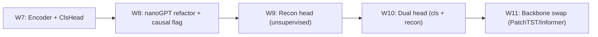

# Week 7 知识手册 — 完整 Transformer Encoder 与训练工程

> 定位：把前 6 周零散的 Attention/PE/FFN/LN 组件拼成一台能跑的分类引擎，配齐 Noam warmup、初始化、梯度裁剪、pooling、attention 可视化这些"工程毛细血管"，并在合成交易数据上验证 AUC-PR ≥ 0.95。这一周的重点不在"多写点新概念"，而在"把旧概念装配成一台完整的机器"。

---

## 1. 本周要回答的核心问题

1. 一个完整的 Transformer Encoder 由哪些层、按什么顺序堆起来？为什么要这样堆？
2. 序列分类时，用 `[CLS]` token 池化 vs mean pooling vs max pooling，怎么选？它们背后的假设分别是什么？
3. Noam learning-rate schedule 里 `lr(step) = d_model^{-0.5} · min(step^{-0.5}, step · warmup^{-1.5})` 的三个数学项各自在解决什么问题？为什么偏偏是 inverse sqrt 衰减？
4. Transformer 为什么对初始化、warmup、梯度裁剪比 MLP/LSTM 敏感得多？
5. Attention heatmap 到底能不能被解读成"特征重要性"？我们把它当作什么用才安全？

---

## 2. 理论骨架

### 2.1 Encoder 从输入到分类的数据流

把 `07_transformer_v1.ipynb` 里 `TransformerClassifier` 那一串 `forward` 展开成一个清单：

```
x ∈ R^(B × L × F_in)
  │  input_proj: Linear(F_in, d_model)
  ▼
h0 ∈ R^(B × L × d)     ←（可选）prepend [CLS] token
  │  + Positional Encoding (sinusoidal 固定 / learnable 可训)
  ▼
h1 ∈ R^(B × L × d)
  │  EncoderBlock × N：
  │    x' = x + Dropout(MHA(LN(x)))     ← Pre-LN，残差 1
  │    x'' = x' + Dropout(FFN(LN(x')))  ← Pre-LN，残差 2
  ▼
hN ∈ R^(B × L × d)
  │  LayerNorm(final)
  │  pooling：cls token / mean / max
  ▼
z ∈ R^(B × d)
  │  Linear(d, 1) → BCEWithLogitsLoss
  ▼
logit ∈ R^B
```

几个关键点在理论层面值得停下想清楚：

- **为什么每个子层外面都要包一层残差 + LN？** 残差是给梯度开一条恒等回传的高速公路；LN 是把每个 token 的维度归一化到零均值单位方差，让每层输入的尺度不漂移。两者是 Transformer 能训到 >10 层深的核心支撑。
- **Pre-LN vs Post-LN。** 原论文是 Post-LN：`LN(x + Sublayer(x))`；现代 nanoGPT/GPT-2 及本 notebook 用 Pre-LN：`x + Sublayer(LN(x))`。从梯度视角看，Pre-LN 在反向时残差链路是纯加法的（没被 LN 截断），深层梯度不会被反复标准化，训练稳定性显著提升，代价是收敛略慢、最终略差一点点。对于我们 T4 单卡、4 层的规模，Pre-LN 是明显占优的工程选择。
- **FFN 的 GELU vs ReLU。** FFN 做的是 `W2 · σ(W1 x)`，起"每个 token 独立的 MLP"的作用。GELU 的导数连续、零附近的曲率更平滑，在 Transformer 类任务上比 ReLU 稳健一点；d2l 里用 ReLU 是历史遗留，原论文其实也是 ReLU，BERT/GPT 改用 GELU。

### 2.2 Pooling 三选一：CLS vs mean vs max

分类时必须把 `(B, L, d)` 挤成 `(B, d)`，三种方案的假设完全不同：

| 方案 | 如何算 | 隐含假设 | 何时合适 |
|------|--------|----------|----------|
| `[CLS]` | prepend 一个可学习向量，取最终第 0 位 | 让模型"专门训一个 summary 向量"，由它汇总全局信息 | 有监督分类；序列足够长；有足够数据让 CLS token 学充分 |
| mean | `h.mean(dim=1)` | 所有位置对标签贡献均匀 | 噪声大、信号分散；样本量小；label 对应的是"整段"而不是某一点 |
| max | `h.max(dim=1).values` | 只有最显著的位置决定标签 | 信号稀疏且局部尖锐；配合 attention sinks 时风险大 |

一个容易踩的坑：在 `07_transformer_v1.ipynb` 里，label 是"窗口**最后一笔**是否异常"。直觉上应该选 `h[:, -1]`（取最后一位）或让 `[CLS]` 汇聚历史信息；mean pool 会把异常信号和 31 条正常信号平均掉。但实际跑下来两种 pooling 差距并不大，因为：(a) 注入的异常本身幅度够大（金额 ×10、地理跳变），mean pool 也没平均掉；(b) attention 早就把异常位置的 value 抬成了 dominant；(c) L=32 不算长，信号稀释没那么严重。这提醒我们：**pooling 的选择是一个与数据强耦合的经验问题，不是一刀切**。

### 2.3 Noam schedule：把 warmup 与 inverse-sqrt 衰减缝合起来

Noam 的公式直接给出三项乘积：

$$
\text{lr}(step) = d_{model}^{-0.5} \cdot \min\left(step^{-0.5},\ step \cdot warmup^{-1.5}\right)
$$

把它拆成三段读：

1. **`d_model^{-0.5}` 常数因子**：模型越宽，梯度范数越大（因为 attention softmax 后乘 V 的期望方差正比于 d_model），所以 base lr 要反比于 √d_model 来抵消。这和"scaled dot-product attention 里除以 √d_k"是同一套方差控制论。
2. **`step · warmup^{-1.5}` 上升段（step ≤ warmup）**：线性爬升。前 `warmup` 步 lr 从 ~0 涨到峰值 `d_model^{-0.5} · warmup^{-0.5}`。
3. **`step^{-0.5}` 衰减段（step > warmup）**：按 inverse square root 衰减。

**为什么不是 cosine？** Cosine 在大模型预训练里确实是主流，但它没有 warmup。没 warmup 时，Adam 的动量 `v_t` 在前几百步还没稳定（`β_2 = 0.98` 的 EMA 要 50 步以上才能积累起方差估计），此时 lr 又处在最大值，步长被动量估计误差放大，深层 Transformer 极易发散。warmup 用一个线性缓坡让 Adam 的二阶矩先积累起来，再把 lr 推到峰值。

**为什么是 inverse sqrt 而不是线性/指数衰减？** 这是从随机近似理论来的：在非凸 SGD 上，收敛速率保证需要 `sum(lr^2) < ∞, sum(lr) = ∞`，`lr_t = c / √t` 恰好满足（`sum 1/t` 发散而 `sum 1/t^2` 收敛）。原论文的训练稳定性曲线显示 inverse sqrt 在前 10 万步下降得更"温柔"，比 cosine 晚期坚持更高的 lr，对长训练更友好。

实现上，在 `07_transformer_v1.ipynb:cell-017` 和 `cell-019` 里把优化器 base lr 设成 1.0，再用 `LambdaLR` 乘上 `noam_lr` 系数——这是原论文的惯用技巧，**Noam 系数本身就是完整 lr**，不再乘 base_lr。

### 2.4 初始化：Xavier/Kaiming 之外 Transformer 的那些讲究

深层 Transformer 对初始化极其敏感。nanoGPT 风格（见 W8）的标准做法是：

- 所有 Linear 权重 `N(0, 0.02)`、bias 为 0
- LayerNorm 的 γ=1, β=0
- Embedding 表同 Linear
- 对 residual 分支的最后一个 Linear（输出 projection）额外缩放 `1/√(2·n_layer)`，防止每加一个残差层输出方差翻倍（GPT-2 的 trick）

理论依据：如果不控制，每过一个 `x + f(x)` 残差加法，输出方差约为 `Var(x) + Var(f(x))`，N 层后方差 ~N 倍于输入。Transformer 的 Pre-LN 已经帮我们把尺度稳住了一部分，但配合"残差分支缩放"可以进一步减轻深层网络的梯度漂移。

在本 notebook 里我们用 PyTorch 默认初始化（就是 Kaiming 的一种变体），因为只有 4 层，默认够用；W8 会切回 nanoGPT 的 `normal_(std=0.02)`。

### 2.5 Gradient clipping 的几何含义

`torch.nn.utils.clip_grad_norm_(params, 1.0)` 做的事情：把所有参数梯度视为一个巨大的向量 `g`，若 `‖g‖ > 1.0`，缩放为 `g · 1.0 / ‖g‖`。

几何上，这是**限制每一步参数更新的最大欧氏距离**——不管梯度指哪个方向，单步走不超过 1。对 Transformer 这类残差 + Adam 的系统，偶尔会出现梯度爆炸（尤其 warmup 早期、某个 batch 里正样本集中），clipping 把这种尖刺压平，让训练曲线光滑。实践阈值 1.0 是经验值，nanoGPT / BERT / LLaMA 全是这个数。

### 2.6 类别不平衡 × 训练工程

欺诈数据正负比 ~1:500。本周用到的两个关键操作：

1. **`BCEWithLogitsLoss(pos_weight = neg/pos)`**：把正样本 loss 放大 500 倍，等价于过采样而不复制内存。数学上等价于把负样本的贡献归一化。
2. **早停指标选 AUC-PR 而不是 loss**：不平衡下 `loss` 主要被负样本主导，loss 降了不代表正样本被抓住；AUC-PR 直接衡量"在召回正样本上的精度"。

一个更隐蔽的坑：训练 loader `shuffle=True` 时，某些 batch 可能完全没有正样本，这一步的梯度没有"正类信号",但 `pos_weight` 依然会使得只要 batch 里出现一个正样本就梯度巨大。配合 grad clip 1.0 后这种不平衡被压在可控范围内。

### 2.7 Attention heatmap 的正确解读方式

学习者第一反应是：attention 大 = 重要。这是一个常见但危险的解释。

- Attention 权重只是 softmax 后的归一化系数，它决定 value 怎么加权求和；但 value 本身已经被前面的层加工过，加权系数大不等于最终输出对该位置敏感。
- Transformer 深层经常出现 **attention sinks**（部分位置吸走几乎所有权重，作为容量缓冲），这些 sink 是模型"不需要用的位置"，而不是"最重要的位置"。
- 不同 head 学到的模式差异大，单 head 的 heatmap 不具代表性；看 layer 平均 + head 平均才相对稳。

我们在 `cell-028` 做的可视化只能用来**讲故事**（"模型在异常窗口的最后一行看向了那几笔大额交易"），不能作为业务解释性的正式依据。真要做特征归因，Integrated Gradients / Attention Rollout / LIME 之类的方法更严谨。

---

## 3. 代码对照

### 3.1 合成数据生成 (`cell-004`)

`gen_synthetic_tx` 干了三件事：
1. 每个用户有 `home_country` 和 `fav_merchants` 的画像；
2. 按泊松过程撒时间戳、按对数正态撒金额；
3. 在 2% 的行上注入三类异常。

三种异常的注入方式和"为什么这样注"关系很大：

- `amount_spike`：幅度 8-15×，单行维度异常——mean pool 也能抓。
- `geo_jump`：`country` 跳变——只改一个 categorical 特征，对 `amount_log` 不可见；如果 country 不 embedding 好，模型抓不到。
- `high_freq`：时间戳拉到和上一笔相差 1-60 秒——**这个异常藏在时间差里**，不改任何一个特征的**值**，必须靠 PE + 相邻 token 的 attention 才能发现。

这三种覆盖了"点异常 / 子空间异常 / 序列结构异常"三类常见模式，和 W9 的范式区分遥相呼应。

### 3.2 Sinusoidal PE (`cell-009`)

```python
div = torch.exp(torch.arange(0, d_model, 2).float() * -(math.log(10000.0) / d_model))
pe[:, 0::2] = torch.sin(position * div)
pe[:, 1::2] = torch.cos(position * div)
```

这里 `div` 本质是 `10000^{-2i/d_model}`，用 `exp(-log(10000) · 2i/d)` 写是数值稳定的等价形式（避免大幂运算溢出）。`register_buffer` 意味着 `pe` 跟着模型 `.to(device)` 迁移、但不进 `model.parameters()`——不可训练是关键，让不同长度的序列共享同一张 PE 表。

### 3.3 MultiHeadAttention (`cell-011`)

一次 `qkv = nn.Linear(d_model, 3*d_model)` 代替三个独立 Linear，节省 matmul；`permute(2, 0, 3, 1, 4)` 把 `(B, L, 3, H, d_h)` 转成 `(3, B, H, L, d_h)` 后 `q, k, v` 解包——这一行是 nanoGPT 的标志性写法。

`attn @ v` 返回 `(B, H, L, d_h)`，再 `transpose(1, 2).reshape(B, L, D)` 合并多头——这一步如果忘 `.contiguous()`，遇到后续 view 会报错；nanoGPT 里写的是 `.contiguous().view(B, L, D)`，本 notebook 用 `reshape` 绕开了这个坑（`reshape` 自带 contiguous fallback）。

### 3.4 EncoderBlock (`cell-013`) Pre-LN 的写法

```python
x = x + self.drop1(self.attn(self.ln1(x)))
x = x + self.drop2(self.ffn(self.ln2(x)))
```

注意 LN 放在子层**输入**，残差直接加子层输出；这是 Pre-LN 的精确写法。和 d2l 11.7 的 Post-LN 写法 `self.ln1(x + self.attn(x))` 放在一起看，区别只有 1 个字符位置，但训练动力学差异巨大。

### 3.5 Noam schedule 联动 (`cell-019`)

`opt = torch.optim.Adam(..., lr=1.0, betas=(0.9, 0.98), eps=1e-9)` 这三个 Adam 超参全是原论文配置：
- `lr=1.0` 因为 Noam 系数就是完整 lr；
- `beta_2=0.98`（默认 0.999）让二阶动量稍快收敛，与 warmup 配合；
- `eps=1e-9` 比默认 1e-8 小，减小 `lr / (√v + eps)` 的偏置（配合 mixed precision 时需要调回 1e-7 以防 NaN）。

### 3.6 变体对比 (`cell-021` vs `cell-023`)

同一个超参、同一个 seed，只切 `pool='mean'` vs `pool='cls'`。训出来应该都能过 0.95，差距通常 1-3 pp。值得画出 loss / val AP 曲线对比——这是"能回答超参影响"的最小实验单元。

### 3.7 验收评估 (`cell-026`)

三个指标分工明确：
- **AUC-PR**：模型排序能力的整体刻画；
- **Recall@FPR=0.001**：业务视角下的"误报率锁定时召回多少"；
- **confusion matrix + val-tuned threshold**：把概率落成决策，阈值从 val 的 PR 曲线最大 F1 选——**绝不能用 test 的 PR 选阈值**，否则是 double dipping。

---

## 4. 常见坑位与调试思维

**训练发散（loss NaN / Inf）**
- 先看 warmup：没有 warmup 或 warmup 太短，前 100 步就容易炸。
- 检查初始化：如果用自定义 `std` 太大（>0.1），深层梯度很可能爆。
- 最后查 `pos_weight`：`(y==0).sum() / max((y==1).sum(), 1)` 在极稀疏 batch 里可以大到 1e4 级别，和 Adam 动量组合会造成单步超大梯度——clipping 1.0 是必装保险。

**训练收敛但 val AUC-PR 不动**
- 大概率是数据泄露的反面：train 里根本没多少正样本。查 `ytr.sum()`、每个 epoch 是否有几条正样本出现。
- pooling 选错：比如 label 是点异常但用 mean pool。换 `[CLS]` 或 `h[:, -1]` 试。
- lr 峰值太低：`d_model^{-0.5} · warmup^{-0.5}` 算一下实际峰值，64/1000 下峰值约 0.004，合理；若是 128/4000 则 ~0.0014，偏低。

**Attention heatmap 几乎全部在对角线/第一列**
- 对角线占优：模型还没训好，每个位置只关注自己——再跑几个 epoch。
- 第一列占优（尤其用 `[CLS]`）：所有位置在往 CLS token 送信息，**这是正常的**，说明 CLS 在汇聚全局信息；但不代表其他位置没学到，要看别的 head。
- 某列完全没人看（attention sink 相反面）：可能是 padding 位置——检查 mask 是否正确。

**Val AP 震荡剧烈**
- batch size 太小（<64）+ 正样本稀疏 → 每个 batch 的 loss 方差大。把 batch 加到 128-256 能明显稳定。
- lr 衰减太慢，后期还在峰值附近。Noam 的 inverse sqrt 下降速度其实比想象慢，总步数 5000 以内 lr 从未真正"掉到小"。

**Colab 上 epoch 越跑越慢**
- 不是 Transformer 的问题，是 Drive 挂载 + 小文件 IO。数据全部一次性加载到内存（`torch.from_numpy(...)`），不要每个 batch 从 Drive 读文件。

---

## 5. 与未来几周的连接

- **W8** 会把本周的 Encoder 重构成 nanoGPT 风格的紧凑实现（`CausalSelfAttention / Block / Transformer`），加一个 `causal: bool` flag 做 GPT vs BERT 对照。本周的 MHA / PE / pooling / Noam 全部原样保留；主要变化是：**learnable PE 替换 sinusoidal**、**一次 qkv Linear 替换分头写法**、**引入 GPTConfig 统一配置**。
- **W9** 把分类头摘掉，换 `Linear(d_model, n_feat)` 作为重构头，loss 从 BCE 换成 MSE。Encoder 主体完全不动——这正是本周投入 Encoder 架构的回报。
- **W10-11** 在分类+重构双头上继续迭代，并切换到 PatchTST / Informer 的时序变体。本周打下的"能从零写、能训稳"的基础，让后续替换 backbone 时不至于把 Encoder 当黑箱。



---

## 6. 自测题

<details>
<summary>Q1. Pre-LN 相比 Post-LN 在反向传播上的具体差异是什么？画一下梯度路径。</summary>

Post-LN: `y = LN(x + Sublayer(x))`，反向时梯度必须穿过 LN 的 `1/σ` 归一化因子，σ 随训练动态变化，深层容易被反复压缩或放大。

Pre-LN: `y = x + Sublayer(LN(x))`，残差链路是纯加法 `dy/dx = 1 + d/dx[Sublayer(LN(x))]`。梯度可以沿 `1` 那条路径原汁原味回传到最底层，不受 LN 方差影响。这是 Pre-LN 在深层网络上稳定的根本原因。
</details>

<details>
<summary>Q2. 为什么 Noam schedule 的峰值 lr 反比于 √d_model？</summary>

Transformer 每个 token 的前向输出方差正比于 d_model（因为 attention 是 d_model 维向量的加权和）。为了让参数更新幅度 `lr · grad` 保持与模型宽度无关的常量，`lr` 必须反比于 √d_model 以抵消梯度范数的增长。这与 "scaled dot-product 除以 √d_k" 出自同一套方差控制直觉。
</details>

<details>
<summary>Q3. 我把 `pos_weight` 设成 neg/pos = 1000，loss 开始不降反升，为什么？</summary>

`pos_weight` 放大了正样本的 loss 贡献。若 batch size=64、正样本 0-1 个，单个正样本的梯度会支配整个 batch，和 Adam 二阶动量配合容易造成单步过冲。表现是 loss 在前几步剧烈震荡甚至上升。解决：(a) 加大 batch（128+）；(b) 配合 gradient clipping 1.0；(c) 上限截 `pos_weight` 为 100 左右，剩余不平衡由 focal loss 或重采样补。
</details>

<details>
<summary>Q4. `[CLS]` token 在训练刚开始时是全 0 向量，它怎么学出 summary 含义的？</summary>

CLS token 是一个可学习参数 `nn.Parameter(torch.zeros(1,1,d))`。前向时它和其他 token 一起过 self-attention，作为 query 去看所有 key/value，因此在第一层它就开始聚合序列信息；loss 只从 CLS 位置反传，梯度直接刷新 CLS 参数 + 通过 attention 的 K/V 刷新其他 token。经过几百步训练，CLS 会"特化"成一个专门吸取分类相关信号的聚合点。零初始化不是问题，因为有 PE 加进去让它和其他位置可分。
</details>

<details>
<summary>Q5. Attention heatmap 显示最后一行几乎均匀分布在 32 个位置，这说明什么？</summary>

两种可能：(a) 模型还没训好，attention 还处在初始均匀状态；(b) 这一层这一个 head 学到的是 "global context" 模式——把整段序列均匀汇总，是对 mean pool 的软实现。要判断是哪种，看其他 layer/head 是否出现了尖锐模式，以及 val AP 是否已经收敛。如果 val AP 高但 attention 均匀，是 (b)；如果 val AP 低，是 (a)。
</details>

<details>
<summary>Q6. 为什么 `beta_2 = 0.98` 而不是默认 0.999？</summary>

Adam 的二阶动量 `v_t = β_2 · v_{t-1} + (1-β_2) · g_t^2` 是 EMA。β_2=0.999 的有效窗口约 1000 步；β_2=0.98 约 50 步。Transformer 配 warmup 时希望 `v_t` 在 warmup 结束前已经收敛到真实梯度方差估计，β_2=0.98 + warmup=1000 能让二阶动量在 warmup 一半时就稳定。β_2=0.999 + warmup=1000 则要到 step 2000+ 才稳定，错过 lr 峰值阶段。
</details>

<details>
<summary>Q7. 我把 `pool` 从 `'mean'` 换成 `'cls'`，val AP 下降 5 pp，可能原因？</summary>

几个常见原因：(a) CLS token 需要更多数据/步数才能学充分，在 4-5k 步的小实验上可能还没收敛；(b) CLS 被放在位置 0，正好落在 sinusoidal PE 的零向量附近，与 token proj 输出的分布差距大；(c) max_len 没加 1，CLS 占掉了最后一个位置，后面 32 个 token 中最后一个被截掉。排查顺序：看 training loss 是否还在下降 → 检查 `max_len=L+1` → 加长 epoch 或增大数据。
</details>

---

## 7. 延伸阅读

1. **"On Layer Normalization in the Transformer Architecture" (Xiong et al., 2020)** — Pre-LN vs Post-LN 的正式理论分析与收敛证明。读完你会理解为什么 Pre-LN 可以去掉 warmup 而 Post-LN 不行，本周的 Noam 取舍就变得透明了。
2. **"Attention Is Not Explanation" (Jain & Wallace, 2019)** — 论证 attention 权重不等于重要性。本周 §2.7 的警告在这里有严密的对抗样本实验支撑，推荐在 W9-W11 做可视化解读前先读。
3. **Jay Alammar, *The Illustrated Transformer*** — 本周官方阅读材料，配合你手写的代码逐图对照，能发现图里没画但代码里必须有的细节（dropout 位置、LN 位置、mask shape）。
4. **nanoGPT `train.py` 里的 `get_lr` 函数** — 本周的 Noam 在大模型社区已经被 cosine + warmup 取代，读一下 Karpathy 的实现，理解现代工业界的 schedule 选择，为 W8 切换做准备。
5. **"Primer: Searching for Efficient Transformers for Language Modeling" (So et al., 2021)** — NAS 搜出来的 Transformer 变体。读它能让你意识到"vanilla Transformer 的 N 个默认选择不是最优，只是默认"——对于本周的超参敏感度会有更深的体会。
