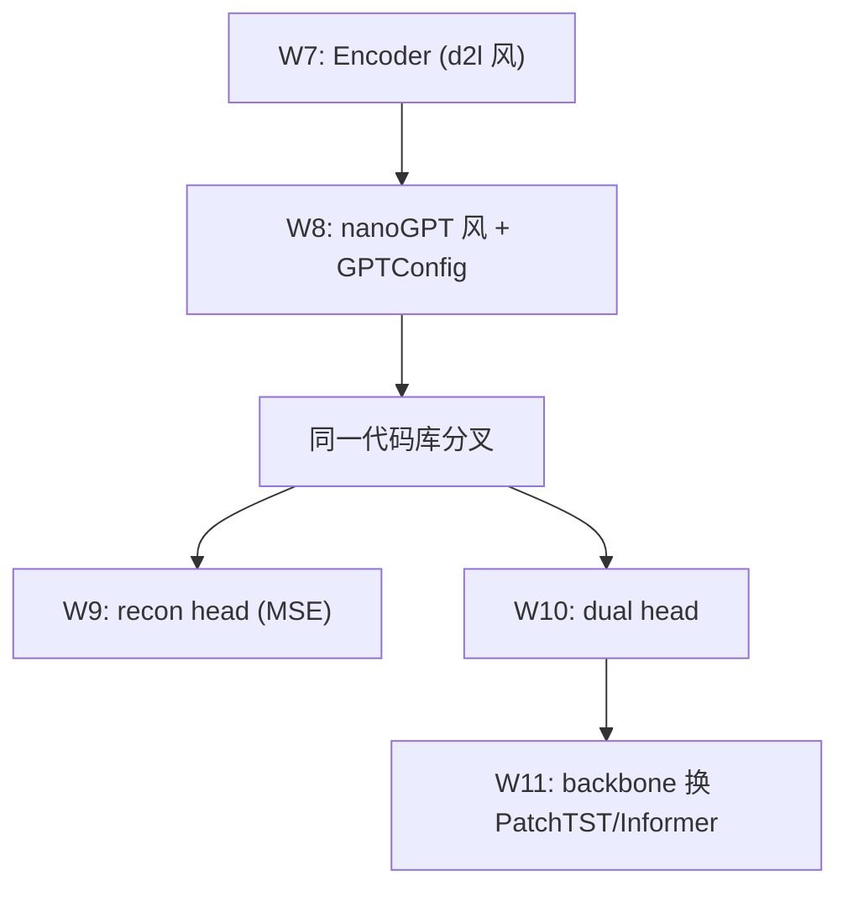

# Week 8 知识手册 — nanoGPT 风格紧凑实现、双向 vs 因果、真实数据的时间切分

> 定位：把 W7 的 Encoder 重构成 Karpathy nanoGPT 风格（<150 行）、引入 `causal: bool` flag 做 GPT/BERT 架构对照、第一次上真实 Kaggle 数据并认真处理"没有 userId + 时间切分"这两个工程化的硬骨头。本周理论增量有限，工程打磨比重最大——很多坑要到真实数据上才会暴露。

---

## 1. 本周要回答的核心问题

1. nanoGPT 的紧凑设计哲学（GPTConfig / CausalSelfAttention / Block）和 W7 的分层写法比，得失在哪？
2. Causal mask 在代码上只是下三角 `tril` + `masked_fill(-inf)` 两行，但它改变了"每个位置看到什么"——为什么 GPT 训练必须因果、为什么异常检测通常不要因果？
3. Encoder-only (BERT) / Decoder-only (GPT) / Encoder-Decoder (T5) 三种架构的边界是什么？在异常检测里我们到底要哪个？
4. Kaggle 信用卡欺诈数据没有 userId，伪用户 ID 的 hash 方法有什么代价？同一个真实用户被打散到不同伪桶后模型会学到什么、学不到什么？
5. 时间切分 vs 随机切分的 AUC-PR 差距为什么动辄 20 pp？背后是什么机制？
6. Learnable PE vs Sinusoidal 的外推性取舍是什么？

---

## 2. 理论骨架

### 2.1 nanoGPT 的设计哲学

把 `08_transformer_kaggle.ipynb:cell-007` 里的 150 行 Transformer 和 W7 的分层实现放一起看，可以提炼出 nanoGPT 的几条设计原则：

1. **GPTConfig 统一配置**：一个 dataclass-like 对象持有所有超参，所有子模块只接收 `cfg` 而不是散装参数。好处：超参变更有一个入口，训练 vs 评估 vs 导出都读同一份 cfg；坏处：子模块与 `cfg` 的耦合让单元测试稍难。
2. **一次 qkv Linear**：`self.qkv = nn.Linear(d, 3*d)` 把 Q/K/V 三个矩阵乘并成一次，节省 Linear 的开销和显存；后面 `reshape(B, L, 3, H, d_h).permute(2, 0, 3, 1, 4)` 把它拆回三个张量。这个写法被全行业（HuggingFace、LLaMA、Mistral）继承。
3. **Block 作为"LN-MHA-LN-MLP 带残差"的最小单元**：所有变体（GPT-2, LLaMA, Qwen）都只需要换 Block 内部的几个模块（RMSNorm 替 LN、SwiGLU 替 GELU、RoPE 替 PE），外层堆叠不动。
4. **`causal: bool` 作为一等 flag**：把"要不要因果 mask"这个架构层面的决策变成一个布尔参数，而不是写两个不同的类。这样切换实验只改一行。

对比 W7 的分层写法：W7 把 `MultiHeadAttention` / `FeedForward` / `EncoderBlock` / `TransformerClassifier` 写成独立类，学习者第一次看更清晰；nanoGPT 把它压缩到最少的概念数，读起来要求对 Transformer 的心智模型已经稳固——所以课程设计上先 W7 再 W8 是合理的。

### 2.2 Causal Mask：softmax 之前加 -∞

数学上，causal mask 就是给 `attn = QK^T / √d_k` 加一个下三角 0 / 上三角 -∞ 的矩阵：

$$
\text{attn}_{ij} = \frac{q_i k_j^\top}{\sqrt{d_k}} + M_{ij},\quad
M_{ij} = \begin{cases} 0 & j \le i \\ -\infty & j > i \end{cases}
$$

softmax 作用后，`exp(-∞) = 0`，所以所有"未来"位置的权重严格为 0。

代码上就是 `cell-007` 里两行：

```python
mask = torch.tril(torch.ones(bs, bs)).view(1, 1, bs, bs)
self.register_buffer('mask', mask)
...
att = att.masked_fill(self.mask[:, :, :L, :L] == 0, float('-inf'))
```

**为什么 GPT 训练时必须 causal？** 语言模型的训练目标是 `P(x_t | x_{<t})`——最大化"第 t 个 token 在前面所有 token 条件下的概率"。如果没有 causal mask，模型训练时可以直接看到 `x_t` 本身和它之后的 token，任务退化成 identity function——这叫**信息泄露**。推理时只有前面 token，没了"偷看"的机会，就会崩溃。

**为什么异常检测通常不要 causal？** 我们的任务是"整段序列是否异常"——序列所有 token 都是已经观测到的历史事件，没有"未来"需要保护。双向 attention 让每个位置都能看整窗，等价于跑了 L 个并行的 encoder query，聚合出来的 representation 更 robust。`cell-027` 的 `causal=True` 对照实验会看到 val AUC-PR 明显下降（典型 5-15 pp），就是因为每个 query 位置的"可见上下文"被砍掉了一半。

一个反例提醒：如果任务是"预测**下一笔**是否异常"（即 next-step anomaly detection），causal 就回到正确方向——这正是本 notebook `cell-028` 的脚注提到的"把 label 改成预测下一步"的场景，也是 W9 无监督预测范式的起点。

### 2.3 三种架构：Encoder-only / Decoder-only / Encoder-Decoder

| 架构 | 代表 | 数据流 | 典型任务 |
|------|------|--------|----------|
| Encoder-only | BERT, RoBERTa | 输入整段 → 双向 attention → 表征 | 分类、NER、检索、本周异常检测 |
| Decoder-only | GPT, LLaMA | 输入 prefix → causal attention → next token | 生成、对话、推理 |
| Encoder-Decoder | T5, BART, 原 Transformer | encoder 双向编码 source → decoder causal + cross-attn 生成 target | 翻译、summarization |

本周用的是 Encoder-only（`causal=False`），但实现上是从 Decoder-only 骨架（nanoGPT）改来的——这说明**架构的本质差异只在 mask 和 cross-attention**，其他组件通用。Karpathy 视频里强调的正是这一点：学会一个 Transformer，其他两个只是 mask 变化。

对异常检测，Encoder-only 是默认选择的原因：
- 序列全可见，不需要 causal；
- 不需要 decoder 做生成；
- 分类/重构头接在 encoder 输出即可；
- 训练/推理都并行，延迟最低。

只有在"预测下一步是否异常"或"给定部分序列生成后续正常序列对比"这类生成式场景才需要 Decoder-only。

### 2.4 双向优于因果：对异常检测的直觉与机制

直觉上：异常的判定依赖于**前后上下文**。一笔 $10 的咖啡消费单看不异常，但若它出现在"一小时前刚在纽约刷了 $5000 珠宝"之后紧跟"5 分钟前在上海加油"，这笔咖啡可能是盗刷测试。双向 attention 让第 i 笔能同时看第 i-k 和第 i+k 笔，发现这种"异常模式夹在正常事件之间"。

机制上，把 `cell-018`（bidir）和 `cell-027`（causal）的最终 representation 比较：
- bidir 里每个位置的 representation 等价于对**整窗 32 笔**做 attention 加权；
- causal 里位置 i 只能看 `0..i`，位置 0 相当于"只看自己"，位置 31 相当于"看整窗"；平均下来每个位置的"可见信息量"是 `(1+2+...+L)/L = (L+1)/2 ≈ 16.5`，约 bidir 的一半。
- 最终 mean pool 聚合时，bidir 的 32 个向量都是"完整视角"；causal 的 32 个向量是"部分视角"的累进。

这也解释了为什么 GPT 即使在分类任务上能工作（它可以在最后一个 token 上看整窗），但在 token-level 的分类（NER、token classification）上被 BERT 类稳压。

### 2.5 伪用户 ID 的 hash 方法及其局限

Kaggle 信用卡欺诈数据没有 userId，只有 `Time`（秒）和 `V1..V28, Amount`（PCA 脱敏）。`cell-010` 用了：

```python
user_id = (amount_bucket * 131 + hour_bucket * 7) % 256
```

其中 `amount_bucket = qcut(Amount, q=16)`、`hour_bucket = Time // 3600`。这个 hash 的假设是：**金额量级相近 + 时间相近** 的交易，更可能来自同一个用户或同一类行为模式。

代价清单：

1. **同一真实用户会被打散**：一个用户今天买咖啡（低金额）、明天买电器（高金额），会被分到不同伪用户桶。跨金额的行为模式（如"该用户平时都是小额，突然一笔大额"）模型学不到。
2. **不同真实用户可能被合并**：两个陌生人刚好在同一小时做了同金额的交易，会被视为同一伪用户。这引入"其他用户的正常行为"当作这个伪用户的历史，稀释真实信号。
3. **Bucket 边界噪声**：`amount_bucket` 的分位数切分在边界上敏感，$49.99 和 $50.01 可能被分到不同桶。
4. **对欺诈的系统性偏差**：欺诈倾向于大额单次刷卡，集中在高金额桶；这使得高金额伪用户里欺诈率不成比例高，模型可能学到"高金额桶 = 风险"这一捷径（shortcut learning），泛化差。

**为什么还要做？** 因为 Transformer 需要序列结构，而 Kaggle 数据是独立同分布的 (tx, label) 对，没有序列就用不了。这是一个"已知有偏但不得不做"的工程妥协。对比方案：
- 按 `Time` 全局排序做滑窗（所有交易共享一个"全局用户"）——会把完全不相关的人混进同一窗口；
- 只用单笔特征不做序列建模（退回 MLP baseline）——丢掉 Transformer 的核心优势；
- 用 IEEE-CIS Fraud 数据（W10 会切到它，自带真实用户分组）——更真实但更大更慢。

W8 的选择是"小代价换上手速度"，W10 会切换到真实用户分组的数据集对比。

### 2.6 时间切分的必要性：为什么随机切会虚高 20 pp

假设我们用随机切分（`sklearn.model_selection.train_test_split`），同一天的一笔交易可能在 train、相邻的一笔在 val。问题在哪？

- **时间自相关**：相邻交易往往有共享的隐藏变量（同一商户的系统故障、同一时段的促销、同一周末的消费高峰）。模型在 train 里见过"这个时段这个商户的特征模式"，到 val 里遇到同一时段的交易，直接命中——这不是真本事。
- **Label leakage**：欺诈经常成簇发生（一批被盗卡信息被集中使用），随机切把簇内样本分散到 train/val，模型在 train 里见过这个簇的模式，val 里碰到"同簇他例"直接识别。
- **生产场景不符**：上线后模型面对的永远是**未来的** 交易，分布可能已经漂移。随机切模拟不了这个约束。

实证上：Kaggle 信用卡欺诈数据用随机切，LSTM/Transformer 的 val AUC-PR 常常跑到 0.90+；切成时间切分（前 70% train、中 15% val、后 15% test）后，同一模型 val AUC-PR 掉到 0.70-0.85。差距 15-25 pp——全是"靠时间泄露刷上去的"虚假增益。

`cell-010-012` 的做法：
1. 按 `Time` 整体排序；
2. 计算 `T70 = quantile(Time, 0.70)` 和 `T85 = quantile(Time, 0.85)` 两条边界；
3. 滑窗构造序列，用**窗口末尾时间** `t_end` 决定它属于哪一份；
4. 标准化 `scaler.fit` 只在 train 上做，再 transform 到 val/test——**绝不要 `fit` 整份数据**，否则 val/test 的统计信息泄露到 train 的 normalization 里。

一个隐蔽的边界问题：val 窗口的 `t_end > T70` 但它的 `t_start = t_end - 31*stride` 可能 < T70，即窗口**内部的前几十笔** 处在 train 时段。这严格意义上不算 future-to-past 泄露，因为这些历史交易是 val 样本合法的已知上下文。但如果 stride 很小、窗口很长，有必要进一步加 gap 缓冲带（例如 `T70 + buffer`）。本 notebook 没加 buffer，因为 stride=1 + L=32，边界影响很小。

### 2.7 Learnable PE vs Sinusoidal：外推性的代价

`cell-007` 用了 learnable PE：`self.pos_emb = nn.Parameter(torch.zeros(1, block_size, d_model))`。

与 W7 的 sinusoidal 相比：

| 维度 | Sinusoidal | Learnable |
|------|-----------|-----------|
| 参数量 | 0（固定 lookup） | `block_size * d_model` |
| 外推到更长序列 | 可以（公式定义，任意位置可算） | **不行**（训练见过的 `block_size` 之外全是零或随机） |
| 表达力 | 固定的相对位置正弦基函数 | 任意形状，能学数据特定的位置模式 |
| 训练成本 | 无需学 | 需要 warmup 步数让 PE 收敛 |
| 典型用例 | 原论文、Reformer、Longformer | BERT、GPT-2、nanoGPT |

nanoGPT 选 learnable 是因为"反正我的 `block_size` 固定（GPT-2 是 1024, GPT-3 是 2048），训练见过的长度就够推理用"。但这个假设在**长文档外推** 和**变长序列** 场景下崩塌。

对我们的异常检测：
- L=32 固定，learnable PE 没问题；
- 但如果未来要支持变长窗口（每个用户历史长度不一），要么 pad 到 max + attention mask、要么切回 sinusoidal、要么换 RoPE。
- 长尾外推在异常检测不常见，除非你要在一个 L=256 的 session 上推理一个 L=32 训练的模型——这时 learnable PE 会失败。

RoPE（Rotary Position Embedding，LLaMA 之后的主流）是两者的折中：用旋转矩阵编码相对位置，既可学（通过可学的频率）又能外推——W11-12 可以作为进阶阅读。

---

## 3. 代码对照

### 3.1 `GPTConfig` (`cell-007`) 的设计

```python
class GPTConfig:
    def __init__(self, n_feat, d_model=96, n_head=4, n_layer=4, d_ff=192,
                 dropout=0.1, block_size=33, causal=False, pool='mean'):
        ...
```

`block_size=33` 是 `L=32 + 1 CLS`，这是未来若切 `pool='cls'` 需要的长度。`d_model=96 / n_head=4 / d_ff=192` 和 W7 的 `64/4/128` 差异来自"真实数据更难，稍微放大容量"，这是经验调参。

### 3.2 `CausalSelfAttention.forward` (`cell-007`) 的单次 qkv 拆解

```python
qkv = self.qkv(x).reshape(B, L, 3, H, D // H).permute(2, 0, 3, 1, 4)
q, k, v = qkv[0], qkv[1], qkv[2]  # (B, H, L, dh)
```

`permute(2, 0, 3, 1, 4)` 的目的：把第 2 维（3 = q/k/v）移到最前，让 `qkv[0]` 切出 q。维度顺序背后是 `matmul` 要求的 `(*, L, dh)` 排列，以及多头的 `H` 维要在 batch 后面以便 batched matmul。

### 3.3 `Block.forward` (`cell-007`) 的 Pre-LN

```python
x = x + self.attn(self.ln1(x))
x = x + self.mlp(self.ln2(x))
```

注意这里没有 attn/mlp 内部的 dropout 和外层的 `drop1/drop2` 两层——`CausalSelfAttention` 内部已经有 `attn_drop` 和 `resid_drop`；MLP 内部的 `nn.Dropout(cfg.dropout)` 也作为最后一层。这是 nanoGPT 的简化：把 dropout 全部下沉到子模块内部，外层 Block 只做残差加法。W7 的 `EncoderBlock` 外层还有一层 dropout——两种写法都行，nanoGPT 更精简。

### 3.4 `Transformer._init_weights` (`cell-007`)

```python
if isinstance(m, nn.Linear):
    nn.init.normal_(m.weight, std=0.02)
    if m.bias is not None: nn.init.zeros_(m.bias)
elif isinstance(m, nn.LayerNorm):
    nn.init.ones_(m.weight); nn.init.zeros_(m.bias)
```

`std=0.02` 是 GPT-2 和 BERT 的约定。PyTorch 默认 Linear 初始化是 Kaiming uniform，在深层 Transformer 上方差偏大容易发散。切到 0.02 让初期 activation 方差更小，warmup 期更稳。

### 3.5 伪用户 ID 构造 (`cell-010`)

```python
amount_bucket = pd.qcut(df_sorted['Amount'], q=16, labels=False, duplicates='drop')
hour_bucket = (df_sorted['Time'] // 3600).astype(int)
df_sorted['user_id'] = (amount_bucket * 131 + hour_bucket * 7) % 256
```

`131` 和 `7` 是互质奇数，降低 `% 256` 后的冲突；`q=16` 让金额桶粒度适中（再细会让边界噪声更严重，再粗会让同桶内差异过大）。256 个桶是平衡"每桶至少有 L=32 条记录" 和"桶不能太少以免所有人都挤在一起"。这是一个经验值，在更大数据集上可以调。

### 3.6 时间切分 + 标准化 (`cell-010-012`)

```python
T70 = df_sorted['Time'].quantile(0.70)
T85 = df_sorted['Time'].quantile(0.85)

train_mask = df_sorted['Time'] <= T70
scaler = StandardScaler().fit(df_sorted.loc[train_mask, feat_cols].values)
feats_all = scaler.transform(df_sorted[feat_cols].values).astype(np.float32)
```

关键在 `fit` 只用 train_mask 的切片，`transform` 应用到全量——这保证 val/test 的均值/方差统计不会泄露回 train 的 normalization 过程。如果写成 `StandardScaler().fit_transform(df_sorted[feat_cols])`，就是全量 fit，val/test 的极端值会影响 train 的 scale，构成轻度泄露。

### 3.7 `causal=True` 对照 (`cell-027`)

```python
cfg_causal = GPTConfig(..., causal=True, pool='mean')
```

只改一个 flag，其他全复用。这是 nanoGPT 设计哲学的直接回报——你能干净地做对照实验而不担心"别的地方也不小心变了"。典型结果：`ap_main - ap_causal` 在 5-15 pp 之间，取决于数据集难度。

### 3.8 Checkpoint 保存 (`cell-030`)

```python
torch.save({
    'state_dict': model_main.state_dict(),
    'cfg': vars(cfg_main),
    ...
    'scaler_mean': scaler.mean_.tolist(),
    'scaler_scale': scaler.scale_.tolist(),
    'time_boundaries': {'T70': float(T70), 'T85': float(T85)},
}, ckpt_path)
```

**保存 scaler 参数和 time boundaries** 是工程化的关键：W9 要在同样的切分/标准化下加载这个模型做重构实验，如果只保存 `state_dict` 却不保存 scaler，下周再标准化会得到不同的数值分布，模型表现崩塌。`vars(cfg)` 存成 dict 是因为 GPTConfig 不是 dataclass——换 `dataclasses.asdict` 会更优雅。

---

## 4. 常见坑位与调试思维

**Transformer 不如 MLP**
- 很可能是 Transformer 根本没学会：检查 val loss 是否下降、train loss 是否合理（BCE 在不平衡下应该快速下到 0.1 以下）。
- 序列构造有问题：`build_windows` 里 `groupby('user_id')` 之后没再按时间排序，窗口内顺序乱掉——先在函数内加 `.sort_values('Time')`。
- `feats_all[window]` 的 `window` 是原始 DataFrame 的 index，如果 `df_sorted` 的 index 没 reset，这里会取错。`reset_index(drop=True)` 是必须的。

**train 看起来在学，val AUC-PR 很差**
- 时间切分做错：检查 `t_end` 是用窗口末尾还是开头；如果是开头，val 窗口的末尾可能在 test 时段。
- `pseudo_user_id` 在 train/val 分布不同：某些 `user_id` 只在某个时段出现。这个在伪 ID 下难避免，属于可接受噪声。
- Class imbalance 在 val 集上比 train 大得多：时间切分后后段欺诈率可能显著变化（欺诈模式有季节性），这时 val AUC-PR 低不一定是模型问题。

**Attention heatmap 最后一行全部落在 `[CLS]` 位置（位置 0）**
- 这是正常的——所有 query 都在往 CLS 送信息。要看非 CLS 位置的 attention，必须挑别的 query（如最后一行 `attn[:, :, -1, 1:]` 排除 CLS）。
- 用 mean pool 时不会有这个 pattern，因为没有 CLS。

**`causal=True` 比 `causal=False` 只差 1-2 pp，不像理论说的差那么多**
- 可能 label 太稀疏，几乎所有异常都在窗口末尾，causal 的"最后一行能看整窗"本来就够用。
- 检查 L 是否足够长：L=8 时 causal 和 bidir 的差距被压缩（能看的 history 本来就少）；L=64 差距会放大。
- 池化方式：`pool='mean'` 下 bidir 的优势更明显；`pool='cls'` 下 `[CLS]` 放在开头（causal 只看自己）反而表现最差。

**Colab T4 上 epoch 跑 > 5 分钟**
- batch_size 太小（<128），GPU 利用率低；加到 256。
- `DataLoader(num_workers=0)` 是 Colab 默认，加到 2-4 能并行 IO。
- 数据在 Drive 里每次重读：把 `X, y` 存成 `.pt` 文件或直接放内存，不要反复 `pd.read_csv`。

**保存的 checkpoint 在 W9 加载失败**
- `vars(cfg)` 保存的是 dict，`W9` 加载要重新构造 GPTConfig：`GPTConfig(**ckpt['cfg'])`，不要直接传 dict 给 Transformer。
- PyTorch 版本差异：`state_dict` 键名在 nn.Module 重构时改变，建议保存时同时记下代码版本或 git commit。

---

## 5. 与未来几周的连接

- **W9** 把这个 Transformer 骨架改成重构式——`self.head = nn.Linear(d, 1)` 换成 `nn.Linear(d, n_feat)`，loss 从 BCE 换 MSE，pooling 拿掉（每个 timestep 都要输出）。其他 Block/Attention 全部复用。本周保存的 checkpoint 可以作为 W9 有监督初始化的起点。
- **W10** 把分类头和重构头**并联**，共享 Encoder：`logit = cls_head(pool(h))`、`recon = recon_head(h)`，loss = α·BCE + β·MSE。本周的 `causal=False` 结论会直接继承。
- **W11** 把 Block 替换成 PatchTST 的 patching 版本或 Informer 的 ProbSparse attention，外层堆叠和训练循环不变——nanoGPT 的模块化让替换变成 1-2 个类的事。



---

## 6. 自测题

<details>
<summary>Q1. GPT 训练时 causal mask 是必须的，那推理时呢？</summary>

推理时技术上不需要重新加 mask，因为每次只输入一个 token 生成下一个（autoregressive），自然只能看已有的。但实现上大多数框架在推理 forward 时也保留了 mask——因为代码是同一份 `model.forward`，mask 留着不伤害正确性；更重要的是 KV cache 场景下，mask 仍然用来控制 "当前 token 能看多少历史"。
</details>

<details>
<summary>Q2. `self.qkv = nn.Linear(d, 3*d)` 和三个独立的 Linear `self.q, self.k, self.v = nn.Linear(d,d), Linear(d,d), Linear(d,d)` 在数学上等价吗？</summary>

完全等价，因为 `nn.Linear(d, 3*d)` 的权重矩阵 `W ∈ R^{d × 3d}` 可以视为 `[W_q | W_k | W_v]` 的拼接，输出 `xW` 可以切成三份 `xW_q, xW_k, xW_v`。合并的好处是：(1) 一次 matmul 代替三次，GPU 更高效；(2) 参数存储连续，加载更快。坏处：如果未来想给 Q/K/V 不同初始化或不同 dropout，要拆开更麻烦。
</details>

<details>
<summary>Q3. 我在 Kaggle 上做随机切分，val AUC-PR = 0.92；切成时间切分后掉到 0.75。这 17 pp 差距全是"泄露"吗？</summary>

不完全。17 pp 里有三部分：(1) 时间自相关带来的 shortcut 学习（主要部分）；(2) train 和 val 的分布差异（欺诈模式有时间漂移，时间切分暴露这个 gap，随机切分平均掉了）；(3) 时间切分下 val 集比例固定，随机切分可能碰上正样本更多的 val，虚高。AUC-PR 对正样本数量敏感。真正的"虚高"通常占 10-15 pp，另外 2-5 pp 是时间切分真实反映的分布漂移，这部分不能通过模型优化消除，只能通过持续重训应对。
</details>

<details>
<summary>Q4. 伪用户 ID 把同一真实用户打散，这是否意味着我们的 Transformer 没在学"用户级行为模式"？</summary>

大致是的。我们学的是"金额-时间 bucket 内的序列模式"，更像是"同类型交易的邻域模式"。对于"这个用户平时都是 $10 消费突然 $1000"这种跨金额的真实用户模式，模型基本无法捕捉——因为 $10 和 $1000 被分到了不同伪桶。这是为什么 W10 要切到 IEEE-CIS Fraud 数据集，它有真实用户标识符（`card1..card6, addr1..addr2` 等），能做真正的用户级序列建模。
</details>

<details>
<summary>Q5. Learnable PE 在 `L=32` 训练完之后，如果我推理时传一个 `L=64` 的窗口会发生什么？</summary>

`self.pos_emb` 只在前 32 个位置有训练过的值，33-64 位置是初始化时的全零（因为 `torch.zeros` 初始化）。推理时 `h + self.pos_emb[:, :64]` 会让后 32 个位置 PE = 0，attention 在这些位置上区分不出 token 位置——严重退化。
解决：(a) 训练时用 sinusoidal PE；(b) 训练时把 block_size 预留足够大（如 128），虽然前期只用 32，让后面的 PE 也得到一些正则化（依赖 dropout/权重衰减传播梯度，效果有限）；(c) 用 RoPE 的相对位置编码，天然外推。
</details>

<details>
<summary>Q6. `cell-027` 的 `causal=True` 实验下，如果我把 pool 从 `'mean'` 换成 `'cls'`（假设 CLS 放在最后一位而不是第一位），`causal=True` 会不会反超 `causal=False`？</summary>

有可能持平或反超。原因：CLS 放在最后一位时，它是唯一能看整窗的 query（`0..L-1` 都是它的 past）；这等价于 BERT 的行为但仅对最后一个位置生效。如果所有 classification 信号都走 CLS，causal 和 bidir 在那一个位置上视野相同，差距就消失了。不过其他 31 个位置的 representation 在 causal 下还是视野受限，整体训练信号仍略弱于 bidir。这个思想实验很重要——它揭示"pooling 位置 × causal flag"是一个组合参数。
</details>

<details>
<summary>Q7. Transformer 和 MLP 在 flatten (L, F) → (L·F) 特征上对比是"公平"吗？</summary>

公平的前提是"MLP 的输入和 Transformer 的输入是同一份信息"——满足。但 MLP 没有位置概念（输入第 1 列和第 100 列同等对待，不知道它们是同一 feature 的不同 timestep），Transformer 有 PE；这个差异是 Transformer 的"结构优势"而不是"信息优势"。如果你想要更公平的对比，MLP 应该加 "position one-hot" feature，或换成 1D CNN（它也有位置归纳偏置），才不会让 Transformer 赢在"别人缺了位置信息"上。本 notebook 的对比是为了展示结构差异，不用追求绝对公平。
</details>

<details>
<summary>Q8. 为什么 `cell-027` 里 `causal=True` 只跑 10 epoch 而 `cell-018` bidir 跑 12 epoch？</summary>

大概率只是时间考虑——causal 额外做 `masked_fill`，每 step 慢一点。但注意：**对照实验的 epoch 数应该一致**，否则差距里掺入 "causal 训练不够"的噪声。严格做法是两边固定 epochs、同样 warmup、同样 early stop patience。本 notebook 是教学演示，数字有轻度偏差在可接受范围，但真要写进论文就得统一。
</details>

---

## 7. 延伸阅读

1. **Andrej Karpathy, *Let's build GPT: from scratch, in code, spelled out* (YouTube, 1h56m)** — 本周 nanoGPT 重构的"官方讲解"。看完对 `CausalSelfAttention / Block / Transformer` 三个类的每一行设计决策都会有直觉。重点 1:00-1:50。
2. **"Language Models are Few-Shot Learners" (GPT-3 paper, Brown et al., 2020)** — 不是为了看 GPT-3 本身，而是看它 Section 2.1 的模型结构描述——和本周的 nanoGPT 一模一样，证明 nanoGPT 是"工业 SOTA 的教学浓缩版"。
3. **"A Primer on Neural Network Models for Natural Language Processing" (Goldberg, 2015)** — Section 9-10 讲 RNN vs Encoder-only vs Seq2seq 的权衡，读完回头看 W8 的架构对比表会更立体。
4. **"RoFormer: Enhanced Transformer with Rotary Position Embedding" (Su et al., 2021)** — learnable PE 外推性差的经典解法。为 W11-12 做铺垫，如果你想把本周的 block 扩展到更长序列必读。
5. **Kaggle "Credit Card Fraud Detection" 公开 Top 5 notebook** — 看别人怎么处理没有 userId 的序列构造；不少 top solution 其实根本不做序列，回到 GBDT + 手工 lag feature。读完你会对"Transformer 在这个数据上到底值不值"有更务实的判断。
