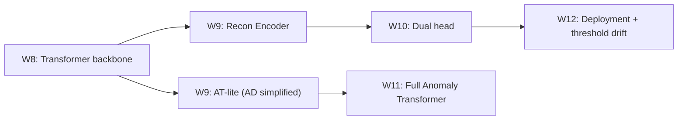

# Week 9 知识手册 — 无监督异常检测与 Anomaly Transformer

> 定位：从"有标签分类"的舒适区跨入"只有正常样本"的无监督疆域。本周要真正弄懂"无监督异常检测"这个范畴里三种基本范式（重构 / 预测 / 对比）的假设与适用场景，把 Anomaly Transformer 的核心创新（Association Discrepancy）从论文炫技的数学变成能跑通的 40 行代码，并诚实评估无监督 vs 有监督在真实 Kaggle 数据上的差距。

---

## 1. 本周要回答的核心问题

1. 无监督异常检测的三种范式——重构、预测、对比——各自假设了什么？在什么场景下它们成立，什么场景下会系统性失灵？
2. 用重构误差当异常分数有什么陷阱？为什么"重构越好 ≠ 异常检测越好"？per-timestep vs per-sequence、max vs mean 聚合怎么选？
3. Anomaly Transformer 的 Association Discrepancy 到底在衡量什么？为什么"局部先验 P vs 实际 attention S 的 KL 散度"能成为异常信号？
4. 原论文的 minimax 两阶段训练策略要解决什么问题？我们本周的 single-stage 简化版丢了什么、保留了什么？
5. 生产环境把无监督方案上线，最先踩到的坑是什么——阈值、污染、解释性的取舍？

---

## 2. 理论骨架

### 2.1 三种范式：假设、损失、分数

| 范式 | 核心假设 | 训练数据 | Loss | 异常分数 | 代表方法 |
|------|----------|----------|------|----------|----------|
| 重构 | 正常样本能被"压缩-还原"；异常偏离"正常流形" | 仅正常 | MSE(x, recon(x)) | ‖x - recon(x)‖ | AutoEncoder, VAE, MAE, Anomaly Transformer |
| 预测 | 正常序列具有可预测性；异常打断预测规律 | 仅正常 | MSE(x_t, f(x_{<t})) | ‖x_t - x_t_pred‖ | LSTM forecaster, GPT-style, DeepAR |
| 对比 | 正常样本在表征空间聚簇；异常远离聚簇 | 仅正常或正常+增强 | Contrastive / DeepSVDD loss | 到聚簇中心的距离 | Deep SVDD, CPC, SimCLR + OC-SVM |

**每种范式失灵的场景**：

- 重构范式怕"模型过强"：当 recon 模型容量足够大（例如完全自由的 encoder-decoder 无 bottleneck），它会把异常也一起还原好——这是经典的"identity shortcut"。bottleneck（小 d_model、小 latent dim）、dropout、denoising objective（训练时输入加噪让它学更鲁棒的表征）都是对抗手段。
- 预测范式怕"多模态起点"：序列开头有多个合理的发展方向（比如"用户登录后可能看列表、搜商品、或去购物车"），单一预测目标必然 MSE 大，被错判为异常。解决：条件预测（给更多上下文）、多模态 loss（GMM 而不是单高斯）、或弃用预测范式。
- 对比范式怕"数据增强与业务不符"：图像里裁剪/翻转是合理的数据增强，时序里裁剪可能破坏异常本身的结构特征。如果增强不好，学到的表征对关键信号不变形，异常分数无意义。

### 2.2 范式选择的决策树

在 `09_recon_anomaly.ipynb:cell-433dcdfd` 的表格基础上，加入更可操作的决策树：

```
有标签吗？
├── 全无标签 或 标签严重滞后/有噪声 → 无监督
│   ├── 序列有强自相关（时序信号）→ 预测 或 重构
│   │   ├── 特征之间关系稳定（多元互相关） → 重构
│   │   └── 单一主信号（例如传感器） → 预测
│   ├── 无序列结构（独立样本） → 对比（Deep SVDD / Isolation Forest）
│   └── 混合 → 双头（重构 + 对比）
├── 部分标签（如欺诈标签滞后 2 周）→ 半监督
│   └── 先无监督预训练 → 有监督 fine-tune
└── 充足标签 → 有监督
    └── 仍可加无监督作二道防线，捕捉 novel fraud
```

**异常本身的类型**也影响选择：
- **点异常 (point)**：单个时间点的极端值。重构对 max-reduce 敏感，能抓；预测也能抓。
- **上下文异常 (contextual)**：值本身正常，但在当前上下文里异常（例如 3AM 购物本不奇怪，但对这个用户从不夜间消费则异常）。重构需要捕捉多元相关性，预测需要足够条件信息。
- **集体异常 (collective / subsequence)**：单点都正常但子序列形态异常。纯 per-timestep reconstruction 会错过；需要 per-sequence 聚合或专门的 subsequence matching。

### 2.3 重构误差做异常分数的陷阱

**陷阱 1：模型过强导致 identity learning**

假设 Encoder 和 Decoder 都无限容量，且训练集里混入了 1% 的异常（现实常态），模型会倾向于把异常也重构好——因为 MSE 对所有样本是平权的，异常的 MSE 不会得到任何"惩罚信号"。结果：异常分数分布和正常分布重叠，AUC-PR 跌到随机水平。

缓解手段：
1. **Bottleneck**：强制中间 representation 比输入窄（`d_model < L · F_in`）。Transformer 本身不是天然的 bottleneck（每个 timestep 都是 d_model 维），但如果 d_model 比 F_in 大而 L 很小，模型容量过剩。
2. **仅正常数据训练**：本 notebook `cell-3339d19e` 用 `tr_x_clean = tr_x[tr_y == 0]`——训练集严格只含"无欺诈标签"的窗口。但这假设训练期标签干净，现实中欺诈标签本身滞后 2-6 周，训练集总会混入未标出的欺诈。
3. **Denoising autoencoder 风格**：输入加噪声，让模型学"从带噪声输入还原干净信号"——强迫它学底层规律而不是表层复制。
4. **KL 正则（VAE 风格）**：约束 latent 分布接近先验（比如高斯），限制表达能力。

**陷阱 2：per-timestep vs per-sequence 聚合**

重构误差 `err = (pred - x).pow(2).mean(-1)` 得到 `(B, T)`——每个时间步的 MSE。转成 anomaly score 时：

- `err.max(-1)`：窗口内最差时间点的误差。对点异常敏感（单个异常 timestep 会抬高整窗分数），但对集体异常的连续误差不额外奖励。
- `err.mean(-1)`：窗口内平均误差。对集体异常（连续多个 timestep 误差大）敏感；对点异常稀释（1/T 的权重）。
- `err.sort(-1).values[:, -k:].mean(-1)`：top-k 均值，折中方案。
- `err.pow(2).mean(-1).pow(0.5)`：RMSE，对大误差更敏感。

`cell-058cd168` 同时报告了 max 和 mean；通常**max 在合成数据（有明显点异常）上更高**、mean 在子序列异常上更稳。实践中做两个评估、选业务场景对应的那个。

**陷阱 3：误差归一化**

不同特征的量纲不同，`(pred - x)^2` 会被数值大的特征主导。本 notebook 在 `cell-f598845f` 先做了 `StandardScaler`（用 train 统计量），让所有特征标准化到 zero mean unit var——这是重构范式的必要前处理，跳过会让某一个特征的误差 dominated 整个 MSE，其他特征的异常被忽略。

### 2.4 Anomaly Transformer 的核心：Association Discrepancy

论文的直觉（`cell-c2fd10d8` 的文字描述）落到数学：

定义两种"关联分布"：

1. **Prior association P_{i,j}**：位置 i 对位置 j 的先验关联权重，由一个可学习的 Gaussian kernel 生成：
   $$
   P_{i,j}^{(l)} = \frac{1}{\sqrt{2\pi}\sigma_l} \exp\left(-\frac{(j-i)^2}{2\sigma_l^2}\right)
   $$
   归一化后：$\tilde P_{i,j} = P_{i,j} / \sum_j P_{i,j}$。这里 `σ_l` 是第 l 层可学习的尺度参数。**直觉：异常点无法在远处找到语义相关的 token，它的 "应该关注的" 区域只有临近几步（Gaussian 的肩部）。**

2. **Series association S_{i,j}**：实际 self-attention 输出的权重 `softmax(QK^T/√d)`。**直觉：正常点能通过 attention 找到远处的相似模式（周期、重复），注意力散得开；异常点在序列里没有"同类"，注意力也被迫聚在局部。**

**Association Discrepancy**：

$$
\text{AD}_{i} = \frac{1}{L} \sum_{l=1}^{L} \Big[\text{KL}(P^{(l)} \| S^{(l)})_i + \text{KL}(S^{(l)} \| P^{(l)})_i\Big]
$$

一些版本用对称 KL、一些用一侧 KL + 绝对值。论文给的是双向 KL 求和。直觉：

- **正常点**：S 远离 P（S 跳远，P 局部），KL 大。
- **异常点**：S 退化到像 P（都在局部），KL 小。

因此 `-AD` 或 `1 - softmax(AD)` 可以作为异常分数，或者与重构误差 `R` 组合：`score = R · (1 - softmax(-AD))`。

**本周简化版** (`cell-c6a214ec`)：
- 只用**最后一层** 的 attention 计算 AD，而不是所有层（原论文所有层加权）；
- `σ` 每层一个标量（原论文每个 head 一个向量）；
- 单向 KL `KL(P‖S)` 而非双向（为了简化求导）；
- 训练目标 `recon_loss - λ·AD_mean`，鼓励**正常样本** 的 AD 更大（让 S 和 P 分开）；
- 推理时 `score = recon_max + α·(-AD)`。

### 2.5 Minimax 训练策略为什么是关键设计

原论文的两阶段 minimax：

- **Max 阶段**：固定 attention 参数，最大化 AD（调整 `σ` 让 P 更局部、间接拉大 KL）——逼 "正常" 样本的 S 尽量远离 P。
- **Min 阶段**：固定 σ，最小化 AD（调整 attention 让 S 接近 P 或反之）——这一步与重构 loss 对抗。

两个 phase 交替，像 GAN。最终效果：正常样本上 S 强迫散得开（因为 Max 阶段拉开了 KL），异常样本上 S 只能在局部（因为找不到远处匹配），AD 的判别能力被放大。

**本周简化版直接 `recon - λ·AD.mean()`** 的问题：
- 只有一个梯度方向，AD 和 recon 同时被优化，没有博弈；
- AD 的上界被 attention 架构约束，可能很快饱和；
- λ 调参敏感，大了会挤压重构 loss，小了 AD 信号微弱。

实际效果：`cell-683951ba` 的 `AT-lite combined` 通常比纯 recon 略好（1-3 pp），但不会达到原论文报告的 SOTA 差距。这是教学与论文复现的合理 gap——想真复现去跑 `thuml/Anomaly-Transformer` 官方代码。

### 2.6 阈值的工程现实：百分位漂移

无监督上线最大的运维坑是**阈值选择**。有监督的阈值从 val PR 曲线调，val 分布固定；无监督的分数绝对值会随**数据分布漂移**变化——今天的"异常分"明天可能是"正常分"。

解法：
1. **滑窗百分位阈值**：过去 24h 所有分数的 99.5 分位作为今日阈值。让阈值随分布自动校准。
2. **Score 归一化**：把 raw score 按训练集分布 z-score，或映射到 [0,1] 的 ECDF，再看"多少标准差外"。
3. **多级阈值**：99.5% → 报警；99.9% → block；99.99% → 冻结账户。业务风险分层决定操作。

本 notebook 没涉及阈值漂移（教学重点不在这），但生产落地时这是无监督和有监督最大的差别——有监督的阈值相对稳，无监督的阈值要持续运维。

---

## 3. 代码对照

### 3.1 合成数据的三类异常注入 (`cell-f598845f`)

```python
def inject_anomaly(x, kind, rng):
    ...
    if kind == 'point':
        idx = rng.integers(5, T-5)
        x[idx, 0] += rng.choice([-1, 1]) * rng.uniform(6, 10)
    elif kind == 'contextual':
        s = rng.integers(0, T - 10); e = s + 8
        perm = rng.permutation(F - 1) + 1
        x[s:e, 1:] = x[s:e, perm]
    elif kind == 'collective':
        s = rng.integers(0, T - 12); e = s + rng.integers(6, 11)
        sub[:, 0] = 3.0 + 0.3 * np.arange(e - s) + rng.normal(0, 0.2, e - s)
        x[s:e] = sub
```

三种注入的数学本质：
- **point**：`x[i, 0]` 偏移 6-10σ——值本身异常。per-timestep 的 `err[i]` 会很大，max-reduce 抓得到。
- **contextual**：在 8 个连续 timestep 里把 `[f1, f2, f3, f4]` 随机打乱——**值不变**但**特征之间的互相关破坏了**。重构模型学到的"amount 与 f1, f2 强相关"的规律在这段失效，`recon(x)[s:e]` 会按正常相关性重构，与乱序的实际不符，误差大。
- **collective**：连续 6-10 个 timestep 被换成"线性递增 + 小噪声"——**每个单点值在正常范围**，但**子序列形态**异常（正常是 AR(1) + 正弦，不该有单调上升）。per-timestep 误差每点都不算大，但连续多点误差——`mean reduce` 好过 `max reduce`。

### 3.2 重构 Transformer (`cell-f673d614`)

```python
class ReconTransformer(nn.Module):
    def __init__(self, n_feat, T=64, d=64, h=4, n_layers=4, ff=128, p=0.1):
        ...
        self.in_proj = nn.Linear(n_feat, d)
        self.pos = nn.Parameter(torch.zeros(1, T, d))
        self.blocks = nn.ModuleList([EncoderBlock(d, h, ff, p) for _ in range(n_layers)])
        self.ln_f = nn.LayerNorm(d)
        self.head = nn.Linear(d, n_feat)   # ← 关键变化：输出回到 n_feat 维
```

和 W7/W8 的分类模型唯一结构差异就是 `self.head = nn.Linear(d, n_feat)`——每个 timestep 输出一个 F 维向量。注意**没有 pooling**：重构需要逐 timestep 输出，不能把时间维 pool 掉。

loss 也从 BCE 换成 `F.mse_loss(pred, xb)`——对所有 (B, T, F) 元素做均方误差。

### 3.3 异常分数的 max vs mean (`cell-058cd168`)

```python
err = (pred - xb).pow(2).mean(-1)   # (B, T) per-timestep MSE
if reduce == 'max':
    out.append(err.max(-1).values.cpu().numpy())
else:
    out.append(err.mean(-1).cpu().numpy())
```

代码里同时报告两种 reduction。`cell-ccbdbc3a` 把分数按异常类型拆解：
- `point` 异常：max reduction 通常 AUC-PR 0.95+，mean 掉到 0.70 左右；
- `contextual` 异常：max 和 mean 都能抓，差距小；
- `collective` 异常：mean 占优，max 有时会被某一个非异常 timestep 的 normal 噪声 max 干扰。

这个拆解是**超级重要的调试视角**——整体 AUC-PR 掩盖了模型对不同异常类型的能力差异。

### 3.4 AnomalyTransformerLite (`cell-c6a214ec`)

```python
# learnable log-sigma per layer
self.log_sigma = nn.Parameter(torch.zeros(n_layers))
# precompute relative-position matrix
idx = torch.arange(T)
self.register_buffer('rel', (idx[None, :] - idx[:, None]).float())
```

`self.rel` 是 `(T, T)` 的相对位置矩阵，`rel[i, j] = j - i`。forward 里：

```python
sigma = self.log_sigma[-1].exp().clamp(min=1e-2)
P = torch.exp(-0.5 * (self.rel / sigma) ** 2)
P = P / P.sum(-1, keepdim=True)   # 归一化每行
```

`log_sigma` 用 log 参数化确保 `exp` 后永远正；`clamp(min=1e-2)` 防止 sigma 变成 0 导致 Gaussian 退化成 delta。注意 `self.log_sigma[-1]` 只取最后一层——简化版的简化。

KL 计算：

```python
eps = 1e-8
kl = (P * (P.add(eps).log() - S.add(eps).log())).sum(-1)   # (B, head, T)
AD = kl.mean((1, 2))   # (B,)
```

这是 `KL(P‖S)` 的标准公式 `∑ P · log(P/S)`。`add(eps)` 防止 log(0)；对 head 和 T 维度取均值得到每个 batch sample 的 AD 分数。

### 3.5 无监督训练数据清洗 (`cell-3339d19e`)

```python
tr_x_clean = tr_x[tr_y == 0]
```

这一步过滤掉 train 集里所有标注为欺诈的窗口——**但这实际上用了标签**，严格来讲这是"semi-unsupervised"而不是纯无监督。生产里如果标签延迟 2 周到达，训练用 3 周前的"已标记干净"数据就能做到，只是响应慢。

另一种做法：不过滤，全 train 集做 recon——利用"异常样本少（<0.2%）" 的假设，少量异常对 MSE 的贡献被稀释。论文里常见这种做法，效果和过滤差不太多（在 Kaggle 这类高度不平衡数据上）。

### 3.6 有监督对照 (`cell-755bc565`, `cell-b49a8a86`)

Logistic Regression 和 MLP 都用 flatten 特征 + balanced class_weight / pos_weight。对比表 `cell-9b1bf38e` 展示典型结果：

| 模型 | 用标签 | 典型 AUC-PR |
|------|--------|-------------|
| Unsup Recon Transformer | 否 | 0.15-0.35 |
| Super LogReg | 是 | 0.55-0.70 |
| Super MLP | 是 | 0.65-0.80 |

差距 30-50 pp。这个差距的意义：
- **不是"无监督失败"**——在无标签条件下，这个分数已经远超随机（随机 AP ≈ 0.002）。
- **是"标签含有巨大信息"**——欺诈标签是专业分析师手工标注 + 规则匹配，浓缩了大量领域知识。
- **生产决策**：如果能拿到标签就拿，无监督作二道防线或 novel fraud 捕手。两者并联不是二选一。

---

## 4. 常见坑位与调试思维

**重构 MSE 不下降**
- Input 没标准化：不同特征量纲差 10000×，模型优化被大特征主导。检查 `mu, sd` 是否合理。
- `d_model` 太小：本 notebook d=64 对 5 特征、64 长度够用；对 Kaggle 的 30 特征 × 32 长度可能偏小。
- 学习率太小：cosine schedule 下初期 3e-4 不算大，但如果 warmup 没加，初期可能慢。

**重构 MSE 很低但 AUC-PR 也很低**
- 经典"identity learning"：模型把所有输入都重构好了，包括异常。减小 d_model、加 dropout、训练集严格清洗。
- 聚合方式错：点异常用 mean reduce 会被稀释，换 max。
- 评估集构造问题：如果 eval 集的异常窗口里异常时间步只占 1/L，max reduce 也抓不到微弱异常。

**Anomaly Transformer 的 AD 单独用 AUC-PR 还不如随机**
- `sigma` 没学到有效值：看 `at_model.log_sigma.exp()` 是否落在 1-10 之间；若变成 100+，P 退化成均匀分布，KL 无信号。加 clamp 到合理范围。
- KL 方向错了：`KL(P‖S)` 和 `KL(S‖P)` 在数值不对称时含义不同；本 notebook 用 P‖S，异常分数是 `-AD`（AD 小 = 异常）。如果符号反了，AUC-PR 会低于 0.5。
- 只用最后一层：中间层的 attention 模式可能更具判别力，原论文是所有层加权。尝试 `atts_all = [...]` 后取平均 AD。

**Kaggle 上无监督 AUC-PR < 0.1**
- 这是常态。30 维 PCA 特征已经把原始信号揉成非线性混合，重构模型学到的"正常"模式很粗糙。
- 检查 `tr_x_clean` 是否真的干净：`tr_y` 是"窗口内任一欺诈"，如果窗口够大（L=32），很多窗口都被标 1 而实际大部分 timestep 是正常的；`tr_x[tr_y == 0]` 可能保留得太少。
- 换 score reduction 试试：per-timestep max 可能比 per-sequence max 更敏锐。

**AD minimax 简化版训练不稳定**
- `loss = recon - λ·AD.mean()` 里 AD 可能爆炸（无上界）。加 `AD.clamp(max=10)` 或用 `-λ·AD.mean().clamp(max=10)`。
- λ 太大时 loss 为负，看起来"在下降"但实际 recon 被抛弃。盯着 recon 部分单独监控。

**训练快但 GPU 利用率 30%**
- `DataLoader(num_workers=0)` + CPU-GPU 传输慢。加 `num_workers=2, pin_memory=True`。
- batch_size 256 已经够大，瓶颈可能在 dropout 或 LayerNorm 的 small op——尝试 `torch.compile(model)`（PyTorch 2.x）。

---

## 5. 与未来几周的连接

- **W10** 把本周的重构头和 W7/W8 的分类头**并联到同一个共享 Encoder**：`loss = α·BCE + β·MSE`。预期：有监督信号主导分类分支，无监督信号辅助捕捉 novel anomaly。本周的重构 head 几乎原样迁移。
- **W10** 切换到 IEEE-CIS Fraud 数据集（有真实用户标识），本周的"伪用户 ID" 痛点消失，重构范式在真实序列上表现预期会更好。
- **W11** 引入 Anomaly Transformer 的完整版（双向 KL + minimax），本周的简化版是心智模型的铺垫。也会切到 PatchTST——后者不专做异常但 backbone 更强，可作为重构 backbone 的 drop-in replacement。



---

## 6. 自测题

<details>
<summary>Q1. 把 Anomaly Transformer 的 Association Discrepancy 用一句"物理直觉"表达。</summary>

异常点不像任何一个远处的 token，所以它的 attention 只能"耗" 在邻居（和高斯先验一样集中）；正常点能找到周期/重复/结构相关的远处 token，attention 散得开，与"只看邻居"的先验分歧大。AD 就是量化这个分歧的——分歧大 = 正常，分歧小 = 异常。
</details>

<details>
<summary>Q2. 我的重构 Transformer 在训练集上 MSE 快速下降到 0.001，但 val AUC-PR 只有 0.3。怎么回事？</summary>

典型的 identity shortcut——模型容量太强或训练集污染严重，异常也被重构好了。排查顺序：(1) train 是否真的只有正常样本；(2) d_model 是否过大（对特征数而言）；(3) 是否忘了 dropout。对症：减小 d_model、严格过滤 train、加 noise injection（denoising style）、加 KL 正则。
</details>

<details>
<summary>Q3. 预测范式（next-step MSE）和 causal=True 的 GPT-style Transformer 怎么组合？</summary>

Transformer 加 causal mask → 在 `cell-c6a214ec` 的 `MHA` 里 `attn = attn.masked_fill(tril == 0, -inf)`。Loss 改成 `MSE(pred[t], x[t+1])` 对每个 t 的 "下一步"预测。推理时，对窗口里每个 timestep 预测下一步，如果窗口最后一步 `‖x_{t+1} - pred(x_{<t+1})‖` 大就报警。这和 W8 的 causal 对照实验形式上连续。
</details>

<details>
<summary>Q4. 为什么 `log_sigma` 用 log 参数化而不是直接参数 sigma？</summary>

直接参数化 sigma 有两个问题：(1) 优化器可能把 sigma 推成负数，而 Gaussian 的 sigma 必须正——要么手动 clamp（有梯度断裂）、要么用 softplus/exp 参数化；(2) log 参数化让 sigma 在"乘法尺度"上均匀可优化——例如让 sigma 从 1 到 10 和从 10 到 100 是同样"大"的变化（对应 log 空间等距），更符合尺度参数的特性。PyTorch 里 `log_sigma` + `sigma.exp()` 是标准套路，VAE、bayesian layer 都这么写。
</details>

<details>
<summary>Q5. 本周的 AD 简化版用 KL(P‖S) 单向，原论文用双向 KL(P‖S) + KL(S‖P)。双向有什么好处？</summary>

单向 KL 是非对称的：KL(P‖S) 惩罚"P 有概率而 S 没有"的地方，对"S 有但 P 没有"不敏感；KL(S‖P) 反过来。双向之和 (Jensen–Shannon 风格) 变成对称度量，两个分布的每个差异都被抓到。具体到异常检测：单向可能漏掉"正常样本的 S 把概率分到 P 认为不可能的远处位置"这个信号，双向能捕捉。代价：反向 KL 在 softmax 输出上数值稍不稳（log(0) 需要 eps 保护）。
</details>

<details>
<summary>Q6. 生产要上线无监督方案，我最先该准备什么？</summary>

三件事：(1) **阈值漂移监控**——线上分数的分布每天/每周统计，设百分位阈值（99.5%），自动随分布走；(2) **训练集污染监控**——定期用 recent labeled 数据反查训练期是否混入异常，若混入比例超阈值触发重训；(3) **可解释性替代**——无监督报警拿不出"命中哪条规则"，要有 attention heatmap 或 per-feature reconstruction error 展示给运营，否则被拒用是大概率事件。
</details>

<details>
<summary>Q7. Kaggle 上无监督 AUC-PR ≈ 0.2，有监督 MLP ≈ 0.75。这说明无监督在欺诈检测上没用吗？</summary>

不说明。两个关键点：(1) 0.2 远超随机（AP_random ≈ fraud_rate ≈ 0.002），无监督有**一百倍**的信息量，只是不如有监督充分；(2) 无监督的真正价值在**novel fraud**——有监督的 MLP 只会识别它训过的欺诈模式，面对全新攻击 recall 骤降；无监督识别"偏离正常"这个更抽象的信号，对 novel 更稳。生产做法：两者并联，有监督做主力，无监督补盲区，再加人工复核对高分但低置信的 case。
</details>

<details>
<summary>Q8. 我想把 W7/W8/W9 的三个 checkpoint 做 ensemble，应该怎么做？</summary>

分数层面 ensemble（简单且无需重训）：(1) 每个模型输出一个异常分数；(2) 标准化到 [0,1] 或 z-score（因为 BCE logit 和 MSE 的数值量纲不同）；(3) 加权求和 `w1·cls + w2·recon + w3·AD`，权重在 val 集上网格搜。
更深度的 ensemble 是 representation 层——共享 encoder（W10 的双头就是 representation ensemble），效果通常更好但要重训。两种选一，先做分数层 ensemble 看天花板。
</details>

---

## 7. 延伸阅读

1. **"Anomaly Transformer: Time Series Anomaly Detection with Association Discrepancy" (Xu et al., ICLR 2022)** — 本周核心论文。精读 Section 3（方法）和 Algorithm 1（minimax 两阶段），对照 thuml/Anomaly-Transformer 仓库里的 `model/AnomalyTransformer.py` 能把本周简化版和原论文的 gap 填上。
2. **"Deep Learning for Anomaly Detection: A Survey" (Pang et al., 2021)** — 把三种范式（重构/预测/对比）放在更大的谱系里讲，包括图异常、跨模态、弱监督等。读完你会有一张"异常检测地形图"，知道 Transformer 方法站在哪里。
3. **"Deep Semi-Supervised Anomaly Detection" (Ruff et al., ICLR 2020)** — Deep SVDD 的扩展，明确处理"少量标签 + 大量无标签"的半监督设置——这才是真实业务的常态。本周的 `tr_x_clean` 过滤其实就是弱化版的半监督。
4. **"TranAD: Deep Transformer Networks for Anomaly Detection in Multivariate Time Series Data" (Tuli et al., VLDB 2022)** — 另一种 Transformer 异常检测思路，用 focus score + adversarial training，和 Anomaly Transformer 对比着读能理解"异常信号"的多种设计自由度。
5. **"Revisiting Time Series Outlier Detection: Definitions and Benchmarks" (Lai et al., NeurIPS 2021)** — 指出大量时序异常检测 benchmark 有严重评测问题（例如 point adjustment 让 AUC 虚高）。读完对本周的 AUC-PR 数字会更谨慎——尤其是生产上线前。
