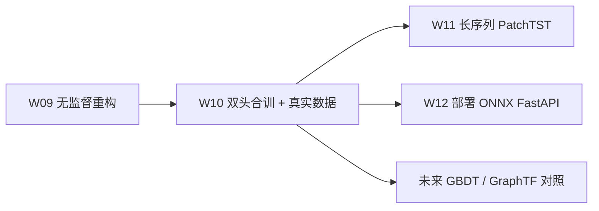

# Week 10 Knowledge Companion — 双头 Transformer、特征工程与基线系统对比

> 配套文件：`week10/README.md`、`week10/10_dual_head.ipynb`、`transformer-12week-plan.md` § v0.4。
> 目标读者：已经手写过 Encoder Block、读完 Anomaly Transformer 的你。这周的挑战从"模型能不能学会"切换到"在真实 tabular 欺诈数据上，我的选择是否值得被写进产线"。

---

## 1. 本周要回答的核心问题

1. 多任务（分类 + 重构）联合训练时，loss 之间会不会"打架"？怎样选 α / β 才算"合理"？
2. 为什么加一个重构头能 regularize 主分类任务？它到底防住了什么 shortcut？
3. Categorical embedding 的维度应该怎么定？IEEE-CIS 里 `card1` 这种高 cardinality 字段和 `ProductCD` 这种 5 类字段应当区别对待吗？
4. 在同一份数据上公平比较 5 个模型（IsolationForest / MLP / LSTM / TF-cls / TF-dual），需要固定哪些变量？变量没固定会怎么误导结论？
5. 在 IEEE-CIS 这类异构特征下，"改模型架构"和"造新特征"哪条投入产出比更高？数字要怎么读？

---

## 2. 理论骨架

### 2.1 联合损失的梯度几何

共享 Encoder $f_\theta$ 产生表征 $h = f_\theta(x)$，两个头 $g_\phi^{\text{cls}}$ 和 $g_\psi^{\text{rec}}$ 在它之上：

$$
\mathcal{L}(\theta,\phi,\psi) = \alpha \cdot \mathcal{L}_{\text{cls}}(g_\phi^{\text{cls}}(h), y) + \beta \cdot \mathcal{L}_{\text{rec}}(g_\psi^{\text{rec}}(h), x_{\text{num}})
$$

对共享参数 $\theta$ 求梯度：

$$
\nabla_\theta \mathcal{L} = \alpha \underbrace{\nabla_\theta \mathcal{L}_{\text{cls}}}_{g_{\text{cls}}} + \beta \underbrace{\nabla_\theta \mathcal{L}_{\text{rec}}}_{g_{\text{rec}}}
$$

两个向量的几何关系决定多任务命运：

- **夹角 < 90°（同向）**：重构梯度像一个"共同学习信号"，确实 regularize 主任务。
- **夹角 > 90°（冲突）**：两个梯度相互抵消，共享参数"左右为难"。经验上在欺诈数据里，极少数"纯结构异常但标签错漏"的样本会导致这种冲突。
- **幅值差 10x 以上**：大的那一路吃掉学习率预算。这是 β 调不好最常见的失败模式——重构 loss 的 scale 通常比 BCE 高 1–2 个数量级。

**实务选 α / β 的三步**：

1. 先把两个 loss 在首个 epoch 末的 **绝对值 scale 对齐**：如果 $\mathcal{L}_{\text{cls}} \approx 0.6$、$\mathcal{L}_{\text{rec}} \approx 2.4$，初始 β = 0.25 即可让它们数量级相当。
2. 再做敏感度扫描：β ∈ {0, 0.1, 0.25, 0.5, 1.0, 2.0}，看 val AUC-PR 的 U 形曲线。β = 0 是 cls-only baseline，β 过大则重构主导。
3. 如果发现 U 形底部很浅（β 对结果不敏感），说明这份数据上"重构头没提供有意义的额外信号"，老实用单头。

**进阶**：如果冲突很严重，值得了解两件事（论文级，不要求本周实现）：

- **GradNorm**（Chen et al., ICML 2018）：动态调整每个任务权重，使得反向梯度的 L2 norm 匹配。
- **PCGrad**（Yu et al., NeurIPS 2020）：当两个梯度夹角 > 90° 时，把一个投影到另一个的正交补，再相加。

### 2.2 重构头为什么能 regularize 主任务

只有分类头时，Encoder 表征 $h$ 只需要对 $y$ 有辨识力；它完全可以坍缩成"分类够用就行"的低秩子空间，甚至学到 shortcut（比如 `TransactionAmt > 10000` → fraud 这种强规则）。Shortcut 模型在训练集很漂亮，但泛化差、对分布漂移脆弱。

加上重构头后，目标变成"表征既要能区分 y，也要能重建 x"。重建项强迫 $h$ 保留足够信息去重构 $x_{\text{num}}$（信息瓶颈的下限），因此 $h$ 更接近一个 **充分统计量**。对欺诈检测的现实含义：

- 模型不再能丢掉"虽与 y 无直接相关但刻画了用户行为语义"的信号；
- 当某种新型欺诈出现（标签还没到），重构误差本身也能作为 out-of-distribution 分数；
- β 很小但非零，就已经能拿到这种"无标签监督"的红利。

### 2.3 Categorical embedding 的维度启发式

Notebook 用的是 `dim = min(50, cardinality // 2 + 1)`。这条经验公式来自 fast.ai 的 tabular 模块，背后有两条朴素直觉：

- 维度应该随 cardinality 单调增长——5 类的 `ProductCD` 显然不需要 50 维。
- 高 cardinality（如 `card1` 可能上万）会超过有效可学习子空间的秩——继续加维度会 over-parametrize，因此 clip 在 50。

另一种常见启发式是 `dim = round(1.6 * cardinality^0.56)`（Google Cloud AI tabular 建议），数量级类似。对本周的结构化欺诈而言两者差别微乎其微，**重要的是一致地对所有类别列使用同一策略**，否则对比实验不再可读。

**初始化**：PyTorch 默认 `N(0, 1)`。对欺诈这种极度不平衡 + 稀疏类别的数据，`N(0, 0.02)` 或 `trunc_normal(std=0.02)`（BERT/ViT 常用）更稳定。

### 2.4 公平基线对比的五条纪律

一个能被写进博客的对比表，必须控制以下变量：

| 控制维度 | 常见破坏方式 | 纪律 |
|---------|-------------|------|
| Train / val / test split | 用不同随机种子、或按用户切换成按时间切 | 所有模型共享同一 split，且 **按时间** 切（防泄漏） |
| 评估脚本 | 有的用 `average_precision_score`、有的自己写 | 单一 `evaluate()` 函数，打印相同字段 |
| 随机种子 | 只 set 一次在最上面 | 每个模型训练前重置 seed；如果可以，跑 k=3 次汇报 mean±std |
| 训练预算 | Transformer 跑 8 epoch、LSTM 跑 30 epoch | 相同 epoch 或相同 wall-clock 预算 |
| 超参调优 | 给 Transformer 调了，给 MLP 没调 | 要么都不调（公平的 off-the-shelf 比较），要么每个模型给同样的 HPO 预算 |

**IsolationForest 作为 anchor 的意义**：它完全无参数学习（只是树的 depth 启发），代表"不做任何模型复杂度你能拿到多少"。如果你的 Transformer AUC-PR 只比 IsolationForest 高 2 个点，这不是 Transformer 的胜利——是"模型复杂度对这份数据没啥帮助"的警报。

**Transformer 在 tabular 上赢不过 GBDT 的场景**：短序列（L < 32）、强类别交叉、无需跨样本的语义建模。GBDT（XGBoost / LightGBM / CatBoost）在 IEEE-CIS 公开榜单上长期统治前十并不是偶然。本周不跑 GBDT 是为了聚焦 DL 栈，但要清楚它应该是你脑中的第六个 baseline。

### 2.5 消融的"最小必要扰动"原则

消融（ablation）的真正价值不是"看一眼哪个最重要"，而是对照组与实验组之间 **只差一个变量**。本周 notebook 的 feature-group ablation 是个例子：

- "mask 数值列" = 把 `Xn` 置零，但保留类别 embedding、保留 positional，其余全不变。
- "mask 类别列" = 把 `Xc` 置零（走 embedding 表的 index 0，即 `__NA__`），其余不变。
- "mask temporal" = 只把 positional embedding 清零。

不要同时 mask 多组，否则你无法归因。也不要 mask 的时候顺手改 batch size —— 那你看到的 AUC-PR 变化会混入 batch noise。

---

## 3. 代码对照

下面以 `10_dual_head.ipynb` 为准，点出每一段的设计意图和可替换点。

### 3.1 数据加载与 fallback (cells `b87db039`, `ac088753`)

`try_download_ieee()` 失败时自动降级到 `creditcardfraud`，并把 `DATA_MODE` 标成 `'creditcard'`。下游所有逻辑统一读 `df[TARGET_COL]`、`NUM_COLS`、`CAT_COLS`。这种 **"一个开关决定全 notebook 路径"** 的模式值得模仿：你将来分享 notebook 时，不知道对方的 Kaggle 凭证是否配好，fallback 能避免"别人一打开全红"。

### 3.2 数值 / 类别分离 (cell `be1a7b8a`)

```python
for c in NUM_COLS:
    df[c] = pd.to_numeric(df[c], errors='coerce').fillna(-999).astype(np.float32)

CAT_CARDS = {}
for c in CAT_COLS:
    cats = df[c].astype(str).fillna('__NA__').astype('category')
    df[c] = cats.cat.codes.astype(np.int64)
    CAT_CARDS[c] = int(cats.cat.categories.size)
```

- 数值缺失填 `-999`（而不是 0）——让模型能把"缺失"当成一个单独的信号，而不是和真实 0 冲突。
- 类别缺失用字符串 `'__NA__'` 再 label encode，保证未来出现新类别时可以 extend。`CAT_CARDS` 记录每个列的 cardinality，后面构造 embedding 用。

### 3.3 时间切分 vs 随机切分 (cell `f0d407b1`)

```python
n = len(df); i1 = int(n * 0.70); i2 = int(n * 0.85)
tr = df.iloc[:i1]; va = df.iloc[i1:i2]; te = df.iloc[i2:]
```

`df` 已经按 `TransactionDT` 排序，切前 70% / 中 15% / 后 15%。**这是欺诈数据最容易踩的坑**——如果你改成 `train_test_split(..., shuffle=True)`，信息会从未来泄漏到过去，AUC-PR 会跳很高但上线全挂。

`StandardScaler().fit(tr[NUM_COLS].values)` 只看训练集，transform 时用于 val / test。对应生产上"scaler 也是模型的一部分"，W12 会反复强调这一点。

### 3.4 滑窗构造序列 (cell `ea892b56`)

IEEE-CIS 没有 userId 字段做 groupby，这里简化成"按时间排序后连续 L=16 笔做一个窗口"。**这是一个妥协**——真正的用户行为序列应该按 `card1` 或 `addr1 + emaildomain` 聚合。README 第 50-56 行的反思三问之一就是"用 `groupby(card1)` 构造真正的用户序列"。

`stride=4` 控制样本量。IEEE-CIS 原始 59 万行，L=16/stride=4 后降到约 14.7 万个窗口，在 Colab T4 上单 epoch 约几十秒可接受。

### 3.5 类别 Embedding + 共享 Encoder + 双头 (cell `f033dc37`)

`CatEmb` 对每个类别列建独立 `nn.Embedding`，输出拼接后再和数值特征一起 `in_proj` 到 `d_model=64`。注意 `nn.Embedding(cards[c] + 1, ...)`——+1 是预留给"未见类别"的 safe slot，线上部署时一定要用它做 OOV 兜底。

`DualHeadTransformer` 的关键设计：

```python
logit = self.cls_head(h[:, -1, :]).squeeze(-1)   # 最后一步作为分类表征
recon = self.recon_head(h)                        # 每一步都重构数值
```

- 分类头用 **最后一个 timestep** 的表征（而不是 `[CLS]` token），因为我们用的是滑窗的最新一笔——这和 LSTM baseline 的做法对齐，便于公平比较。
- 重构头只回归数值特征，不重构类别（类别离散做 MSE 没有意义；要做应当 per-column cross-entropy，本周简化掉了）。

### 3.6 双头合训 (cell `ecc65b34`)

```python
loss_cls = bce(logit, yy)
loss_rec = F.mse_loss(recon, xn) if beta > 0 else torch.tensor(0., device=device)
loss = alpha * loss_cls + beta * loss_rec
```

- `pos_w` 由训练集类比算出（`neg / pos`），交给 `BCEWithLogitsLoss(pos_weight=pos_w)`。
- CosineAnnealingLR 配 AdamW 是 Transformer 家族的标准组合。
- Gradient clipping `max_norm=1.0` 对 Transformer 稳定性很关键。
- `best_state` 以 val AUC-PR 为准保存，不要看 train loss——欺诈任务容易在训练集上过拟合。

### 3.7 五个 baseline 的统一评估 (cells `88b9299b`–`c2668b47`)

每一个 baseline 最后都走同一个 `evaluate(name, y_true, y_score, params, train_time)`，把结果塞进全局 `RESULTS` 列表。这种"所有路径汇入同一个表"的结构是本周最重要的软工程习惯——你将来任何需要对比的场景都要这么组织。

值得点出的两个细节：

- `IsolationForest` 只在 train 上 `fit`（不看标签），score 取 `-decision_function`（越负越异常，取负让越大越异常与其它模型统一）。
- `Transformer (cls-only)` 就是把同一个 `DualHeadTransformer` 设 `beta=0.0` 重训——这样不改模型结构，严格做 β 消融。

### 3.8 特征组消融 (cells `8c1ebb86`–`3d36d326`)

对已训练好的 dual-head 模型：

1. 数值列置零 → 看 ΔAUC-PR；
2. 类别列置零（回退到 embedding 的 safe slot）→ 看 ΔAUC-PR；
3. 位置 embedding 清零（先 clone 再还原）→ 看 ΔAUC-PR。

解读：**哪组掉得多，哪组在模型决策中承担的权重就大**。在 IEEE-CIS 这种"弱时序 + 强类别"的数据上，类别 mask 带来的跌幅往往最大，这直接支持了 cell `103226a9` 的反思结论："特征工程在这份数据上略胜一筹"。

---

## 4. 常见坑位与调试思维

| 症状 | 可能原因 | 排查顺序 |
|------|---------|---------|
| `loss_rec` NaN | `-999` 填充值未 scale，MSE 爆炸 | 检查 scaler 是否 fit 了含 `-999` 的训练集；考虑改用 median 填充或 `np.nan` + 专门的 mask |
| 分类 loss 正常但 AUC-PR ≈ fraud rate | 预测全坍缩到同一个 logit | 查 pos_weight 是否正确；查学习率是否过大把模型打飞 |
| 双头 AUC-PR < 单头 | β 过大，重构主导 | β = 0、0.1、0.25、0.5 扫一遍画 U 形 |
| val AUC-PR 随 epoch 波动剧烈 | batch 里 fraud 样本太少（正例比 3.5%，batch 256 平均不到 10 条） | 调大 batch 到 512 或用 WeightedRandomSampler |
| IsolationForest 比 Transformer 还高 | 八成是时间泄漏——随机切了 | 回去查 `df.sort_values(TIME_COL)` 是否生效；检查 train / val 的时间范围 |
| 类别 embedding 训练时报 index out of range | val / test 出现了 train 没见过的类别码 | 构造 encoder 时预留 OOV slot（`cards[c] + 1`），未见值 map 到最后一个 index |
| 特征 mask ablation 后 AUC-PR 反而升高 | mask 掉了对 y 负相关的噪声列 | 正常现象，说明那组特征带噪；也可能是 leak signal 反向 |

**调试思维的通用模板**：

1. **小到可运行**：出错时先把 batch 降到 2、L 降到 4，看能不能跑通前向；
2. **可视化中间量**：打印 `h.mean()`, `h.std()`, `logit.mean()`, `recon.mean()`；模型爆炸前通常中间量先异常；
3. **二分定位**：注释掉 recon 头跑一次，注释掉 cls 头跑一次，分别对比——双头有问题时很难直接定位到哪头;
4. **和 baseline 对齐**：先把 LSTM 调通，再把 Transformer 调到 ≥ LSTM；如果上来就和 SOTA 比，调起来没方向。

---

## 5. 与未来几周的连接

- **Week 11（PatchTST / Informer）**：本周的 dual-head 成为"模型结构对比"的 baseline。W11 会把序列拉到 L=256，届时 vanilla attention 的 $O(L^2 d)$ 瓶颈会把本周习以为常的训练时间翻几倍，PatchTST 就是来解决这个问题的。
- **Week 12（部署）**：本周用 `torch.save` 存的 checkpoint 就是 W12 导 ONNX 的起点。留意本周的 `CAT_CARDS`、`scaler` 这两个状态量——它们是"模型之外"的工件，上线时必须一起持久化，否则线上 feature parity 对不上。
- **长期**：本周建立的 "一个函数 + 一张总表 + 一组消融图" 是交付任何业务对比的模板。将来做图 Transformer / 对比学习预训练 / LLM-augmented 方案时，第一件事仍然是建 baseline 表。



---

## 6. 自测题

<details>
<summary>Q1. 为什么欺诈检测的对比实验一定要按时间切，而不是随机切？举一个随机切会高估 AUC-PR 的具体机制。</summary>

按时间切保证训练时不会看到未来。随机切会让同一用户的不同时刻出现在 train / val / test 里——如果某用户有 10 笔正常 + 1 笔欺诈，随机切很可能把 9 笔正常放 train、欺诈和剩 1 笔放 val，模型只要认出这个用户就能正确预测欺诈，但这是"记住用户 ID"而非"识别欺诈模式"。线上该用户未来的新欺诈完全没被学到。
</details>

<details>
<summary>Q2. 双头损失 $\mathcal{L} = \alpha \mathcal{L}_{\text{cls}} + \beta \mathcal{L}_{\text{rec}}$ 中，把 α 和 β 整体乘 10 会改变训练动态吗？为什么？</summary>

仅改变等效学习率——对 AdamW 这种 adaptive 优化器影响较小（二阶矩归一化），对 SGD 影响显著。重要的是 **α / β 的比值**，不是绝对值。所以扫参时固定 α=1，只扫 β，避免维度冗余。
</details>

<details>
<summary>Q3. `dim = min(50, cardinality // 2 + 1)` 对 `card1`（cardinality ≈ 17000）会给出什么维度？这个维度合理吗？</summary>

会 clip 到 50。是否合理取决于数据量——如果 `card1` 在训练集里有足够样本覆盖每个类（至少 20 个样本/类），50 维能学到有意义的表征；否则应该考虑 target encoding / frequency encoding 替代。IEEE-CIS 里 `card1` 有长尾，很多类只出现几次，此时纯 embedding 效果会打折，公开 solution 里多会叠一个 mean-target encoding。
</details>

<details>
<summary>Q4. 如果你的特征组消融显示"把数值全 mask 后 AUC-PR 只掉 0.02，把类别全 mask 后掉 0.15"，你会如何解释给产品经理？下一步会做什么？</summary>

解释：模型的决策高度依赖类别特征（如商户编码、卡段、邮箱域名），数值特征的边际贡献很低。这和 IEEE-CIS 数据的性质一致——欺诈者更容易在商户/设备维度露出马脚，金额本身容易伪装。下一步行动：（1）优先投入做类别特征工程，例如 card1 × ProductCD 交叉、email domain 的 suffix hash；（2）考虑引入 GBDT 做纯 tabular baseline 和 Transformer 对比；（3）数值通道可以考虑加 `log1p`、`z-score by card`，把它们的边际贡献做起来。
</details>

<details>
<summary>Q5. `β=0` 的 Transformer 同时充当 cls-only baseline 和 dual-head 的 β-ablation，这样做有什么潜在陷阱？</summary>

二者虽然代码路径相同，但作为 baseline 和 ablation 有不同要求。作为 baseline，它应该像一个"独立训练的 cls-only 模型"——同样的 epoch、同样的初始化、同样的 seed。作为 ablation，它应该从 dual-head 的 **同一次随机初始化** 出发，只差 β 这一个变量。当前实现是两次独立初始化——如果要严谨，应该存 dual-head 的初始权重，两条路径都从它出发。
</details>

<details>
<summary>Q6. IsolationForest 为什么常常在短序列 + 强类别的欺诈数据上和神经网络打平？</summary>

IF 基于"异常点容易在随机 split 下被较浅深度孤立"这一直观假设。对 tabular 数据，这个假设在"数值特征尺度差大、类别直接能分"的场景下非常贴合。神经网络的优势在于能学跨特征的非线性交互，但对短序列 + 强类别数据，这些交互往往可以被几层浅树捕获，因此差距不大。
</details>

<details>
<summary>Q7. 如果线上的 `card1` 出现了训练集没见过的值，本 notebook 的代码会发生什么？应该怎么改？</summary>

当前代码对 val / test 的 `card1` 重新 `astype('category').cat.codes`，会把新类编码为新的整数——训练时的 embedding 表根本没学过这个 index，推理会报 out-of-range。正确做法：训练时记录 `card1` 的 category-to-int mapping，推理时严格用训练 mapping，未见值全部 map 到 embedding 表的最后一个 OOV slot（构造时已预留 `cards[c] + 1`）。
</details>

<details>
<summary>Q8. 如果不得不在"花两天造 5 个新特征"和"花两天调 Transformer 超参"之间二选一，你会怎么判断？</summary>

看 ablation 结果和 learning curve 两个证据。（1）如果特征 mask ablation 显示某组特征掉幅远大于模型差异，说明特征是瓶颈，造新特征 ROI 高；（2）如果训练 loss 早早收敛但 val 远没饱和，说明是数据/特征不足，加特征更优；（3）如果训练 loss 还在稳步下降，模型有改进空间，调超参更优。直觉经验：tabular + 有业务 domain knowledge → 先造特征；tabular + 数据已很干净 + 架构新 → 先调模型。
</details>

---

## 7. 延伸阅读

1. **Konstantin Yakovlev — IEEE-CIS 1st Place Solution (Kaggle discussion)**：学"magic feature"的构造思路，重点看 `TransactionAmt` decimal、UID identification 几节，比任何教科书都直接。
2. **Cheng Guo, Felix Berkhahn — Entity Embeddings of Categorical Variables (2016)**：类别 embedding 的经典论文，fast.ai `dim = min(50, card//2+1)` 启发式的原始来源之一。
3. **Yu et al. — Gradient Surgery for Multi-Task Learning (PCGrad, NeurIPS 2020)**：了解多任务梯度冲突的处理。本周我们只做 α/β 手调，但知道 PCGrad / GradNorm 存在有助你判断什么时候该升级。
4. **HuggingFace NLP Course Chapter 3 — Fine-tuning**：尽管是 NLP，"训练循环 + 评估 + checkpoint 管理"的模式和本周的 `train_transformer()` 骨架高度一致，能帮你把本周的手写训练循环对接到工业级实践。
5. **Ke et al. — LightGBM（2017）**：当你下一次问自己"要不要先试 GBDT"时，读它的 leaf-wise split 和 categorical handling 章节。它是 IEEE-CIS 公开榜单的真正常青树，也是 Transformer 在 tabular 上最难撼动的对手。
