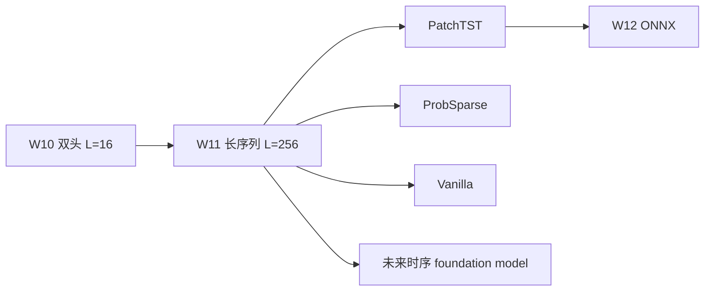

# Week 11 Knowledge Companion — 时序 Transformer 的复杂度与归纳偏置

> 配套文件：`week11/README.md`、`week11/11_patchtst.ipynb`、`transformer-12week-plan.md` § v0.5。
> 本周走到自学计划的模型高峰：序列长度从 L=16 跃升到 L=256，vanilla attention 的 $O(L^2 d)$ 第一次真切地咬人。你会手写 PatchTST backbone（约 120 行）和 Informer-style ProbSparse attention（约 50 行），并建立一张"参数量 / 显存 / 时长 / AUC-PR"四维对比表。

---

## 1. 本周要回答的核心问题

1. Vanilla scaled dot-product attention 在 L = 256 时为什么不只是慢，而且是 **显存** 先挂？复杂度到底吃在哪一步？
2. Informer 的 ProbSparse attention 用什么稀疏性指标挑 query？为什么"max − mean"是合理代理？它的保证在哪里、盲点在哪里？
3. PatchTST 的两个核心设计（patching + channel-independence）分别缓解了哪类问题？为什么合起来会"又快又好"？
4. DLinear 论文泼的冷水值不值得听？什么时候简单线性模型反而应该胜出？
5. 欺诈检测（多变量异构特征）这个场景，在 PatchTST 和 vanilla 之间该怎么选？为什么不能无脑选 PatchTST？

---

## 2. 理论骨架

### 2.1 Vanilla attention 的复杂度到底吃在哪

对于单头、单 batch、序列长 $L$、hidden $d$，scaled dot-product attention 的形式是：

$$
\text{Attn}(Q, K, V) = \text{softmax}\!\left(\frac{Q K^\top}{\sqrt{d}}\right) V, \quad Q, K, V \in \mathbb{R}^{L \times d}
$$

三步的代价：

| 步骤 | FLOPs | 显存占用（中间张量） |
|------|-------|---------------------|
| $Q K^\top$ | $O(L^2 d)$ | $O(L^2)$ 的 attention logit 矩阵 |
| softmax + dropout | $O(L^2)$ | 另一个 $O(L^2)$ 矩阵（反向要存） |
| $\text{attn} \cdot V$ | $O(L^2 d)$ | $O(L d)$ 输出 |

**关键点**：FLOPs 和显存都是 $L^2$ 项主导。当 L = 256、bs = 32、heads = 4、fp32 时，单层 attention logit 张量是 $32 \times 4 \times 256 \times 256 \times 4\text{B} \approx 33\text{ MB}$。四层堆上去，加上反向要保存，Colab T4 的 15 GB 显存立刻被啃下一大块。

把 L 从 64 提到 256（4 倍）：FLOPs 升 16 倍，显存升 16 倍。这就是为什么 W07 还能愉快跑，W11 必须做结构级的改动。

### 2.2 Informer 的 ProbSparse Attention

核心洞察：经验上每个 query 对 keys 的 attention 分布大多接近 uniform——这些"懒 query"贡献的信号还不如直接用 V 的均值。只对 **活跃 query** 做 full softmax，其他用 mean(V) 填回，就能把复杂度从 $O(L^2)$ 降到 $O(L \log L)$。

**怎么定义"活跃"？** 用 KL 距离衡量 query $q_i$ 对应的 attention 分布偏离 uniform 的程度。论文给出一个上界近似，最终评分简化为：

$$
M(q_i, K) \approx \max_j \frac{q_i \cdot k_j^\top}{\sqrt{d}} - \frac{1}{L}\sum_j \frac{q_i \cdot k_j^\top}{\sqrt{d}}
$$

直觉：如果 max 远大于 mean，说明 $q_i$ 对某些 key 极敏感——注意力分布尖锐，信息量大。如果 max ≈ mean，分布平坦，近似 uniform，对模型贡献小。

保留 top-$u$ 个 query（$u = c \cdot \lceil \ln L \rceil$，$c$ 是超参数，论文取 5），这 $u$ 个 query 走正常 softmax + V 聚合；剩下 $L - u$ 个 query 直接用 $\bar V = \frac{1}{L}\sum_j v_j$ 填回。

**复杂度账**：

- 计算 $M$ 需要看 $q_i \cdot K^\top$ 的 max 和 mean，论文用采样近似降到 $O(L \ln L)$。
- 对选中的 $u$ 个 query 做 full attention：$O(u \cdot L \cdot d) = O(L \ln L \cdot d)$。
- 总复杂度 $O(L \ln L \cdot d)$。

**本 notebook 的简化版 vs 原论文**：

- 计算 $M$ 时直接拿完整 $Q K^\top$ 算 max/mean（而不是采样），在 L = 256 下可接受，但理论上仍是 $O(L^2)$。
- 没有实现 self-attention distilling（原论文 encoder 每层用 Conv1D + MaxPool 把序列折半）。
- 没有实现生成式 decoder（论文的另一个亮点）。

这是教学取舍：把核心的"top-u 选取 + mean(V) 填回"这两步讲清楚，比照搬全文更重要。

**局限性值得记住**：

- $M$ 是启发式，没有保证 top-u 一定覆盖所有"真重要"的 query——极端反例：两个 key 都有中等相似度的 query，max - mean 偏小，可能被误判成懒 query。
- 把"懒 query"用 $\bar V$ 填回会抹掉 position 信息——这对 position-sensitive 任务（异常定位）是隐患。

### 2.3 PatchTST 的核心设计

PatchTST (Nie et al., ICLR 2023) 的两条设计看似朴素，但叠起来极有效：

#### Channel-independence

输入 $(B, L, F)$ 先 reshape 成 $(B \cdot F, L, 1)$——每个变量独立走一次 Transformer，参数共享但通道互不干扰。注意 **共享参数** 是关键：并不是每个通道单独一组权重，而是所有通道共用一个 Transformer，只是 attention 计算在每个通道内独立发生。

为什么有效？时序多变量数据里各通道的量纲、周期、噪声水平差异极大——股价、成交量、情绪指数混在一起时，attention 会被量纲大的通道主导。独立处理后，每个通道在自己尺度内提特征，跨通道交互留给最后的 pooling / head。

**代价**：模型失去了学习跨通道非线性交互的能力。对"电网、传感器网络"这类通道耦合弱的场景是优势；对"欺诈检测，金额 × 商户 × 时段的交叉才是信号来源"的场景可能是劣势。**这是本周最大的工程判断题**，README 第 53-54 行的复盘三问之二特意点到。

#### Patching

把长度 $L$ 的序列切成长度 $P$、stride $S$ 的 patch，总 patch 数：

$$
N = \left\lfloor \frac{L - P}{S} \right\rfloor + 1
$$

每个 patch 是 $P$ 个时间步拼成的向量，先线性映射到 $d_{\text{model}}$，再作为一个 token 喂 Transformer。Attention 复杂度：

$$
O(L^2 d) \longrightarrow O(N^2 d) = O\!\left(\left(\frac{L - P}{S}\right)^2 d\right)
$$

在本周 L = 256、P = 16、S = 8 时，$N = 31$，attention logit 矩阵从 $256 \times 256$ 降到 $31 \times 31$，计算和显存都降一个数量级。

**patching 的三重收益**：

1. 计算降维（attention 直接快）；
2. **局部归纳偏置**——一个 patch 内的时间步被一起处理，相当于"先做局部聚合，再做全局 attention"，防过拟合；
3. 和 ViT 的 "image is worth 16x16 words" 是同一思想——把高维原始信号先聚合成有语义的 token 再上 Transformer。

### 2.4 DLinear 的反思

Zeng et al. (DLinear, AAAI 2023) 用一个极简模型打赢 Informer / Autoformer：

$$
\hat{y}_{t+h} = W_{\text{trend}} \cdot \text{MA}(x)_{t-L+1:t} + W_{\text{season}} \cdot (x - \text{MA}(x))_{t-L+1:t}
$$

就是 "把序列拆成趋势 + 季节，各自用一个线性层预测，再相加"。结果在多个 LTSF (Long-Term Series Forecasting) benchmark 上击败当时 SOTA 的 Transformer 变体。

**这说明什么？**

- 在一些长序列预测任务上，**复杂模型的归纳偏置反而有害**——趋势 + 季节本来就是时序的核心结构，线性模型直接吃进去；Transformer 的 position-agnostic attention 需要从头学这个结构，样本不够就学不好。
- 不是说 Transformer 没用，而是它的优势在 **multivariate interaction / exogenous features / 预训练迁移** 几个场景。欺诈检测属于这类优势场景。

**什么时候你确实需要 Transformer？**

1. 多变量间存在非线性耦合（跨通道 attention 能学到）；
2. 有外生特征（如节假日、商户类目）需要端到端融合；
3. 可以通过大规模预训练（TimeGPT / Chronos 等）迁移；
4. 需要在长 context 下定位异常（attention map 天然提供位置解释）。

本周的合成数据（AR(1) + 随机位置 spike）恰好满足第 4 点——能看到 Transformer 三兄弟都有不错的 AUC-PR；若换到纯预测任务（LTSF），DLinear 就有机会反超。

### 2.5 三者的复杂度账比较

| Backbone | Token 数 | 单层 attention FLOPs | 显存（attention logit） | 归纳偏置 |
|----------|---------|---------------------|-------------------------|---------|
| Vanilla | $L$ = 256 | $O(L^2 d)$ | $O(L^2)$ | 弱（全局 attention） |
| ProbSparse | $L$ = 256 但只算 top-$u$ | $O(L \ln L \cdot d)$（理论） | 仍是 $O(L^2)$ 的 $M$ 计算（简化版） | 弱 |
| PatchTST | $N$ = 31（patch） | $O(N^2 d) \cdot F$（通道独立） | $O(N^2)$ | 局部性（patch 内聚合） + 通道独立 |

注意 PatchTST 乘了一个 $F$（通道独立要为每个通道跑一次），但 $N^2 \ll L^2$，综合仍然划算。

---

## 3. 代码对照

### 3.1 长序列合成数据生成 (cells `cell-4`, `cell-5`)

```python
def make_sequence(is_fraud):
    x = np.stack([_ar1(SEQ_LEN, phi=rng.uniform(0.6, 0.95)) for _ in range(N_FEATS)], axis=1)
    x += rng.normal(0, 0.2, x.shape).astype(np.float32)
    if is_fraud:
        span = rng.integers(8, 24)
        t0   = rng.integers(0, SEQ_LEN - span)
        ch   = rng.integers(0, N_FEATS)
        x[t0:t0+span, ch] += rng.uniform(3.0, 5.0)  # spike
        x[t0:t0+span, :]  += rng.normal(0.5, 0.3, (span, N_FEATS))  # 整体偏置
    return x
```

两层设计：**正常**是 AR(1) 噪声序列（$\phi$ 随通道随机，模拟不同"惯性"）；**异常**在随机位置插入一个 8-24 步的异常段——单通道 spike + 全通道偏置。这种"定位型异常"正是 Transformer attention 能大放异彩的场景（而 DLinear 这种全局线性模型会在这类任务吃亏）。

`mu` / `std` 只在训练集上拟合，再 transform val——避免数据泄漏的老生常谈。

### 3.2 PatchEmbed 的 `unfold` 技巧 (cell `cell-7`)

```python
def forward(self, x):                       # x: (B*F, L, 1)
    x = x.squeeze(-1)                       # (B*F, L)
    x = x.unfold(dimension=-1, size=self.patch_len, step=self.stride)
    return self.proj(x)                     # (B*F, N, d_model)
```

`torch.Tensor.unfold` 是一个零拷贝的 sliding window 原语。对 `(B*F, L)` 在最后一维 unfold，得到 `(B*F, N, patch_len)`，其中 $N = (L - P)/S + 1$。它比 `x[:, i:i+P]` 循环快得多，也比 `F.unfold`（卷积前置的那个）接口更适合 1D。

`Linear(patch_len, d_model)` 是所有通道和所有 patch 共享的——这是 PatchTST "channel-independent but parameter-shared" 的核心体现。

### 3.3 PatchTST forward 的形状变换 (cell `cell-7`)

```python
def forward(self, x):                        # x: (B, L, F)
    B, L, F_ = x.shape
    x = x.permute(0, 2, 1).reshape(B * F_, L, 1)     # 折 F 进 batch
    x = self.embed(x) + self.pos_emb                  # (B*F, N, d)
    x = self.encoder(x)                               # (B*F, N, d)
    x = x.mean(dim=1)                                 # 聚合 patch
    logit_per_channel = self.head(x).squeeze(-1).view(B, F_)
    return logit_per_channel.mean(dim=1)              # 聚合 channel
```

读这段代码要想清楚三件事：

1. **为什么 `permute(0, 2, 1)`**：把 F 放到第 1 维，才能 reshape 进 batch 维。否则 reshape 后通道会和时间错位。
2. **`x.mean(dim=1)` 是在 patch 维取平均**：这一步把 N 个 patch 的表征聚合成每通道一个向量；常见替代是取 `[CLS]` token 或 last-token。
3. **`logit_per_channel.mean(dim=1)`** 是跨通道取平均**：简单粗暴的 channel pooling。如果你想让"某个通道的异常信号更醒目"，可以改成 max pooling 或 learnable attention-over-channels。

### 3.4 ProbSparseAttention 的核心五行 (cell `cell-9`)

```python
scores_full = torch.matmul(q, k.transpose(-2, -1)) / math.sqrt(self.d_head)
M = scores_full.max(dim=-1).values - scores_full.mean(dim=-1)  # (B, h, L)
u = max(1, int(self.factor * math.log(L)))
top_idx = M.topk(u, dim=-1).indices                            # (B, h, u)
```

- 第 1 行：先算出完整的 attention logit 矩阵（简化版，论文用采样）；
- 第 2 行：`M` 是每个 query 的稀疏性得分（max − mean），高分 = "活跃 query"；
- 第 3 行：$u = \lfloor c \cdot \ln L \rfloor$，$c$ 是 `factor=5`；
- 第 4 行：选 top-u 的 query 索引。

接下来的 `gather` / `scatter_` 两行是把 top-u query 的 full attention 结果塞回到原位置，未选中位置填 mean(V)：

```python
mean_v = v.mean(dim=2, keepdim=True).expand(-1, -1, L, -1).clone()
mean_v.scatter_(2, gather_idx, out_top)
```

这段代码读懂需要对 `gather` / `scatter_` 的维度语义熟悉。**建议实战技巧**：当 `scatter_` 报 "index out of bounds" 时，先打印 `gather_idx.shape`, `gather_idx.max()`, `mean_v.shape` 对齐维度。

### 3.5 三方训练 (cell `cell-14`)

```python
torch.cuda.reset_peak_memory_stats()  # 在每次 train_one 开始
...
peak_mem_mb = torch.cuda.max_memory_allocated() / 1024**2
```

这是用 PyTorch 官方 CUDA memory profiler 量出 peak GPU memory，结果和 `nvidia-smi` 观测值常有微小差异（后者会含其它进程、driver overhead）。写对比表时清楚说明用的是哪一种。

三个模型同 epoch / lr / batch / seed，`BCEWithLogitsLoss(pos_weight=...)` 处理 5% 不平衡。按正负比 $(1 - \pi)/\pi = 19$ 设 pos_weight，让正例 loss 权重变高。

### 3.6 保存 checkpoint (cell `cell-20`)

```python
torch.save({'state_dict': m_pst.state_dict(),
            'config': dict(n_feats=..., seq_len=..., patch_len=..., stride=...,
                           d_model=..., n_heads=..., n_layers=...)},
           ckpt_dir / 'w11_patchtst.pt')
```

注意存了 `config` 字典——W12 导 ONNX 时会根据这个 config 重建同结构模型再 load state_dict。**一个 checkpoint = 权重 + 架构描述 + 训练 metadata**，这是工程化的基本习惯。

---

## 4. 常见坑位与调试思维

| 症状 | 根因 | 修法 |
|------|-----|------|
| `unfold` 后 patch 数对不上理论公式 | `(L - P) % S != 0`，最后一段被丢 | 要么调整 L/P/S 让整除，要么 pad L 到 $\lceil (L-P)/S \rceil \cdot S + P$ |
| PatchTST 训练 loss 不降 | 通道聚合 `mean(dim=1)` 太粗暴 | 换成 learnable channel attention，或先 concat 再 Linear |
| ProbSparse 的 `scatter_` 报 "index out of bounds" | `gather_idx` 扩展维度漏了或顺序错 | 断点打印 shape，对照论文公式逐维核对 |
| ProbSparse 的 AUC-PR 明显低于 vanilla | 简化版 $M$ 计算仍是 $O(L^2)$，且没实现 distilling，在 L=256 没拿到论文宣称的效果 | 正常现象，是教学简化版；真正用 Informer 请直接拷贝官方仓库 |
| Vanilla 显存爆了 | batch × L² 超过 GPU 容量 | 减 batch；如果减到 bs=1 还爆，说明 L=256 太长，换 PatchTST |
| PatchTST 的 val AUC 不如 vanilla | 通道独立导致跨变量耦合信号丢失 | 如果数据本身有强跨通道耦合，别用 PatchTST；或改成 hybrid—— patching + 跨通道 attention 的最后一层 |
| 重跑 seed 后三方对比结果波动大 | val 集太小（400 * 0.2 = 80 seqs） | 加大 N_USERS，或跑 k=3 次 seed 汇总 mean ± std |
| pos_emb 学不动 | 用的是零初始化 + 固定学习率 | 改 `trunc_normal_(std=0.02)` 初始化（notebook 已这样）；或改 sinusoidal PE |

**调试策略**：

1. **从 small 开始**：先把 L=32 / N_USERS=200 跑通，再上 L=256。
2. **shape 可视化**：在每个 reshape / permute 后打印 `x.shape`。PatchTST 的形状变换有 5 个维度在来回走，一错很难直觉发现。
3. **逐层对比**：把同一个输入分别喂 vanilla 和 PatchTST，在 encoder 输出前打印中间张量的 mean / std，若数量级差别超过 10x，基本是 scale 没对齐。

---

## 5. 与未来几周的连接

- **Week 12（部署）**：W11 结束时会有 `w11_patchtst.pt` 和 `w11_vanilla.pt` 两个 checkpoint，W12 的 ONNX 导出会优先选 PatchTST——因为它的算子更干净（只用到标准 Linear / LayerNorm / MHA / unfold），opset 17 完整支持；vanilla 也能导，但 `nn.TransformerEncoderLayer` 的一些 dropout / mask 分支有时会让 ONNX 吐出比较冗长的 graph。
- **Kafka / 流式推理**：PatchTST 的 channel-independence 意味着一个通道的新数据来了可以独立 forward——在流式场景天然友好，W12 谈部署形态时会回到这一点。
- **长期（基础模型）**：最近一年的时序基础模型（TimeGPT / Lag-Llama / Chronos / Moirai）不约而同采用 patching 作为 tokenization 步骤。你这周手写的 `PatchEmbed` 基本就是它们的第一层。读完 PatchTST 再去看 Chronos，会觉得顺理成章。



---

## 6. 自测题

<details>
<summary>Q1. L 从 64 翻到 256 时，vanilla attention 的显存增长是 4 倍还是 16 倍？为什么？</summary>

16 倍。attention logit 矩阵大小是 $L \times L$，$L$ 翻 4 倍意味着矩阵元素数翻 16 倍；反向还要保存，再乘 2 但量级不变。FLOPs 同比例。
</details>

<details>
<summary>Q2. ProbSparse 的 $M(q_i, K) = \max - \text{mean}$ 为什么是对 "稀疏性" 的合理代理？这个代理在什么情况下会失效？</summary>

如果 attention 分布极端尖锐（uniform 之外的高偏离），max 远大于 mean；若分布近似 uniform，max ≈ mean。所以 max − mean 可以粗略衡量"分布偏离 uniform 的程度"。失效场景：双峰分布——两个 key 都得高 logit，其余低，max − mean 依然大，但这类 query 携带的信息其实只是"关注这两个 key"，不一定比单峰更 informative。另一个失效场景是 logit 整体负偏（比如某 layer 的 scale 很大），max/mean 的数值关系会被整体尺度扭曲。
</details>

<details>
<summary>Q3. PatchTST 的 channel-independence 在欺诈检测里是优势还是劣势？说出你的判断依据。</summary>

多为劣势。欺诈检测的 signature 常常是跨变量交叉（金额 × 时段 × 商户），channel-independent 处理把这种交叉留到最后的 head，信号被稀释。优势场景是数据的各通道语义 / 量纲差异大到单 Transformer 无法同时建模——这在欺诈里并不突出。经验判断：若跨通道耦合 > 通道内时序模式，选 vanilla 或 hybrid；反之选 PatchTST。
</details>

<details>
<summary>Q4. 假设你观察到 vanilla Transformer 在本周的合成数据上 AUC-PR = 0.92，PatchTST = 0.88，ProbSparse = 0.78，下一步会如何分析差异？</summary>

按"结构差异定位 → 超参对齐 → 数据特性复核"三步：（1）PatchTST 低于 vanilla 的主因大概率是跨通道耦合（合成数据的异常是全通道偏置，跨通道 attention 有用）。（2）ProbSparse 差较多大概率是简化版没实现 distilling，且 $M$ 近似在 L=256 下保留的 query 集合不够稳。（3）跑多 seed 看是否显著，再考虑是否换 PatchTST + hybrid（最后一层做跨通道 attention）。
</details>

<details>
<summary>Q5. DLinear 在你本周的合成数据上大概率输掉的原因是什么？</summary>

DLinear 建模的是"趋势 + 季节"的全局线性结构。本周合成数据的异常是"随机位置的局部 spike"，既不是趋势也不是季节，而是定位型异常。DLinear 的线性基失去了捕获局部异常的能力，Transformer 的 attention 则能定位到 t0:t0+span 这一段。所以 DLinear 在 LTSF 上打赢 Transformer 的优势在这个场景失效。
</details>

<details>
<summary>Q6. 如果把 PatchTST 的 patch_len 从 16 调到 64，你预期什么会变化？</summary>

Token 数 $N = (256-64)/8 + 1 = 25$，attention 更省（25 × 25 vs 31 × 31）；但 patch 内平均 64 个时间步，异常段（8-24 步）会被整个 patch 的均值稀释——定位精度下降。再加上 `PatchEmbed` 的 Linear 从 16→64 = 4 倍参数。通常的做法是 patch_len 比典型异常长度短一点，保证"异常要跨 patch 边界才会被严重稀释"。
</details>

<details>
<summary>Q7. Informer 的 self-attention distilling 是什么？为什么本 notebook 没实现它？</summary>

distilling 是在 encoder 每层之间加 Conv1D + MaxPool，把序列长度折半（$L → L/2 → L/4 → \dots$），让 attention 在越来越短的序列上工作，同时有 multi-resolution 效果。notebook 没实现的原因有二：（1）教学聚焦在 ProbSparse 的 query 选取机制上，distilling 是独立优化维度，加进来会混淆对比；（2）distilling 和本周 PatchTST 的 patching 本质相近（都是降 token 数）——对比时会出现"同一个 ideas 从两个角度实现"的冗余。
</details>

<details>
<summary>Q8. 为什么同一份 onnx-exportability 评价里，PatchTST 比 vanilla Transformer 更"干净"？</summary>

PatchTST 内部算子：`Linear` / `LayerNorm` / `nn.TransformerEncoder` / `unfold`，全部在 ONNX opset 17 有直接映射。vanilla Transformer 除了这些之外，`nn.TransformerEncoderLayer` 在一些 PyTorch 版本会动态选 fast-path（`torch._transformer_encoder_layer_fwd`），ONNX 导出时会打印 warning 或生成更长的 graph。如果导出器不支持某个 fast-path 路径就会挂。W12 会处理这个差异。
</details>

---

## 7. 延伸阅读

1. **Zhou et al. — Informer: Beyond Efficient Transformer for Long Sequence Time-Series Forecasting (AAAI 2021 Best Paper)**：原文 § 3.2 的 ProbSparse attention 是本周手写代码的蓝本；§ 3.3 的 self-attention distilling 值得了解但本周没实现。
2. **Nie et al. — A Time Series is Worth 64 Words: Long-term Forecasting with Transformers (PatchTST, ICLR 2023)**：原文 § 3 配合本 notebook 的 120 行实现读效率最高；附录的 RevIN (instance norm) trick 是下一步想要进一步提升时可以加的简单改动。
3. **Zeng et al. — Are Transformers Effective for Time Series Forecasting? (DLinear, AAAI 2023)**：用一页纸的 `Linear` 做 baseline 就能打赢 SOTA 的醒脑剂。读它的 Table 2 和 ablation。
4. **Dosovitskiy et al. — An Image Is Worth 16x16 Words: Transformers for Image Recognition at Scale (ViT)**：PatchTST 在时序维度的直接精神祖先，patching 思想的原点。
5. **Time-Series-Library (THUML, GitHub: thuml/Time-Series-Library)**：如果你想实际上手跑 Informer / Autoformer / PatchTST 的官方实现，这个仓库把 10+ 时序 Transformer 统一成同一个接口，验证你对论文理解的效率最高。
