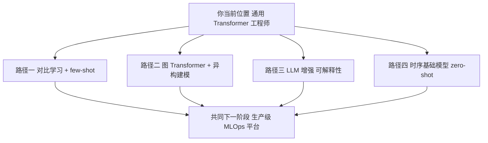

# Week 12 Knowledge Companion — 推理优化、落地工程与 12 周总结

> 配套文件：`week12/README.md`、`week12/12_deployment.ipynb`、`week12/12_summary_blog.md`、`transformer-12week-plan.md` § W12。
> 到了最后一周，目标从"我能不能训出更好的模型"切换到"我能不能把模型变成一个可以被 curl 的服务，并且上线后不会把我半夜叫起来"。本周同时也是整个 12 周的收束——你会用一张 Mermaid 图在自己脑中画出"从 MLP 到 PatchTST"的完整路径，并写出下一步。

---

## 1. 本周要回答的核心问题

1. 同一个模型，为什么 `PyTorch eager` / `torch.compile` / `ONNX Runtime` 的 p50 和 p99 会差几倍？瓶颈到底在模型代码里还是在 runtime 里？
2. 动态 INT8 量化为什么默认只量化 `nn.Linear`？对精度（AUC-PR）会造成什么可预期的损失？什么场景不能用？
3. "线上部署"远不止起一个 FastAPI 那么简单——真正让我夜里能睡着觉的 readiness 清单包含哪些项？
4. 12 周走下来，哪些 habit 是你会带进下一个项目的，哪些只属于学习阶段可以丢？
5. 下一阶段若要继续深入 Transformer-for-sequential-data，有哪些值得投入 3-6 个月的方向？

---

## 2. 理论骨架

### 2.1 推理优化工具箱

**torch.compile（PyTorch 2.0+）**

核心机制是 **TorchDynamo（graph capture）+ AOTAutograd（自动求导 lowering）+ Inductor（codegen 到 Triton / C++）**。对用户来说几乎零侵入：

```python
compiled_model = torch.compile(model, mode='default')
```

典型加速来自三件事：

1. **算子融合**：把 `LayerNorm + Linear + GELU + Linear` 融成一个 kernel，减少 HBM 往返。
2. **减少 Python 开销**：eager 模式每 op 都要走 Python dispatch；graph capture 后在 C++ 层执行。
3. **常量折叠 / 形状特化**：根据第一次 warmup 时见到的 shape 生成特化 kernel。

"典型 1.3-2× 加速" 是经验值。对小模型 / 小 batch 有时加速不明显甚至更慢（编译开销没摊平）。

**ONNX + ONNX Runtime（ORT）**

ONNX 是跨框架的计算图格式。把 PyTorch 模型导 ONNX 的意义：

1. **生态解耦**：线上不需要安装 PyTorch（几 GB 依赖），只要 ORT（几百 MB）；
2. **多后端支持**：CPU / CUDA / TensorRT / DirectML / CoreML / WebAssembly 一套 graph 跑到底；
3. **runtime 级优化**：常量折叠、算子融合、子图 reuse、线程池调度；
4. **量化友好**：ORT 自带 int8 量化工具链。

`dynamic_axes` 的作用：告诉导出器"batch 维是变长的"，否则导出的 graph 固定在 dummy 输入的 batch 大小。本 notebook 用：

```python
dynamic_axes={'x': {0: 'batch'}, 'score': {0: 'batch'}}
```

**Dynamic INT8 Quantization**

```python
q_model = torch.quantization.quantize_dynamic(model, {nn.Linear}, dtype=torch.qint8)
```

"Dynamic" 的含义：

- **权重** FP32 → INT8（离线转换，永久保存成 INT8）；
- **激活** FP32 → INT8（每次 forward **动态** 计算 scale，推理时发生）。

为什么默认只量化 `nn.Linear`？

- Transformer / MLP 的主要 FLOPs 集中在 Linear；
- LayerNorm / Softmax / Embedding 对量化敏感（动态范围大 / 概率分布保真要求高）；
- Attention 的 QK 矩阵乘需要保留精度才能稳定 softmax。

**预期收益**：CPU 上通常 2-3× 加速（AVX-VNNI / AMX 指令），AUC-PR 跌 < 1%（对 IEEE-CIS / 合成欺诈数据）。GPU 上加速有限——CUDA Cores 的 FP32/FP16 算力很强，int8 优势不如 CPU 明显，且还要走 Tensor Cores 才有真正收益。

**FlashAttention / FlashAttention-2**（补充知识，本周不实现）

训练时 attention 的 $O(L^2)$ 显存主要花在 "保存 full attention matrix 做反向" 上。FlashAttention 用 online softmax + block 切分，**以 recompute 换 IO**，让 attention 的显存从 $O(L^2)$ 降到 $O(L)$，同时 wall-time 更快（因为 HBM IO 是瓶颈）。生产推理栈中若做 GPU 部署，值得用它的 inference kernel（如 `xformers.memory_efficient_attention`）。

### 2.2 部署形态光谱

| 形态 | 延迟要求 | 吞吐 | 典型场景 | 工具 |
|------|---------|------|---------|------|
| 同步 REST | 低（p99 < 100 ms） | 中 | 支付网关实时打分 | FastAPI + uvicorn + ONNX Runtime |
| 异步消息队列 | 中（秒级） | 高 | 批量打分、离线反欺诈 | Kafka consumer + ORT batch |
| Streaming | 中（100 ms - 秒级） | 极高 | 实时风控流水 | Flink / Spark Streaming + 模型 UDF |
| Batch | 高（分钟-小时） | 极高 | 日终对账、离线特征刷新 | Airflow / Spark |

**关键决策点**：

- 单请求延迟是硬约束还是软约束？
- 特征是实时计算还是事后批量？
- 模型更新频率——天级（可以冷启动）还是分钟级（需要 hot reload）？

本 notebook 的 FastAPI + pyngrok 属于"最简单的同步 REST"——教学级足够，生产上要加 auth / rate limit / metrics / health check / graceful shutdown。

### 2.3 产品化清单（每条都必须有落地方案）

1. **Feature parity（训练 vs 服务特征一致）**：
   - 训练时 `StandardScaler.fit(tr[NUM_COLS])` 的 `mu / std`、`CAT_CARDS` 的 category-to-int mapping、`TransactionAmt` 的 `log1p` 顺序——全部要序列化，线上同一份代码加载。
   - 血泪教训：训练 Python 脚本里填缺失用 `-999`，上线 Java/Go 服务里用 `0`——线下 AUC-PR 0.85，线上 0.5。
2. **Schema 校验**：
   - 用 Pydantic / jsonschema 强制校验 shape / dtype / value range；
   - 异常输入 400 而不是 500，避免下游看到 nonsense 分数。
3. **Monitoring**：
   - **Latency**：p50 / p95 / p99，按 percentile alarm；
   - **Throughput**：QPS，按容量阈值 alarm；
   - **Feature drift**：每特征的 PSI (Population Stability Index) / KS 统计，日级或小时级计算；
   - **Score drift**：预测分数分布（直方图）对比训练期，突变告警；
   - **Label drift / performance decay**（等标签回流后）：rolling AUC-PR。
4. **A/B rollout + guardrails**：
   - shadow traffic（模型跑但不决策）→ 10% 流量 → 50% → 100%；
   - guardrail：若 AUC-PR 下降超过阈值或 false-positive 率飙升 → 自动回滚；
   - feature flag 控制，一键切回 baseline。
5. **Calibration（概率校准）**：
   - `sigmoid(logit)` 不保证是"well-calibrated probability"——尤其类别不平衡、focal loss / pos_weight 训练后；
   - **Platt scaling**：在 held-out 验证集上拟合 $p_{\text{cal}} = \sigma(a \cdot \text{logit} + b)$，2 个参数；
   - **Isotonic regression**：非参数，更灵活但需要更多数据；
   - 关心"给定分数阈值 0.9 时，precision 是多少"→ 必须校准。
6. **Explainability**：
   - **Attention 可视化**：哪一步 / 哪一通道的 attention 权重最高——适合时序异常定位；
   - **SHAP**：每个特征的边际贡献——适合 tabular；
   - **Counterfactual**：最小改动能让分数翻转的特征集——适合合规解释；
   - 生产实践：attention map 存日志，SHAP 按需计算（SHAP 推理贵 10-100x）。
7. **Feedback loop + label incorporation**：
   - 人工审核后的 label 回流，参与下一次重训；
   - 注意避免 "confirmation bias"——只回流模型判 high-score 的样本会把 decision boundary 越收越窄；需主动抽样 low-score 样本做人工复核。
8. **性能调优实战**：
   - **batch size vs latency**：单条请求强行凑 batch 会引入排队延迟；Triton Inference Server 的 dynamic batching 是折中；
   - **CPU vs GPU**：小模型（几十 MB） + 中 QPS（< 1000） → CPU ONNX Runtime 通常够；大模型 / 长序列 / 高 QPS → GPU；
   - **Warm-up**：进程启动后先喂几个 dummy 请求预热，避免第一批真请求 p99 飞天。

---

## 3. 代码对照

### 3.1 Checkpoint 加载 + graceful fallback (cell `cell-4`)

```python
def load_best_checkpoint():
    candidates = ['w11_patchtst.pt', 'w10_dualhead.pt', 'w11_vanilla.pt']
    for name in candidates:
        if (ckpt_dir / name).exists():
            data = torch.load(..., map_location='cpu')
            cfg = data.get('config', ...)
            m = PatchTST(**cfg)
            m.load_state_dict(data['state_dict'], strict=False)
            return m.eval(), cfg
    # no checkpoint → random-init 兜底
```

设计要点：

- **优先级**：`w11_patchtst` > `w10_dualhead` > `w11_vanilla`；PatchTST 先因为 ONNX 导出更稳。
- **`strict=False`**：允许 state_dict key 不完全匹配——双头模型导入单头结构时，recon_head 的权重会被忽略，不报错。
- **没有 checkpoint 也能跑**：用随机权重，保证本 notebook 端到端可执行。这是"教学 notebook 不能因为缺资源而挂"的设计哲学。

### 3.2 torch.compile 基准 (cell `cell-6`)

```python
def bench_forward(fn, x, n_iter=100, warmup=10, use_cuda=False):
    for _ in range(warmup):
        fn(x)
    if use_cuda: torch.cuda.synchronize()
    t0 = time.perf_counter()
    for _ in range(n_iter):
        fn(x)
    if use_cuda: torch.cuda.synchronize()
    return (time.perf_counter() - t0) / n_iter
```

两个必做的细节：

- **warmup**：torch.compile 第一次调用会花几秒 JIT；不 warmup 你测到的全是编译时间；
- **`torch.cuda.synchronize()`**：CUDA 异步，`time.perf_counter()` 在 kernel launch 后立刻返回，不同步会测到假的低延迟。

`try / except` 包住 `torch.compile`——有些旧 PyTorch / 无 Triton 环境会直接 fail，失败时用 NaN 占位让后续代码不 crash。

### 3.3 ONNX 导出 + 数值一致性验证 (cells `cell-8`, `cell-9`)

```python
torch.onnx.export(
    model_cpu, dummy, str(onnx_path),
    input_names=['x'], output_names=['score'],
    dynamic_axes={'x': {0: 'batch'}, 'score': {0: 'batch'}},
    opset_version=17,
    do_constant_folding=True,
)
```

- `opset_version=17`：Transformer 相关算子（`LayerNormalization`、`ScaledDotProductAttention`）在 17 及以后支持得更完整；低版本可能把 `LayerNorm` 拆成一堆小算子，graph 变丑而且慢。
- `do_constant_folding=True`：把 positional embedding 之类的常量计算预先折叠；生产级默认开。
- 验证：32 个随机 batch，`max|Δ| < 1e-4`。这个阈值对 FP32 + 标准 Transformer 来说是严格但可达的。若 diff > 1e-3，多半是：
  - 某算子 ONNX 实现不等价（如 PyTorch 的 `SDPA` fast path 走了融合 kernel）；
  - Dropout 没被切成 eval mode（exporter 会 warn，但要细看）；
  - LayerNorm 的 eps 值精度差异。

### 3.4 三方延迟基准（CPU + GPU × 3 后端）(cell `cell-11`)

核心是 `time_many` 返回 500 次样本列表，再用 `np.percentile` 算 p50 / p95 / p99。实践中：

- 每次 forward **单独** `time.perf_counter()` 是为了拿分布而不是均值——均值会被 p99 尾巴拉高；
- CPU 路径只测 eager 和 ORT（torch.compile 对 CPU 收益有限）；
- GPU 路径多加 `torch.compile` 和 `ORT CUDA`；
- `ort.get_available_providers()` 检查有没有 CUDA provider，才决定跑不跑那行。

**读表的心法**：
1. 对 CPU 关注 `ORT` vs `eager`——ORT 通常 1.5-3x；
2. 对 GPU 关注 `compile` vs `eager`——若 compile 没赢，八成模型小到编译开销占大头；
3. 对 `ORT GPU` 关注是否比 `eager GPU` 更快——不一定，GPU 上 PyTorch 的 cuDNN 路径已经相当快。

### 3.5 Dynamic INT8 量化 (cell `cell-13`)

```python
q_model = quantize_dynamic(model_cpu, {nn.Linear}, dtype=torch.qint8)
```

这里给出量化前后的两组数字：

- CPU p50（FP32 vs INT8）；
- AUC-PR（FP32 vs INT8）。

注意本 notebook 的 eval 用的是一个 `X_eval = rng.normal(..)` + 人工注入信号的 **合成验证集**——真实项目里应该 plug W10 / W11 的真正 val loader。当前做法是保证 notebook 端到端可跑的妥协。

### 3.6 FastAPI server.py (cell `cell-15`)

```python
class ScoreRequest(BaseModel):
    sequences: List[List[List[float]]] = Field(..., description="(B, L, F) float tensor")

@app.post("/score", response_model=ScoreResponse)
def score(req: ScoreRequest):
    x = np.asarray(req.sequences, dtype=np.float32)
    if x.ndim != 3 or x.shape[1] != SEQ_LEN or x.shape[2] != N_FEATS:
        raise HTTPException(400, f"expect shape (B, {SEQ_LEN}, {N_FEATS}), got {x.shape}")
    logits = sess.run(None, {"x": x})[0]
    probs  = 1.0 / (1.0 + np.exp(-logits))
    return ScoreResponse(scores=probs.tolist())
```

生产级要补的：

- auth（API key / JWT）；
- rate limit（slowapi / redis-based）；
- metrics（prometheus 客户端，导出 latency histogram）；
- request logging（含 request_id，方便和下游日志对齐）；
- `/health` 做真实的模型加载 / ORT 可用性检查（当前只返回 ok）；
- graceful shutdown（`SIGTERM` 时处理完 in-flight 请求再退）。

### 3.7 不阻塞 notebook 的 tunnel 启动（cell `cell-17`）

`pyngrok` + `uvicorn` 启动是**阻塞**的——如果直接在 notebook 最后一格跑，整个 notebook 会挂死在那里。本 notebook 的做法是写死注释，让学习者复制出去手动跑。这是 notebook 工程化的小智慧。

### 3.8 Mermaid 12 周全景图 (cell `cell-20`)

```mermaid
flowchart LR
    A["Week 1-2 数据理解 + 基线"] --> B["Week 3 MLP v0.1"]
    B --> C["Week 4 LSTM v0.2"]
    C --> D["Week 5-6 Transformer v0.3 分类"]
    D --> E["Week 7-8 Transformer v0.3.1 Kaggle 真实数据"]
    E --> F["Week 9 无监督重构 v0.4 上"]
    F --> G["Week 10 双头 分类 + 重构 v0.4 下"]
    G --> H["Week 11 PatchTST v0.5 长序列"]
    H --> I["Week 12 ONNX + FastAPI 上线"]
```



建议学习者把这张图打印出来贴墙上——比任何复盘博客都直观。

---

## 4. 常见坑位与调试思维

| 症状 | 根因 | 修法 |
|------|-----|------|
| ONNX 导出时 warn "operator not supported" | opset 版本低 / 自定义算子 | 升 opset_version 到 17；若是自定义 attention，换成标准 `nn.MultiheadAttention` |
| ORT 输出和 PyTorch 差 1e-2 | LayerNorm eps / BN running stats 没转对 | 导出前 `model.eval()` 并确认没有 Dropout / BN 活跃路径 |
| torch.compile 第一次调用卡住 10 秒 | JIT 正在生成 Triton kernel | 正常，加 warmup |
| 量化后 AUC-PR 掉 5% 以上 | 某层对量化敏感（如最后 classifier） | 把敏感层加到量化黑名单，只量化中间 Linear |
| FastAPI 并发压测下 CPU 100% 但 QPS 上不去 | 每请求都走 ORT 单次 forward，没有 batching | 上 Triton Inference Server 或自己写 request queue + dynamic batching |
| pyngrok 提示 auth token invalid | NGROK_AUTH_TOKEN 没配 | 在 Colab Secrets 加 NGROK_AUTH_TOKEN |
| 线上 AUC-PR 比线下低很多 | feature parity 出问题 | 逐字段校对：缺失填充、scaler mu/std、category mapping、dtype |
| p99 远大于 p95（长尾） | GC pause / CPU 调度抢占 / 首次推理未 warmup | 进程启动后做 warmup；用 jemalloc；pin CPU |
| 量化 + GPU 没加速 | GPU 量化走的不是 Tensor Core path | int8 加速 GPU 通常要 TensorRT；ORT 的 CUDAExecutionProvider 不是所有算子都 int8 |

**调试思维的通用模板**：

1. **先做数值等价性，再谈性能**：任何优化（compile / ONNX / 量化）前后先对比输出；
2. **测延迟必 warmup + sync**：少一个结果都不可信；
3. **p50 / p95 / p99 分开看**：只报平均会被长尾骗。

---

## 5. 长期演进方向

12 周毕业不是终点——它只是你进入 Transformer-for-sequential-data 的第一个里程碑。下面四条路径是值得用 3-6 个月深耕的方向。

### 5.1 对比学习 / 自监督预训练

**动机**：欺诈样本极少且标注成本高——自监督预训练用大量未标注交易，先学"什么是正常的交易表征"，再用少量标签做 few-shot 微调。

**方法家族**：

- **SimCLR 风格**：对同一序列做两种不同的 augmentation（时间 mask / 通道 mask / jittering），让它们的表征靠近，不同序列的表征推远。
- **BYOL / DINO**：非对称双塔，无需负样本，避免 collapse。
- **TS2Vec / CoST**：专门针对时序的对比学习。
- **掩码重建预训练**：BERT-style masked modeling 的时序版——mask 掉部分时间步让模型重建，类似 W9 的重构思路但不用标签。

**落地考虑**：交易数据的 augmentation 比图像难（时间步是有序的，不能随便 shuffle），需要业务侧设计；few-shot 微调的 labeling strategy 本身也是个子问题。

### 5.2 图 Transformer

**动机**：交易欺诈的本质是"图上的异常模式"——同一个设备短时间刷多个卡、一个商户突然新来一批低信誉用户、团伙通过中间账户转账——这些都在图结构上比序列结构上更显著。

**方法家族**：

- **Graph Attention Network (GAT)**：经典起点；
- **GPS / GraphGPS**（ICLR 2023）：把局部 MPNN 和全局 Transformer attention 结合；
- **NodeFormer**：显式建模全局 attention 的 graph variant；
- **异构图**：用户 / 商户 / 设备 / IP 各自一种 node 类型，边类型包括 "transacts_at"、"logs_in_from"。

**挑战**：图规模（用户 × 商户百万级）、负采样策略、时间动态（图在演化）。可以先做"小时级快照"处理掉时间维度，上 static graph transformer。

### 5.3 LLM-augmented fraud detection

**动机**：LLM 本身不一定比专用模型分类更准，但它提供了两样专用模型提供不了的东西：

1. **可解释的推理链**：把一笔交易 + 相关规则喂给 LLM，让它生成"为什么这笔可疑"的结构化推理，辅助人工审核提效；
2. **Zero-shot 规则迭代**：把审核员的反馈（自然语言）让 LLM 转成可执行的业务规则，缩短"审核发现新欺诈模式 → 规则上线"的周期。

**方法家族**：

- **Transaction-as-narration**：把结构化交易序列编码成自然语言叙述，再喂 LLM；
- **Tool-use / RAG**：LLM 调用专用欺诈检测模型 + 查询历史，综合给结论；
- **Multi-agent**：审核员 agent + 调查员 agent + 规则生成 agent 协作。

**陷阱**：LLM 推理成本高（每秒几次 vs 专用模型每秒几千次），通常只用在高风险复审环节，不做一线打分。

### 5.4 时序基础模型 (Time-Series Foundation Models)

**动机**：NLP 有 BERT/GPT，CV 有 CLIP/DINO——时序领域直到 2023-2024 才开始出现通用预训练模型。它们在大量跨领域时序数据上预训练，zero-shot / few-shot 应用到新任务。

**代表模型**：

- **TimeGPT (Nixtla, 2023)**：闭源 API，forecast 零样本不错；
- **Lag-Llama (2024)**：开源，decoder-only，基于 lag features；
- **Chronos (Amazon, 2024)**：把时序值 tokenize 成离散 symbol，用 T5/LLM 架构预训练；
- **Moirai (Salesforce, 2024)**：universal forecaster，多变量、多频率统一模型。

**对欺诈检测的启示**：

- 目前这些模型主要针对 forecasting；anomaly detection 的预训练模型还在路上；
- Chronos 的 tokenize 思路（值 → 离散 token）可以套用在欺诈——把交易金额 / 时间差等离散成 vocabulary，再上 GPT-style autoregressive；
- 实用路径：用 Chronos / Moirai 做 embedding extractor，接自己的分类头。

### 5.5 12 周回顾心智模型

你已经会做的：

- 从 tabular → sequence → Transformer 的三级跃迁；
- 手写 scaled dot-product attention / MHA / Encoder Block；
- 监督分类 / 无监督重构 / 双头合训三种 objective 的搭配；
- 长序列的 O(L²) 瓶颈诊断与 PatchTST / Informer 应对；
- ONNX 导出 / torch.compile / 量化 / FastAPI 的完整部署链路。

下一阶段的心智模型（用一张图说）：



无论选哪条路径，最终汇聚到"生产级 MLOps 平台"——这包括 feature store / model registry / A/B infra / monitoring，本周的 readiness 清单是它的雏形。

---

## 6. 自测题

<details>
<summary>Q1. 为什么 `torch.compile` 的第一次调用会很慢？在做延迟基准时你该如何处理？</summary>

第一次调用触发 TorchDynamo 的 graph capture 和 Inductor 的 codegen——会生成并编译 Triton kernel，典型耗时几百毫秒到数秒。做基准时必须在计时前跑 warmup（notebook 里是 10 次），确保测到的是"编译后稳态"而非"编译过程"。
</details>

<details>
<summary>Q2. `dynamic_axes={'x': {0: 'batch'}}` 不写会怎样？线上会踩什么坑？</summary>

不写的话，导出的 graph 把 batch 维固定为 dummy 的 batch 大小（本 notebook 是 1）。线上来一个 batch = 8 的请求，ORT 会报 shape mismatch。dynamic_axes 告诉 ORT 这一维是可变的，生成真正泛化的 graph。
</details>

<details>
<summary>Q3. 动态 INT8 量化对 Transformer 的哪些层不应该量化？为什么？</summary>

LayerNorm、Softmax、Embedding 一般不量化。LayerNorm 需要计算 running mean/std，动态范围不确定；Softmax 的输出概率保真对后续 attention 聚合很重要；Embedding 的 lookup 没有矩阵乘，量化无收益还有精度损失。默认的 `{nn.Linear}` 白名单已经覆盖了 FLOPs 大头。
</details>

<details>
<summary>Q4. 线下 AUC-PR = 0.85，线上只有 0.5，最可能的前三个原因是什么？怎么排查？</summary>

（1）特征一致性——scaler 的 mu/std、categorical encoder 的 mapping、缺失填充策略，训练和服务代码不一致；（2）时间泄漏——训练时随机切或把未来特征穿越，线上根本没有这些特征；（3）分布漂移——欺诈者已经学会绕过模型学到的模式。排查顺序：先对比训练/服务的单条样本逐字段输出，找差异；再做 PSI / KS 看分布漂移；最后看 rolling AUC-PR 看性能衰减。
</details>

<details>
<summary>Q5. 为什么 `sigmoid(logit)` 不一定是 well-calibrated probability？什么场景下校准很关键？</summary>

pos_weight / focal loss / 类别采样都会扭曲模型的 output probability。经验上 `sigmoid(logit) = 0.9` 并不意味着"这笔真有 90% 是欺诈"——实际可能是 70% 或 99%，取决于训练策略。校准关键场景：（1）基于阈值做业务决策（如 score > 0.95 拦截），需要阈值对应的 precision / recall 可信；（2）多模型 ensemble 时需要比较不同模型的 probability；（3）向业务/合规解释 "我们这个风险评级是多少"。
</details>

<details>
<summary>Q6. FastAPI 单请求 p50 = 20ms，压到 1000 QPS 时 p99 = 2s。可能是哪几个原因？</summary>

（1）uvicorn worker 数不足（默认 1 个），无法并行处理；（2）ORT session 不是线程安全默认配置，每请求 lock；（3）请求排队——没有 dynamic batching，一次算一条性价比低；（4）CPU 100% 导致 OS 调度抢占，尾延迟飙升；（5）GC pause（Python GIL + 大对象创建）。修法：开多 worker 或 Gunicorn + uvicorn worker；设 ORT intra_op_num_threads；考虑 Triton Inference Server 做 dynamic batching。
</details>

<details>
<summary>Q7. W11 保存了 `w11_patchtst.pt` 和 `w11_vanilla.pt`，为什么 W12 优先选 PatchTST 导 ONNX？</summary>

PatchTST 内部算子简单（Linear / LayerNorm / unfold / 标准 encoder），opset 17 完整支持，导出干净。vanilla Transformer 在部分 PyTorch 版本会走 `nn.TransformerEncoderLayer` 的 fast-path（`torch._transformer_encoder_layer_fwd`），ONNX exporter 有时无法正确处理或会 warn。PatchTST 导出更稳，数值一致性验证也更容易 < 1e-4。
</details>

<details>
<summary>Q8. 如果让你用一个 Mermaid 图向新同事讲"这 12 周我学了什么"，你会画几个节点？哪些是核心？</summary>

最少 4 个节点：数据认知 → baseline 三级（MLP / LSTM / Transformer） → 时序变体（PatchTST） → 部署。如果要再凝练，可以合并成"基础 → 架构 → 扩展 → 落地"四步。核心节点是 Transformer encoder 手写那一周——前面全为它铺垫，后面全基于它扩展。Mermaid 呈现时建议用 `subgraph` 把"MVP 迭代"包起来，和"关键决策点"分开画。
</details>

---

## 7. 延伸阅读

1. **PyTorch 2.0 论文 — "TorchDynamo: An Internals Deep-Dive"**：理解 torch.compile 的 graph capture / AOTAutograd / Inductor 三层分工，帮你判断"什么模型能从 compile 受益"。
2. **ONNX Runtime Performance Tuning Guide (onnxruntime.ai/docs/performance)**：ORT 的调优细节比官方导出指南更实用——intra/inter op threads、graph optimization level、provider 选择。
3. **Dao et al. — FlashAttention: Fast and Memory-Efficient Exact Attention with IO-Awareness (NeurIPS 2022) + FlashAttention-2 (2023)**：推理和训练时 attention 的 GPU 内核优化，长序列必读。
4. **Nie et al. — Chronos: Learning the Language of Time Series (Amazon, 2024)**：时序基础模型的代表作，"把时序值 tokenize 成离散 symbol"的思路对欺诈序列也可套用。
5. **Sculley et al. — Hidden Technical Debt in Machine Learning Systems (NeurIPS 2015)**：10 年前的经典，但现在读仍 80% 适用。产品化清单的每一条基本都在这篇论文里出现过。
